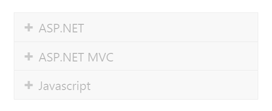
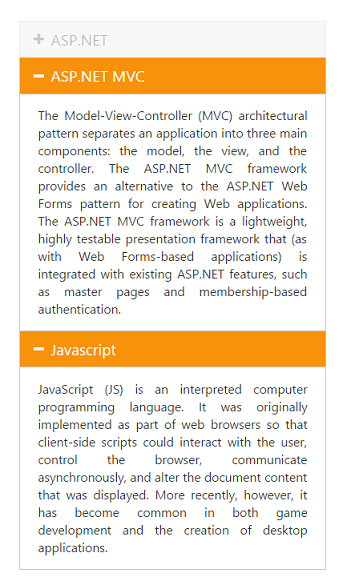

# Accordion Panel enabler

## Enable or Disable control

You can enable or disable the Accordion widget on initial rendering using the Enabled property. By default Enabled property is set to true and the Accordion panels are active always. 

The following code explains you on how to enable or disable the Accordion widget



// In the View page, render Accordion with corresponding data and disable the control actions.

<ej-accordion id="basicAccordion" enabled="false">
    <e-accordion-items>
        <e-accordion-item text="ASP.NET">
            <e-content-template>
                

                    Essential Chart for ASP.NET MVC is a visually stunning, high-performance charting component that is easy to use.
                    It includes 35 chart types ranging from simple column charts to specialized financial charts.
                    The charts are highly customizable and have a powerful data model that makes data binding simple.
                

            </e-content-template>
        </e-accordion-item>
        <e-accordion-item text="ASP.NET MVC">
            <e-content-template>
                

                    The Model-View-Controller (MVC) architectural pattern separates an application into three main components:
                    the model, the view, and the controller. The ASP.NET MVC framework provides an alternative to the ASP.NET Web Forms pattern for creating Web applications. The ASP.NET MVC framework is a lightweight, highly testable presentation framework that (as with Web Forms-based applications) is integrated with existing ASP.NET features, such as master pages and membership-based authentication.
                

            </e-content-template>
        </e-accordion-item>
        <e-accordion-item text="Javascript">
            <e-content-template>
                

                    JavaScript (JS) is an interpreted computer programming language.
                    It was originally implemented as part of web browsers so that client-side scripts could interact with the user, control the browser,
                    communicate asynchronously, and alter the document content that was displayed. More recently, however,
                    it has become common in both game development and the creation of desktop applications.
                

            </e-content-template>
        </e-accordion-item>
    </e-accordion-items>
</ej-accordion>



Output for disabled Accordion control is as follows.

 

## Enable panel items

You can enable the Accordion widget items on initial loading using EnabledItems property. This property takes array of indices whose panel needs to be enabled in Accordion widget. 

The DisabledItems property disables the Accordion items based on the index. This takes array of indices whose panel is to be disabled. 

### Enabling accordion panel items

The following code explains you on how to enable the panel items in Accordion widget.



// In the View page, configure Accordion with the corresponding data, and to enable and disable Accordion panel items set the values for EnabledItems and DisabledItems.

@{      
//List of integer array with index values.

List<int> enableditem = new List<int>() { 1, 2 };

List<int> disableditem = new List<int>() { 0 };

}

<ej-accordion id="basicAccordion" selected-item-index="1" enable-multiple-open="true" enabled-items=enableditem disable-items=disableditem>
<e-accordion-items>
    <e-accordion-item text="ASP.NET">
        <e-content-template>
            

                Essential Chart for ASP.NET MVC is a visually stunning, high-performance charting component that is easy to use.
                It includes 35 chart types ranging from simple column charts to specialized financial charts.
                The charts are highly customizable and have a powerful data model that makes data binding simple.
            

        </e-content-template>
    </e-accordion-item>
    <e-accordion-item text="ASP.NET MVC">
        <e-content-template>
            

                The Model-View-Controller (MVC) architectural pattern separates an application into three main components:
                the model, the view, and the controller. The ASP.NET MVC framework provides an alternative to the ASP.NET Web Forms pattern for creating Web applications. The ASP.NET MVC framework is a lightweight, highly testable presentation framework that (as with Web Forms-based applications) is integrated with existing ASP.NET features, such as master pages and membership-based authentication.
            

        </e-content-template>
    </e-accordion-item>
    <e-accordion-item text="Javascript">
        <e-content-template>
            

                JavaScript (JS) is an interpreted computer programming language.
                It was originally implemented as part of web browsers so that client-side scripts could interact with the user, control the browser,
                communicate asynchronously, and alter the document content that was displayed. More recently, however,
                it has become common in both game development and the creation of desktop applications.
            

        </e-content-template>
    </e-accordion-item>
</e-accordion-items>
</ej-accordion>



Output for Accordion control with some enabled and disabled items, where first panel is disabled and it can’t be expanded or collapsed is as follows.

 