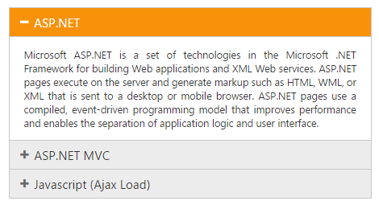
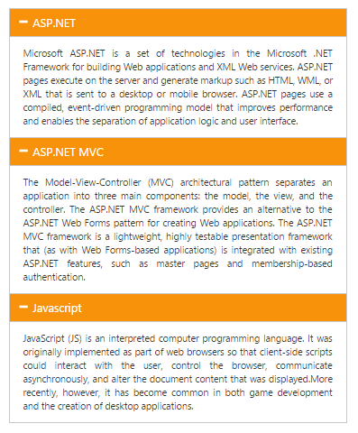
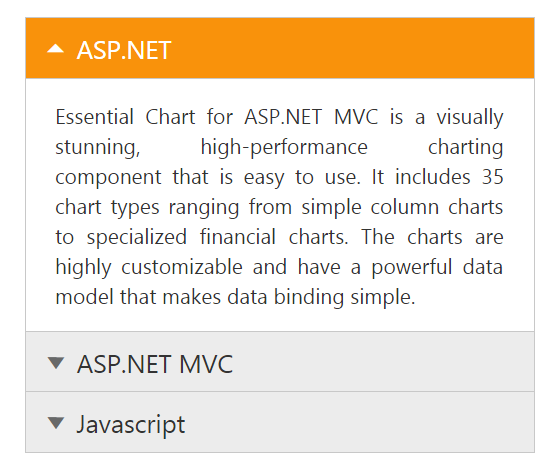

# Getting Started

This section explains briefly about how to create an Accordion in your ASP.NET Core application.

## Create your first Accordion in ASP.NET

Accordion control allows you to provide multiple panes and display them one/more at a time. In this section, you can learn how the Accordion control is configured and how to use it in your application.

## Create a Simple Accordion

ASP.NET Core Accordion basically renders using a div element. You can refer [ASP.NET Core Getting Started](https://help.syncfusion.com/aspnet-core/getting-started) documentation to initially configure the common specifications.



	/*ej-Tag Helper code to render Accordion*/

	<ej-accordion id="basicAccordion">
		<e-accordion-items>
			<e-accordion-item text="ASP.NET">
				<e-content-template>
					

					Essential Chart for ASP.NET MVC is a visually stunning, high-performance charting component that is easy to use.
					It includes 35 chart types ranging from simple column charts to specialized financial charts.
					The charts are highly customizable and have a powerful data model that makes data binding simple.
					

				</e-content-template>
			</e-accordion-item>
			<e-accordion-item text="ASP.NET MVC">
				<e-content-template>
					

					The Model-View-Controller (MVC) architectural pattern separates an application into three main components:
					the model, the view, and the controller. The ASP.NET MVC framework provides an alternative to the ASP.NET Web Forms pattern for creating Web applications. The ASP.NET MVC framework is a lightweight, highly testable presentation framework that (as with Web Forms-based applications) is integrated with existing ASP.NET features, such as master pages and membership-based authentication.
					

				</e-content-template>
			</e-accordion-item>
			<e-accordion-item text="Javascript">
				<e-content-template>
					

					JavaScript (JS) is an interpreted computer programming language.
					It was originally implemented as part of web browsers so that client-side scripts could interact with the user, control the browser,
					communicate asynchronously, and alter the document content that was displayed. More recently, however,
					it has become common in both game development and the creation of desktop applications.
					

				</e-content-template>
			</e-accordion-item>
		</e-accordion-items>
	</ej-accordion>





	/*Razor code to render Accordion*/

	@{
		Html.EJ().Accordion("basicAccordion").Items(data => { data.Add().Text("ASP.NET").ContentTemplate(@

			Microsoft ASP.NET is a set of technologies in the Microsoft .NET Framework for building Web applications and XML Web services. ASP.NET pages execute on the server and generate markup such as HTML, WML, or XML that is sent to a desktop or mobile browser. ASP.NET pages use a compiled, event-driven programming model that improves performance and enables the separation of application logic and user interface.
		
);
		data.Add().Text("ASP.NET MVC").ContentTemplate(@

			The Model-View-Controller (MVC) architectural pattern separates an application into three main components: the model, the view, and the controller. The ASP.NET MVC framework provides an alternative to the ASP.NET Web Forms pattern for creating Web applications. The ASP.NET MVC framework is a lightweight, highly testable presentation framework that (as with Web Forms-based applications) is integrated with existing ASP.NET features, such as master pages and membership-based authentication
		
);
		data.Add().Text("Javascript").ContentTemplate(@

			JavaScript (JS) is an interpreted computer programming language.
			It was originally implemented as part of web browsers so that client-side scripts could interact with the user, control the browser,
			communicate asynchronously, and alter the document content that was displayed. More recently, however,
			it has become common in both game development and the creation of desktop applications.
		
);}).Render();
	}



N> To render the Accordion Control you can use either Razor or Tag helper code as given in the above code snippet.

Execute the above code example to display the Accordion control with simple control list.

You can customize the Accordion control using various properties. The Accordion control properties and its default values are described in the following section.

## Configure Multiple Open

Its possible to open multiple Accordion tabs to view all products at a time. To render this set the EnableMultipleOpen property of the Accordion control to true.

N> EnableMultipleOpen property is false by default. 

You can also open all the panels during initialization using the SelectedItems property of the Accordion control. The following code sample illustrates the opening of multiple tabs by passing the tab index values of tab.



	@{
		List <int> selecteditem = new List <int>() { 0, 1, 2 };
	}





	/*ej-Tag Helper code to render Accordion*/

	<ej-accordion id="basicAccordion" enable-multiple-open="true" selected-items=selecteditem>
		<e-accordion-items>
			<e-accordion-item text="ASP.NET">
				<e-content-template>
					

					Essential Chart for ASP.NET MVC is a visually stunning, high-performance charting component that is easy to use.
					It includes 35 chart types ranging from simple column charts to specialized financial charts.
					The charts are highly customizable and have a powerful data model that makes data binding simple.
					

				</e-content-template>
			</e-accordion-item>
			<e-accordion-item text="ASP.NET MVC">
				<e-content-template>
					

					The Model-View-Controller (MVC) architectural pattern separates an application into three main components:
					the model, the view, and the controller. The ASP.NET MVC framework provides an alternative to the ASP.NET Web Forms pattern for creating Web applications. The ASP.NET MVC framework is a lightweight, highly testable presentation framework that (as with Web Forms-based applications) is integrated with existing ASP.NET features, such as master pages and membership-based authentication.
					

				</e-content-template>
			</e-accordion-item>
			<e-accordion-item text="Javascript">
				<e-content-template>
					

					JavaScript (JS) is an interpreted computer programming language.
					It was originally implemented as part of web browsers so that client-side scripts could interact with the user, control the browser,
					communicate asynchronously, and alter the document content that was displayed. More recently, however,
					it has become common in both game development and the creation of desktop applications.
					

				</e-content-template>
			</e-accordion-item>
		</e-accordion-items>
	</ej-accordion>





	/*Razor code to render Accordion*/
	
	@{
		Html.EJ().Accordion("basicAccordion").EnableMultipleOpen(true).SelectedItems(selecteditem).Items(data => { data.Add().Text("ASP.NET").ContentTemplate(@

			Microsoft ASP.NET is a set of technologies in the Microsoft .NET Framework for building Web applications and XML Web services. ASP.NET pages execute on the server and generate markup such as HTML, WML, or XML that is sent to a desktop or mobile browser. ASP.NET pages use a compiled, event-driven programming model that improves performance and enables the separation of application logic and user interface.
		
);
		data.Add().Text("ASP.NET MVC").ContentTemplate(@

			The Model-View-Controller (MVC) architectural pattern separates an application into three main components: the model, the view, and the controller. The ASP.NET MVC framework provides an alternative to the ASP.NET Web Forms pattern for creating Web applications. The ASP.NET MVC framework is a lightweight, highly testable presentation framework that (as with Web Forms-based applications) is integrated with existing ASP.NET features, such as master pages and membership-based authentication
		
);
		data.Add().Text("Javascript").ContentTemplate(@

			JavaScript (JS) is an interpreted computer programming language.
			It was originally implemented as part of web browsers so that client-side scripts could interact with the user, control the browser,
			communicate asynchronously, and alter the document content that was displayed. More recently, however,
			it has become common in both game development and the creation of desktop applications.
		
);}).Render();
	}



Accordion control with EnableMultipleOpen property is illustrated in the following screenshot.

## Set Rounded corner

Accordion control by default is rendered in a regular rectangle. You can modify the regular rectangles with rounded corners by setting the ShowRoundedCorner property to true.

N> ShowRoundedCorner property is false by default.



	/*ej-Tag Helper code to render Accordion*/

	<ej-accordion id="basicAccordion" show-rounded-corner=true>
		<e-accordion-items>
			<e-accordion-item text="ASP.NET">
				<e-content-template>
					

					Essential Chart for ASP.NET MVC is a visually stunning, high-performance charting component that is easy to use.
					It includes 35 chart types ranging from simple column charts to specialized financial charts.
					The charts are highly customizable and have a powerful data model that makes data binding simple.
					

				</e-content-template>
			</e-accordion-item>
			<e-accordion-item text="ASP.NET MVC">
				<e-content-template>
					

					The Model-View-Controller (MVC) architectural pattern separates an application into three main components:
					the model, the view, and the controller. The ASP.NET MVC framework provides an alternative to the ASP.NET Web Forms pattern for creating Web applications. The ASP.NET MVC framework is a lightweight, highly testable presentation framework that (as with Web Forms-based applications) is integrated with existing ASP.NET features, such as master pages and membership-based authentication.
					

				</e-content-template>
			</e-accordion-item>
			<e-accordion-item text="Javascript">
				<e-content-template>
					

					JavaScript (JS) is an interpreted computer programming language.
					It was originally implemented as part of web browsers so that client-side scripts could interact with the user, control the browser,
					communicate asynchronously, and alter the document content that was displayed. More recently, however,
					it has become common in both game development and the creation of desktop applications.
					

				</e-content-template>
			</e-accordion-item>
		</e-accordion-items>
	</ej-accordion>





	/*Razor code to render Accordion*/

	@{
		Html.EJ().Accordion("basicAccordion").ShowRoundedCorner(true).Items(data => { data.Add().Text("ASP.NET").ContentTemplate(@

			Microsoft ASP.NET is a set of technologies in the Microsoft .NET Framework for building Web applications and XML Web services. ASP.NET pages execute on the server and generate markup such as HTML, WML, or XML that is sent to a desktop or mobile browser. ASP.NET pages use a compiled, event-driven programming model that improves performance and enables the separation of application logic and user interface.
		
);
		data.Add().Text("ASP.NET MVC").ContentTemplate(@

			The Model-View-Controller (MVC) architectural pattern separates an application into three main components: the model, the view, and the controller. The ASP.NET MVC framework provides an alternative to the ASP.NET Web Forms pattern for creating Web applications. The ASP.NET MVC framework is a lightweight, highly testable presentation framework that (as with Web Forms-based applications) is integrated with existing ASP.NET features, such as master pages and membership-based authentication
		
);
		data.Add().Text("Javascript").ContentTemplate(@

			JavaScript (JS) is an interpreted computer programming language.
			It was originally implemented as part of web browsers so that client-side scripts could interact with the user, control the browser,
			communicate asynchronously, and alter the document content that was displayed. More recently, however,
			it has become common in both game development and the creation of desktop applications.
		
);}).Render();
	}



## Customize Icon

You can customize the Header icon using Custom Icon property. This property is having two features such as Header and SelectedHeader. By default, the classes of Header and SelectedHeader are e-collapse and e-expand respectively.

You can change the + and - symbols in the Accordion header, that are default icons with Up and Down arrow icons. 

Up and Down arrow icons are available in e-arrowheadup and e-arrowheaddown classes respectively in the ej.widgets.core.min.css stylesheets from the sample. 

You can set the Up/Down arrow icon to Accordion header, by adding e-arrowheadup and e-arrowheaddown class to SelectedHeader and Header properties respectively.



	/*ej-Tag Helper code to render Accordion*/

	<ej-accordion id="basicAccordion" show-rounded-corner=true>
		<e-custom-icon header="e-arrowhead-down" selected-header="e-arrowheadup" />
		<e-accordion-items>
			<e-accordion-item text="ASP.NET">
				<e-content-template>
					

					Essential Chart for ASP.NET MVC is a visually stunning, high-performance charting component that is easy to use.
					It includes 35 chart types ranging from simple column charts to specialized financial charts.
					The charts are highly customizable and have a powerful data model that makes data binding simple.
					

				</e-content-template>
			</e-accordion-item>
			<e-accordion-item text="ASP.NET MVC">
				<e-content-template>
					

					The Model-View-Controller (MVC) architectural pattern separates an application into three main components:
					the model, the view, and the controller. The ASP.NET MVC framework provides an alternative to the ASP.NET Web Forms pattern for creating Web applications. The ASP.NET MVC framework is a lightweight, highly testable presentation framework that (as with Web Forms-based applications) is integrated with existing ASP.NET features, such as master pages and membership-based authentication.
					

				</e-content-template>
			</e-accordion-item>
			<e-accordion-item text="Javascript">
				<e-content-template>
					

					JavaScript (JS) is an interpreted computer programming language.
					It was originally implemented as part of web browsers so that client-side scripts could interact with the user, control the browser,
					communicate asynchronously, and alter the document content that was displayed. More recently, however,
					it has become common in both game development and the creation of desktop applications.
					

				</e-content-template>
			</e-accordion-item>
		</e-accordion-items>
	</ej-accordion>





	/*Razor code to render Accordion*/

	@{
		Html.EJ().Accordion("basicAccordion").ShowRoundedCorner(true).CustomIcon(icon => icon.SelectedHeader("e-arrowheadup").Header("e-arrowhead-down")).Items(data => { data.Add().Text("ASP.NET").ContentTemplate(@

			Microsoft ASP.NET is a set of technologies in the Microsoft .NET Framework for building Web applications and XML Web services. ASP.NET pages execute on the server and generate markup such as HTML, WML, or XML that is sent to a desktop or mobile browser. ASP.NET pages use a compiled, event-driven programming model that improves performance and enables the separation of application logic and user interface.
		
);
		data.Add().Text("ASP.NET MVC").ContentTemplate(@

			The Model-View-Controller (MVC) architectural pattern separates an application into three main components: the model, the view, and the controller. The ASP.NET MVC framework provides an alternative to the ASP.NET Web Forms pattern for creating Web applications. The ASP.NET MVC framework is a lightweight, highly testable presentation framework that (as with Web Forms-based applications) is integrated with existing ASP.NET features, such as master pages and membership-based authentication
		
);
		data.Add().Text("Javascript").ContentTemplate(@

			JavaScript (JS) is an interpreted computer programming language.
			It was originally implemented as part of web browsers so that client-side scripts could interact with the user, control the browser,
			communicate asynchronously, and alter the document content that was displayed. More recently, however,
			it has become common in both game development and the creation of desktop applications.
		
);}).Render();
	}



The following screenshot illustrates the customization of SelectedHeader and Header of the Accordion control.

