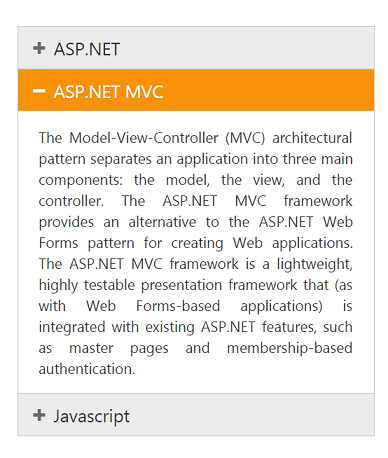
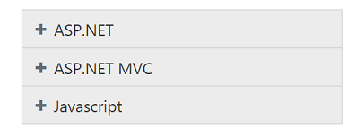
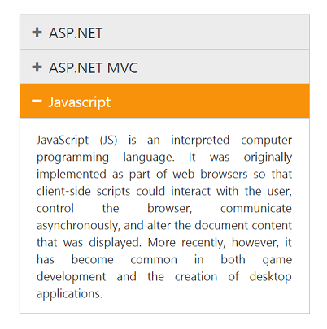
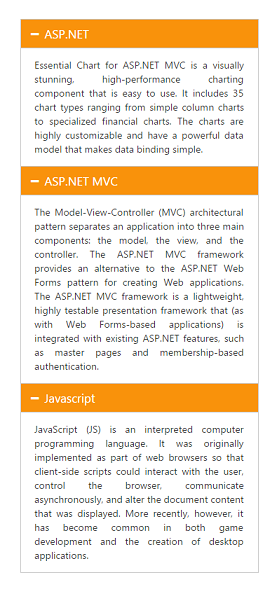

# Header customization

## Collapsible

Accordion widget allows you to set Collapsible state for an Accordion header. Thus you can expand and collapse accordion contents. By default Collapsible is set to false.

## Enable Collapsible settings

The following code explains to enable Collapsible state for Accordion.



// In the View page, render Accordion with corresponding data and enable Collapsible property.

<ej-accordion id="basicAccordion" collapsible="true">
	<e-accordion-items>
		<e-accordion-item text="ASP.NET">
			<e-content-template>
				

					Essential Chart for ASP.NET MVC is a visually stunning, high-performance charting component that is easy to use.
					It includes 35 chart types ranging from simple column charts to specialized financial charts.
					The charts are highly customizable and have a powerful data model that makes data binding simple.
				

			</e-content-template>
		</e-accordion-item>
		<e-accordion-item text="ASP.NET MVC">
			<e-content-template>
				

					The Model-View-Controller (MVC) architectural pattern separates an application into three main components:
					the model, the view, and the controller. The ASP.NET MVC framework provides an alternative to the ASP.NET Web Forms pattern for creating Web applications. The ASP.NET MVC framework is a lightweight, highly testable presentation framework that (as with Web Forms-based applications) is integrated with existing ASP.NET features, such as master pages and membership-based authentication.
				

			</e-content-template>
		</e-accordion-item>
		<e-accordion-item text="Javascript">
			<e-content-template>
				

					JavaScript (JS) is an interpreted computer programming language.
					It was originally implemented as part of web browsers so that client-side scripts could interact with the user, control the browser,
					communicate asynchronously, and alter the document content that was displayed. More recently, however,
					it has become common in both game development and the creation of desktop applications.
				

			</e-content-template>
		</e-accordion-item>
	</e-accordion-items>
</ej-accordion>



 Output for Accordion control with collapsible headers.

### Enable Header expand

Accordion widget provides you support to set the event, where the headers should expand and collapse. The events properties takes default events like mouseout, mouseover, and click.

### Configure header expand event

The following code explains you to configure header expand event for Accordion.



// In the View page, render Accordion with corresponding data and configure the Events property.

<ej-accordion id="basicAccordion" events="mouseout">
	<e-accordion-items>
		<e-accordion-item text="ASP.NET">
			<e-content-template>
				

					Essential Chart for ASP.NET MVC is a visually stunning, high-performance charting component that is easy to use.
					It includes 35 chart types ranging from simple column charts to specialized financial charts.
					The charts are highly customizable and have a powerful data model that makes data binding simple.
				

			</e-content-template>
		</e-accordion-item>
		<e-accordion-item text="ASP.NET MVC">
			<e-content-template>
				

					The Model-View-Controller (MVC) architectural pattern separates an application into three main components:
					the model, the view, and the controller. The ASP.NET MVC framework provides an alternative to the ASP.NET Web Forms pattern for creating Web applications. The ASP.NET MVC framework is a lightweight, highly testable presentation framework that (as with Web Forms-based applications) is integrated with existing ASP.NET features, such as master pages and membership-based authentication.
				

			</e-content-template>
		</e-accordion-item>
		<e-accordion-item text="Javascript">
			<e-content-template>
				

					JavaScript (JS) is an interpreted computer programming language.
					It was originally implemented as part of web browsers so that client-side scripts could interact with the user, control the browser,
					communicate asynchronously, and alter the document content that was displayed. More recently, however,
					it has become common in both game development and the creation of desktop applications.
				

			</e-content-template>
		</e-accordion-item>
	</e-accordion-items>
</ej-accordion>



Output for Accordion control that expands header on mouseout event is as follows.

## Single selection

BY using SelectedItemIndex property you can modify the expanded panel when the control is rendered. By default SelectedItemIndex is ‘0’ that always activate the first Accordion panel.

### Specify the selected item in Accordion panel

Using SelectedItemIndex property you can modify the expanded panel when the control is rendered. By default SelectedItemIndex is ‘0’ that always activate the first Accordion panel.

Specify the selected item in Accordion panel

The following code explains you to configure selected item for Accordion.



// In the View page, render Accordion with corresponding data and configure selected item for Accordion based on the index.

<ej-accordion id="basicAccordion" selected-item-index="2">
	<e-accordion-items>
		<e-accordion-item text="ASP.NET">
			<e-content-template>
				

					Essential Chart for ASP.NET MVC is a visually stunning, high-performance charting component that is easy to use.
					It includes 35 chart types ranging from simple column charts to specialized financial charts.
					The charts are highly customizable and have a powerful data model that makes data binding simple.
				

			</e-content-template>
		</e-accordion-item>
		<e-accordion-item text="ASP.NET MVC">
			<e-content-template>
				

					The Model-View-Controller (MVC) architectural pattern separates an application into three main components:
					the model, the view, and the controller. The ASP.NET MVC framework provides an alternative to the ASP.NET Web Forms pattern for creating Web applications. The ASP.NET MVC framework is a lightweight, highly testable presentation framework that (as with Web Forms-based applications) is integrated with existing ASP.NET features, such as master pages and membership-based authentication.
				

			</e-content-template>
		</e-accordion-item>
		<e-accordion-item text="Javascript">
			<e-content-template>
				

					JavaScript (JS) is an interpreted computer programming language.
					It was originally implemented as part of web browsers so that client-side scripts could interact with the user, control the browser,
					communicate asynchronously, and alter the document content that was displayed. More recently, however,
					it has become common in both game development and the creation of desktop applications.
				

			</e-content-template>
		</e-accordion-item>
	</e-accordion-items>
</ej-accordion>



Output for Accordion control with the selected item by index is as follows.

## Multiple selection

In Accordion widget you can select multiple panel items using SelectedItems property. It takes array of indices that needs to be selected on rendering the control. As you need to select multiple items, you can set EnableMultipleOpen to true.

### Configure multiple selection in Accordion panel

The following code explains to configure selected items for Accordion.



// In the View page, render Accordion with corresponding data and configure multiple items selection for Accordion.

@{
    List<int> selecteditem = new List<int>() { 0, 2 };
}

<ej-accordion id="basicAccordion" enable-multiple-open="true" selected-items=selecteditem>
	<e-accordion-items>
		<e-accordion-item text="ASP.NET">
			<e-content-template>
				

					Essential Chart for ASP.NET MVC is a visually stunning, high-performance charting component that is easy to use.
					It includes 35 chart types ranging from simple column charts to specialized financial charts.
					The charts are highly customizable and have a powerful data model that makes data binding simple.
				

			</e-content-template>
		</e-accordion-item>
		<e-accordion-item text="ASP.NET MVC">
			<e-content-template>
				

					The Model-View-Controller (MVC) architectural pattern separates an application into three main components:
					the model, the view, and the controller. The ASP.NET MVC framework provides an alternative to the ASP.NET Web Forms pattern for creating Web applications. The ASP.NET MVC framework is a lightweight, highly testable presentation framework that (as with Web Forms-based applications) is integrated with existing ASP.NET features, such as master pages and membership-based authentication.
				

			</e-content-template>
		</e-accordion-item>
		<e-accordion-item text="Javascript">
			<e-content-template>
				

					JavaScript (JS) is an interpreted computer programming language.
					It was originally implemented as part of web browsers so that client-side scripts could interact with the user, control the browser,
					communicate asynchronously, and alter the document content that was displayed. More recently, however,
					it has become common in both game development and the creation of desktop applications.
				

			</e-content-template>
		</e-accordion-item>
	</e-accordion-items>
</ej-accordion>



Output for Accordion control with the multiple selected items is as follows.

