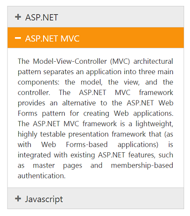

# State Persistence

Accordion widget can store the model value in the browser cookies and on every time after initial rendering, the control get the model from the cookie only. Using EnablePersistence property you can store the model value in cookies. Thus when any changes are made dynamically then those values are updated in cookie. On refreshing the page the past state of the Accordion control is maintained in cookie and control is rendered from it.

## Configure state persistence of Accordion panel

The following code explains to enable state maintenance for Accordion.



// In the View page, configure Accordion with corresponding data and enable the state persistence.

<ej-accordion id="basicAccordion" enable-persistence="true">
	<e-accordion-items>
		<e-accordion-item text="ASP.NET">
			<e-content-template>
				

					Essential Chart for ASP.NET MVC is a visually stunning, high-performance charting component that is easy to use.
					It includes 35 chart types ranging from simple column charts to specialized financial charts.
					The charts are highly customizable and have a powerful data model that makes data binding simple.
				

			</e-content-template>
		</e-accordion-item>
		<e-accordion-item text="ASP.NET MVC">
			<e-content-template>
				

					The Model-View-Controller (MVC) architectural pattern separates an application into three main components:
					the model, the view, and the controller. The ASP.NET MVC framework provides an alternative to the ASP.NET Web Forms pattern for creating Web applications. The ASP.NET MVC framework is a lightweight, highly testable presentation framework that (as with Web Forms-based applications) is integrated with existing ASP.NET features, such as master pages and membership-based authentication.
				

			</e-content-template>
		</e-accordion-item>
		<e-accordion-item text="Javascript">
			<e-content-template>
				

					JavaScript (JS) is an interpreted computer programming language.
					It was originally implemented as part of web browsers so that client-side scripts could interact with the user, control the browser,
					communicate asynchronously, and alter the document content that was displayed. More recently, however,
					it has become common in both game development and the creation of desktop applications.
				

			</e-content-template>
		</e-accordion-item>
	</e-accordion-items>
</ej-accordion>



Output after page refresh maintaining the previous state of Accordion widget is as follows.

   

1. Accordion Selected Item changed

   

2. Accordion state persisted after page refresh