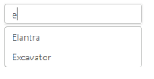
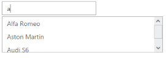
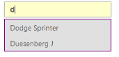

# Appearance and Styling

## Adjusting AutoComplete size

AutoComplete widget allows you to set the height and width of the textbox element in AutoComplete. The height and width properties take pixel values to set the dimension accordingly.

### Define height and width for AutoComplete textbox

The following steps explain the dimensional properties of an AutoComplete textbox.

1. In the View page, define the AutoComplete control and set values for Height and Width property.



@*Refer to the DataSource defined in Local Data binding Step 1 *@

   <ej-autocomplete id="autocomplete" datasource="ViewBag.datasource" watermark-text="Select a car" height="50px" width="250px" multi-select-mode="Delimiter">
                <e-autocomplete-fields text="Text" key="UniqueKey" />
   </ej-autocomplete>



The following image is the output for AutoComplete textbox with customized dimensions.

AutoComplete with Customized dimensions
{:.caption}

## Rounded corner

By enabling the ShowRoundedCorner property, you can customize the shape of the AutoComplete widget from a regular rectangular shape to a rounded rectangle shape that is set to ‘false’ by default.

### Enabling Rounded corner 

The following steps explain enabling the show-rounded-corner property for an AutoComplete textbox.

1. In the View page, define the AutoComplete control and enable the show-rounded-corner property.



@*Refer to the DataSource defined in Local Data binding Step 1 *@

 <ej-autocomplete id="autocomplete" datasource="ViewBag.datasource" watermark-text="Select a car" show-rounded-corner="true">
        <e-autocomplete-fields text="Text" key="UniqueKey" />
 </ej-autocomplete>



The following image is the output for AutoComplete when ShowRoundedCorner is set to “true”.

AutoComplete with Rounded corners
{:.caption}

## Watermark text

watermark-text property provides you with an option to display a faded text in the AutoComplete textbox when the textbox is empty.

### Defining Watermark text 

The following steps explain you how to configure watermark-text property for an AutoComplete textbox.

1. In the View page, define the AutoComplete control and enable the watermark-text property.



@*Refer to the DataSource defined in Local Data binding Step 1 *@

 <ej-autocomplete id="autocomplete" datasource="ViewBag.datasource" watermark-text="Select an item">
                <e-autocomplete-fields text="Text" key="UniqueKey" />
 </ej-autocomplete>



The following image is the output for AutoComplete when WatermarkText is defined.

AutoComplete loaded with watermark text
{:.caption}

## Adjusting Suggestion list size

AutoComplete widget provides you with a property to define the dimensions of the popup panel that holds the suggestions list items. The PopupHeight and PopupWidth properties allow you to set the maximum height and width of the popup element for use when the content exceeds the default dimensions.

### Configure dimensions of PopUp panel

The following steps help you set height and width of the popup panel of an AutoComplete textbox.

1. In the View page, define the AutoComplete control and configure the Popup panel height and width properties.



@*Refer to the DataSource defined in Local Data binding Step 1 *@

            <ej-autocomplete id="autocomplete" datasource="ViewBag.datasource" watermark-text="Select a car" popup-height="80px" popup-width="350px">
                <e-autocomplete-fields text="Text" key="UniqueKey" />
            </ej-autocomplete>



The following image is the output for AutoComplete, after configuring the height and width of the popup panel.

AutoComplete PopUp panel with configured dimensions
{:.caption}

## PopUp Time Delay

AutoComplete widget allows you to set the time delay to fetch the list items. The value of DelaySuggestionTimeout is set in milliseconds, so that data search time can be configured. This enhances the turnaround time to populate the list items.

### Configure Time delay of PopUp panel

The following steps are used to set the time delay to load the popup panel of an AutoComplete textbox.

1. In the View page, add an Autocomplete helper and configure it.

2. Configure the delay time for popup panel in AutoComplete control as follows.



@*Refer to the DataSource defined in Local Data binding Step 1 *@

            <ej-autocomplete id="autocomplete" datasource="ViewBag.datasource" watermark-text="Select a car" delay-suggestion-timeout="1000">
                <e-autocomplete-fields text="Text" key="UniqueKey" />
            </ej-autocomplete>



This takes 1000ms to display the popup panel list items.

## Theme

AutoComplete control’s style and appearance are controlled based on CSS classes. In order to apply styles to the AutoComplete control, you can refer 2 files namely, ej.widgets.core.min.s and ej.theme.min.s. When the file ej.widgets.all.min.s is referred, then it is not necessary to include the files ej.widgets.core.min.s and ej.theme.min.s in your project, as ej.widgets.all.min.s is the combination of these two. 

By default, there are 12 theme supports available for AutoComplete control namely:

* default-theme
* flat-azure-dark
* fat-lime
* flat-lime-dark
* flat-saffron
* flat-saffron-dark
* gradient-azure
* gradient-azure-dark
* gradient-lime
* gradient-lime-dark
* gradient-saffron
* gradient-saffron-dark

## CSS Class

CSS class is used to customize the AutoComplete control’s appearance. Define CSS class as per requirement and assign the class name to CssClass property.

Configure AutoComplete textbox using CSS class

The following steps allow you to configure CssClass for an AutoComplete textbox.

1. Define CSS class for customizing the AutoComplete control.



		


   

2. In the View page, define the AutoComplete control and assign the class name to CssClass property.



		@*Refer to the DataSource defined in Local Data binding Step 1 *@

    <ej-autocomplete id="autocomplete" datasource="ViewBag.datasource" watermark-text="Select a car" css-class="customCss">
                <e-autocomplete-fields text="Text" key="UniqueKey" />
            </ej-autocomple>


   

The following image is of an AutoComplete textbox configured based on CSS class.

AutoComplete widget configured with CSS class
{:.caption}
