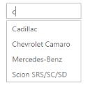
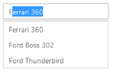
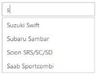
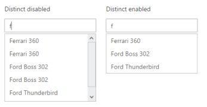
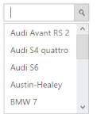
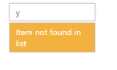

# Behavior Settings

## Filtering Type

AutoComplete textbox supports a wide range of filtering options to search items in the PopUp list. The FilterType takes enum or string values. The default value is StartsWith. Other supported values are Contains, EndsWith, LessThan, GreaterThan, GreaterThanOrEqual, LessThanOrEqual, Equal and NotEqual.

### Defining the Filter type

The following steps explain the configuration of the filtering conditions for an AutoComplete textbox.

1. In the View page, define the AutoComplete control and add the filter type as contains.



@*Refer to the DataSource defined in Local Data binding Step 1 *@

  <ej-autocomplete id="autocomplete" datasource="ViewBag.datasource" watermark-text="Select a car" filter-type="Contains">
        <e-autocomplete-fields text="Text" key="UniqueKey" />
    </ej-autocomplete>



The following image is the output for AutoComplete control that filters list items based on the ‘contains’ option.

AutoComplete using "contains" filterType
{:.caption}

## AutoFill

The AutoComplete textbox widget offers an AutoFill option. This feature is used to automatically fill the item when text is entered when EnableAutoFill is set to ‘true’. The first Item in the suggestions list that matches the entered text is automatically displayed in the AutoComplete textbox. The search text is selected in the AutoComplete textbox for identification. 

This feature reduces the need to type the entire text and makes the search box more efficient. This is used only with filterType “StartsWith”, since text is filled automatically based on the text entered.

### Configure AutoFill property in AutoComplete

The following steps explain how to enable the AutoFill property for an AutoComplete textbox.

1. In the View page, add the Autocomplete helper and enable the enable-auto-fill property



@*Refer to the DataSource defined in Local Data binding Step 1 *@

<ej-autocomplete id="autocomplete" datasource="ViewBag.datasource" watermark-text="Select a car" enable-auto-fill="true">
        <e-autocomplete-fields text="Text" key="UniqueKey" />
    </ej-autocomplete>

   



The following image is the output for AutoComplete when EnableAutoFill is set to ‘true’.

AutoComplete with AutoFill
{:.caption}

## Sorting Items

AutoComplete widget allows you to sort the suggestions list items and set the sorting order. To enable sorting, set allow-sorting to ‘true’. It is enabled by default. The sort-order property takes enum values, either in ascending or descending order.

### Steps to define sorting order and distinct

The following steps explain how to enable the sorting property for an AutoComplete textbox.

1. In the View page, define the AutoComplete control and enable the  allow-sorting.



@*Refer to the DataSource defined in Local Data binding Step 1 *@

    <ej-autocomplete id="autocomplete" datasource="ViewBag.datasource" watermark-text="Select a car" allow-sorting="true" sort-order="Descending">
        <e-autocomplete-fields text="Text" key="UniqueKey" />
    </ej-autocomplete>



The following image is the output for AutoComplete when “SortOrder” is configured.

AutoComplete PopUp sorted in descending order
{:.caption}

## Distinct List items

AutoComplete widget provides an option to extract repeating items in the PopUp list. By setting EnableDistinct property to ‘true’, you can prevent the duplicate items in the suggestions list.

### Steps to enable distinct items

The following steps explain you how to enable this property.

1. In the View page, define the AutoComplete control and configure the enable-distinct property.



@*Refer to the DataSource defined in Local Data binding Step 1 *@

    

        <h6>
            

                Distinct disabled
            
        </h6>

        <ej-autocomplete id="autocomplete" datasource="ViewBag.datasource" watermark-text="Select a car" allow-sorting="true" sort-order="Descending" enable-distinct="false">
            <e-autocomplete-fields text="Text" key="UniqueKey" />
        </ej-autocomplete>

    

    

        <h6>
            

                Distinct enabled
            
        </h6>
        <ej-autocomplete id="autocomplete1" datasource="ViewBag.datasource" watermark-text="Select a car" allow-sorting="true" sort-order="Descending" enable-distinct="true">
            <e-autocomplete-fields text="Text" key="UniqueKey" />
        </ej-autocomplete>
    



The following images are the outputs for AutoComplete when enable-distinct is set to “true” and “false”.

AutoComplete PopUp items with Distinct property disabled and enabled
{:.caption}

## Show Popup button

show-popup-button property provides you with an option to display an icon, to show the popup list in the AutoComplete widget.

### Enabling Popup button

The following steps explains you how to configure the Popup button for an AutoComplete textbox.

1. In the View page, define the AutoComplete control and enable show-popup-button property.

	

@*Refer to the DataSource defined in Local Data binding Step 1 *@

        <ej-autocomplete id="autocomplete" datasource="ViewBag.datasource" watermark-text="Select a car" show-popup-button="true">
            <e-autocomplete-fields text="Text" key="UniqueKey" />
        </ej-autocomplete>



The following image is the output for AutoComplete when ShowPopupButton is enabled.

AutoComplete with popup icon
{:.caption}

## Restrict editing

AutoComplete textbox widget provides ReadOnly property to disable editing in the control, so that the value set to AutoComplete can only be read and cannot be modified by the user. The value property allows you to set the default value for AutoComplete widget, when it is created.

### Configure AutoComplete textbox to restrict editing

The following steps help you to disable editing in an AutoComplete textbox.

1. In the View page, define the AutoComplete control and configure read-only property.



@*Refer to the DataSource defined in Local Data binding Step 1 *@

  <ej-autocomplete id="autocomplete" datasource="ViewBag.datasource" watermark-text="Select a car" show-popup-button="true" value="BMW 7" read-only="true">
            <e-autocomplete-fields text="Text" key="UniqueKey" />
  </ej-autocomplete>



The following image is the output for the AutoComplete textbox configured to restrict editing.

AutoComplete with readOnly property
{:.caption}

## Empty Result settings

The AutoComplete widget allows you to configure the display message when the list doesn’t return any values. By default, ShowEmptyResultText is set to ‘true’ and EmptyResultText is set to the string value “No suggestions_”._ 

### Configure Empty result setting

The following steps allow you to set text for empty results of an AutoComplete textbox.

1. In the View page, define the AutoComplete control and set the desired text message to be shown in empty-result-text.



@*Refer to the DataSource defined in Local Data binding Step 1 *@

        <ej-autocomplete id="autocomplete" datasource="ViewBag.datasource" watermark-text="Select a car" show-empty-result-text="true" empty-result-text="Item not found in list">
            <e-autocomplete-fields text="Text" key="UniqueKey" />
        </ej-autocomplete>



The following image is the output of the AutoComplete textbox when the list doesn’t return any value.

AutoComplete with customized EmptyResultText
{:.caption}

