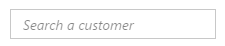
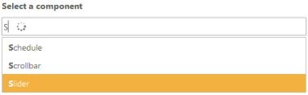
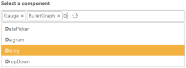
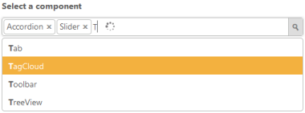

# Getting Started

This section allows you to learn and how to configure the AutoComplete control in your application. It also allows you to learn how to pass the required data to it.

## Create a Simple AutoComplete 

AutoComplete Textbox control basically renders with built-in features like keyboard navigation with animations and flexible API’s. You can easily create the AutoCompleteTextbox control by the following steps.

1. Refer the [Getting Started](https://help.syncfusion.com/aspnet-core/getting-started) page of the Introduction part to know more about the basic system requirements and the steps to configure the Syncfusion components in an ASP.NET Core application.
2. Once you have done all the basic configurations which is mentioned in the ASP.NET Core getting started page, Now you can create and deploy our AutoComplete Control.
3. Initialize the AutoComplete control in the view page by using the below code.

    

                <ej-autocomplete id="searchCustomer"  width="100%" watermark-text="Search a component">
                
                </ej-autocomplete>

    

4. After Execute the above code the AutoComplete control appears as follows

    

## Populate Data to AutoComplete

You can provide either local data or remote data to the Autocomplete.

### Local Data Binding

AutoComplete provides extensive data binding support to populate AutoComplete items, so that the values are mapped to the AutoComplete fields, namely Key and Text. DataBinding helps you bind a key value pair to AutoComplete textbox. Key field takes the unique id of the dataSource elements. Text field gets the value to be displayed in the AutoComplete textbox.

##### Defining the Local data for AutoComplete

The following steps explain local data binding to an AutoComplete textbox.

You need to add the class in the Models. Define the Class with key and text field. Then create a List of that class and add the data.

    

        public class ComponentsList
        {

            public int ComponentId { get; set; }
            public string ComponentName { get; set; }          
            public static List<ComponentsList> GetComponentsList()
            {
                List<ComponentsList> component = new List<ComponentsList>();
                component.Add(new ComponentsList { ComponentName = "Autocomplete" });
                component.Add(new ComponentsList { ComponentName = "Accordion" });
                component.Add(new ComponentsList { ComponentName = "BulletGraph" });
                component.Add(new ComponentsList { ComponentName = "Chart" });
                component.Add(new ComponentsList { ComponentName = "DatePicker" });
                component.Add(new ComponentsList { ComponentName = "Dialog" });
                component.Add(new ComponentsList { ComponentName = "Diagram" });
                component.Add(new ComponentsList { ComponentName = "DropDown" });
                component.Add(new ComponentsList { ComponentName = "Gauge" });
                component.Add(new ComponentsList { ComponentName = "Schedule" });
                component.Add(new ComponentsList { ComponentName = "Scrollbar" });
                component.Add(new ComponentsList { ComponentName = "Slider" });
                component.Add(new ComponentsList { ComponentName = "RangeNavigation" });
                component.Add(new ComponentsList { ComponentName = "Rating" });
                component.Add(new ComponentsList { ComponentName = "RichTextEditor" });
                component.Add(new ComponentsList { ComponentName = "Tab" });
                component.Add(new ComponentsList { ComponentName = "TagCloud" });
                component.Add(new ComponentsList { ComponentName = "Toolbar" });
                component.Add(new ComponentsList { ComponentName = "TreeView" });               
                return component;
            }
        }

    

In the controller page, you need to pass the model class to the corresponding view.

    

            public ActionResult Index()
            {
            
              return View(ComponentsList.GetComponentsList());  

            }

    

In the View page, add Autocomplete helper and map the Local data list to corresponding DataSource and AutoCompleteFields. You need to refer the model class at the top of the page.

    

        @model List<ApplicationName.Models.ComponentsList>
        

        

            
           
                <ej-autocomplete id="delimit" width="500" datasource="Model" >
                    <e-autocomplete-fields key="ComponentId" text="ComponentName" />
                </ej-autocomplete>
            
       
        

        

    

Run the above code now you can get AutoComplete Control with data source. Your output will be shown as below.

## Configure Visual Mode with filter option

By default AutoComplete allows you to select single value. We can select multiple values also by using MultiSelectMode property.

Two Types of Multiple Selections

1. Visual Mode     - Multiple Values are separated by delimiter character specified.
2. Delimiter Mode  - Multiple Values are separated by box model.
You can use available filter-type to show suggestions based on your filter. By default filter-type will be "StartsWith".



            <ej-autocomplete id="Visualmod" datasource="Model" width="100%" watermark-text="Search a component" multi-select-mode="@MultiSelectModeTypes.VisualMode" filter-type="StartsWith" >                
                <e-autocomplete-fields key="ComponentId" text="ComponentName" />
            </ej-autocomplete>
            


After execute the above code your output will be,

## Configure Highlight Search and Rounded corners

When you set the highlight-search property to 'true', the characters typed in textbox gets highlighted in the suggestion list. To display textbox reforms from sharp ends to rounded ends, you can enable the show-rounded-corner property.



        <ej-autocomplete id="Visualmod" datasource="Model" width="100%" watermark-text="Search a component" multi-select-mode="@MultiSelectModeTypes.VisualMode" filter-type="StartsWith"highlight-search="true" show-rounded-corner="true" >                
                <e-autocomplete-fields key="ComponentId" text="ComponentName" />
        </ej-autocomplete>
            


Run the above code and you will got output as given below,

## Configure Popup button

To enable Popup Button you have to set "show-popup-button" as "true". Now you can able to show suggestion list items either by clicking popup button or else by keyboard interaction.You can change the Popup icon as per your requirement by overriding through CSS.



     <ej-autocomplete id="Visualmod" datasource="Model" width="100%" watermark-text="Search a component" multi-select-mode="@MultiSelectModeTypes.VisualMode" filter-type="StartsWith"highlight-search="true" show-rounded-corner="true"  show-popup-button="true">                
                <e-autocomplete-fields key="ComponentId" text="ComponentName" />
     </ej-autocomplete>
            


Now the output will be as follows.

