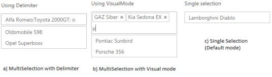

# MultiSelection modes

AutoComplete widget allows you to select multiple values from the suggestions list using the MultiSelectMode property. Multiple values are selected when MultiSelectMode value is set to VisualMode or Delimiter. 

Delimiter mode separates multiple items using a separator character defined. When the delimiter mode is set, you can define the delimiter character using DelimiterChar. It takes a single character and it is a symbol. 

VisualMode selects multiple items by enclosing the item in a rounded rectangle with a close icon to remove item from the selection.

## Configuring MultiSelection Mode

The following steps explain the configuration of the MultiSelectMode for an AutoComplete textbox.

1. In the View page, define the AutoComplete control and configure multiple selection mode.



@*Refer to the DataSource defined in Local Data binding Step 1 *@

    

        Using Delimiter

            <ej-autocomplete id="autocomplete" datasource="ViewBag.datasource" watermark-text="Select a car" multi-select-mode="@MultiSelectModeTypes.Delimiter" delimiter=";">
                <e-autocomplete-fields text="Text" key="UniqueKey" />
            </ej-autocomplete>

    

    

        Using VisualMode

        <ej-autocomplete id="autocomplete2" datasource="ViewBag.datasource" watermark-text="Select a car" multi-select-mode="@MultiSelectModeTypes.VisualMode">
            <e-autocomplete-fields text="Text" key="UniqueKey" />
        </ej-autocomplete>
    

    

        Single selection

        <ej-autocomplete id="autocomplete3" datasource="ViewBag.datasource" watermark-text="Select a car" multi-select-mode="@MultiSelectModeTypes.None">
            <e-autocomplete-fields text="Text" key="UniqueKey" />
        </ej-autocomplete>

    



The following image is the output for AutoComplete control with configured multiple selection.

_AutoComplete with MultiSelection_

