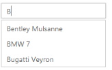

# Search Customization

## HighlightSearch

AutoComplete widget allows you to highlight the search text in the AutoComplete suggestions list using the highlight-search property. When this property is set to ‘true’, the suggestions list appear with the search text it contains is highlighted.

### Enabling highlightSearch option

The following steps explain how you can enable the highlight-search property for an AutoComplete textbox.

1. In the View page, define the AutoComplete control and enable the highlight-search property.



@*Refer to the DataSource defined in Local Data binding Step 1 *@

        <ej-autocomplete id="autocomplete" datasource="ViewBag.datasource" watermark-text="Select a car" highlight-search="true" filter-type="@FilterOperatorType.Contains" min-character="2">
            <e-autocomplete-fields text="Text" key="UniqueKey" />
        </ej-autocomplete>



The following image is the output for AutoComplete when HighlightSearch is set to ‘true’.

AutoComplete with highlightSearch enabled
{:.caption}

## Case-sensitive Search

AutoComplete allows you to enable case sensitivity to filter the suggest list items based on the entered text casing. This property enables strict filtering of list items based on entered text. To enable it, set CaseSensitiveSearch value to ‘true’. It is false, by default.

### Configure case sensitivity for AutoComplete

The following steps explain you how to enable the CaseSensitiveSearch property for an AutoComplete textbox.

1. In the View page, define the AutoComplete control and enable the CaseSensitiveSearch property.



@*Refer to the DataSource defined in Local Data binding Step 1 *@

@Html.EJ().Autocomplete("autocomplete")

    .Datasource((IEnumerable<CarsList>)ViewBag.datasource)

    .AutocompleteFields(field => field.Key("UniqueKey").Text("Text"))

.CaseSensitiveSearch(true)



The following image is the output for AutoComplete when CaseSensitiveSearch is set to ‘true’.

AutoComplete textbox with caseSensitiveSearch
{:.caption}

