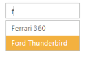

# State Persistence

AutoComplete widget can store the model value in the browser’s cookies. Every time after initial rendering, the control gets the model from the cookie only. Using EnablePersistence property you can store the model value in cookies. So when any changes are made dynamically, the values are updated in the cookie. On refreshing the page, the previous state of the AutoComplete control is maintained in the cookie and the control is rendered from it.

## Configure state persistence of AutoComplete

The following steps explain you how to enable state maintenance for AutoComplete.

1. In the View page, define the AutoComplete control and configure state persistence by using enable-persistence property.



@*Refer to the DataSource defined in Local Data binding Step 1 *@

    <ej-autocomplete id="autocomplete" datasource="ViewBag.datasource" enable-persistence="true">
        <e-autocomplete-fields text="Text" key="UniqueKey" />
    </ej-autocomplete>



The following image is the output for AutoComplete when EnablePersistence is set to ‘true’.

<table>
<tr>
<td>
{{ '' | markdownify }}
1. Autocomplete during value selection </td><td>
{{ '' | markdownify }}
2. Autocomplete after page refresh</td></tr>
</table>

AutoComplete with State maintenance
{:.caption}

