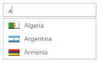

# Templates

You can provide a Template for customizing the appearance of the AutoComplete textbox suggestions. This is achieved by assigning a string template to the template property.

## Configuring Templates

The following steps explain you how to define a Template to display a text and image for an AutoComplete textbox.

1. Define DataSource elements with required template fields by using the Sprite CSS class names.



     public partial class AutocompleteController : Controller

     {

        List<Flags> flags = new List<Flags>();

        public ActionResult AutocompleteFeatures()

        {

			flags.Add(new Flags { Text = "Algeria", Sprite = "flag-dz" });

			flags.Add(new Flags { Text = "Armenia", Sprite = "flag-am" });

			flags.Add(new Flags { Text = "Brazil", Sprite = "flag-br" });

			flags.Add(new Flags { Text = "Bangladesh", Sprite = "flag-bd" });

			flags.Add(new Flags { Text = "Canada", Sprite = "flag-ca" });

			flags.Add(new Flags { Text = "Cuba", Sprite = "flag-cu" });

			flags.Add(new Flags { Text = "China", Sprite = "flag-cn" });

			flags.Add(new Flags { Text = "Denmark", Sprite = "flag-dk" });

			flags.Add(new Flags { Text = "Estonia", Sprite = "flag-ee" });

			flags.Add(new Flags { Text = "Egypt", Sprite = "flag-eg" });

			flags.Add(new Flags { Text = "France", Sprite = "flag-fr" });

			flags.Add(new Flags { Text = "Finland", Sprite = "flag-fi" });

			flags.Add(new Flags { Text = "Greenland", Sprite = "flag-gl" });

			flags.Add(new Flags { Text = "India", Sprite = "flag-in" });

			flags.Add(new Flags { Text = "Indonesia", Sprite = "flag-id" });

			flags.Add(new Flags { Text = "Malaysia", Sprite = "flag-my" });

			flags.Add(new Flags { Text = "Mexico", Sprite = "flag-mx" });

			flags.Add(new Flags { Text = "New Zealand", Sprite = "flag-nz" });

			flags.Add(new Flags { Text = "Netherlands", Sprite = "flag-nl" });

			flags.Add(new Flags { Text = "Norway", Sprite = "flag-no" });

			flags.Add(new Flags { Text = "Portugal", Sprite = "flag-pt" });

			flags.Add(new Flags { Text = "Poland", Sprite = "flag-pl" });

			flags.Add(new Flags { Text = "Qatar", Sprite = "flag-qa" });

			flags.Add(new Flags { Text = "Romania", Sprite = "flag-ro" });

			flags.Add(new Flags { Text = "Spain", Sprite = "flag-es" });

			flags.Add(new Flags { Text = "Singapore", Sprite = "flag-sg" });

			flags.Add(new Flags { Text = "Saudi Arabia", Sprite = "flag-sa" });

			flags.Add(new Flags { Text = "Thailand", Sprite = "flag-th" });

			flags.Add(new Flags { Text = "Tursprite", Sprite = "flag-tr" });

			flags.Add(new Flags { Text = "Ukraine", Sprite = "flag-ua" });

			flags.Add(new Flags { Text = "United States", Sprite = "flag-us" });

			flags.Add(new Flags { Text = "Uruguay", Sprite = "flag-uy" });

			flags.Add(new Flags { Text = "Viet Nam", Sprite = "flag-vn" });

			ViewBag.datasource = flags;

			return View();

		} 

     }

     public class Flags

     {
		 public string Text { get; set; }

		 public string Sprite { get; set; }

     } 


   

2. Configure template structure for AutoComplete control as follows, including a 
 element with image and text in every row of the popup panel. Assign the corresponding variable name within ${<field name>} to map them into the list.



  <ej-autocomplete id="autocomplete" datasource="ViewBag.datasource" template="

 ${Text} ">
        <e-autocomplete-fields text="Text" key="UniqueKey" group-by="Category" />
    </ej-autocomplete>


   

3. Define the CSS classes for the sprite images. You can find the images in the following location:

[Installed Drive]:\Users\[user name]\AppData\Local\Syncfusion\EssentialStudio\X.X.X.X\MVC\Samples\web\Images\autocomplete\flags.png





The following image is the output for AutoComplete widget with Template support.

AutoComplete with Custom template
{:.caption}
