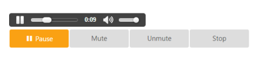
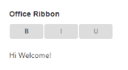
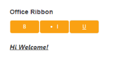

# Getting Started with ASP.NET Core Button

This section explains you briefly on how to create a Button in your application with ASP.NET Core.

## Create your first Button in ASP.NET Core

Essential ASP.NET Core Button provides support to display a Button control within your web page and allows you to Click, Toggle Click, Reset, and Submit. Using the following guidelines, you can customize Button for a real-time Multimedia player scenario. This allows you to Play, Pause, Stop, Mute, Un-mute a music player. 

The following screenshot illustrates the functionality of Button in Multimedia player control.

Multimedia Player
{:.caption}

## Create Button Control

Essential ASP.NET Core Button control contains built-in features like Click and different display option. You can easily create the Button control by using Tag helper as follows.

1. You can create a .NetCore Project with the help of the given [ASP.NET Core-Getting Started](https://help.syncfusion.com/aspnet-core/gettingstarted/getting-started-1-1-0) documentation.
2. Add the following code example to the corresponding view page to render Button.



/*ej-Tag Helper code to render Button*/

  <table>
        <tr>
            <td>
                <ej-toggle-button id="Bold"
                                  active-text="Pause"
                                  default-text="Play"
                                  active-prefix-icon="e-icon e-mediapause"
                                  default-prefix-icon="e-icon e-mediaplay"
                                  toggle-state="true"
                                  content-type="TextAndImage"
                                  show-rounded-corner="true"
                                  size="Large" 
                                  create="play"
                                  click="pause"
                                  change="play"/>
            </td>
            <td>
                <ej-button id="mute"
                           size="Large" show-rounded-corner="true" text="Mute" />
            </td>
            <td>
                <ej-button id="unmute"
                           size="Large" show-rounded-corner="true" text="UnMute" />
            </td>
            <td>
                <ej-button id="stop"
                           size="Large" show-rounded-corner="true" text="Stop" />
            </td>
        <tr>
    </table>





/*Razor code to render Button*/
 
    <table>
      <tr>
        <td>
          @{ Html.EJ().ToggleButton("Bold").ActiveText("Pause").DefaultText("Play").ActivePrefixIcon("e-icon e-mediapause").DefaultPrefixIcon("e-icon e-mediaplay").ToggleState(true).ContentType(ContentType.TextAndImage).ShowRoundedCorner(true).Size(ButtonSize.Large).ClientSideEvents(e => e.Create("play").Click("pause").Change("play")).Render(); }
        </td>
        <td>
         @{   Html.EJ().Button("mute").Size(ButtonSize.Large).ShowRoundedCorner(true).Text("Mute").Render();}
        </td>
        <td>
          @{ Html.EJ().Button("unmute").Size(ButtonSize.Large).ShowRoundedCorner(true).Text("UnMute").Render(); }
        </td>
        <td>
          @{ Html.EJ().Button("stop").Size(ButtonSize.Large).ShowRoundedCorner(true).Text("Stop").Render(); }
        
        </td>
     </tr>
    </table>



N> To render the Button Control you can use either Razor or Tag helper code as given in the above code snippet.

### Create Multimedia Player

1. Add the Action Result for Audio control in HomeController.cs file.

   ~~~ csharp

	public ActionResult MyAudio()

	{

		var file = Server.MapPath("../song.mp3");

		return File(file, "audio/mp3");

	}

   ~~~
  

2. Add the following code example to your view page to display Audio control and render the Button.



/*ej-Tag Helper code to render Button*/
   

    <audio controls>

        <source src="@Url.Action("MyAudio","Home")" type="audio/mp3" />

        
Your browser does not support HTML 5 audio element

    </audio>

    <table>
        <tr>
            <td>
                <ej-toggle-button id="Bold"
                                  active-text="Pause"
                                  default-text="Play"
                                  active-prefix-icon="e-icon e-mediapause"
                                  default-prefix-icon="e-icon e-mediaplay"
                                  toggle-state="true"
                                  content-type="TextAndImage"
                                  show-rounded-corner="true"
                                  size="Large" 
                                  create="play"
                                  click="pause"
                                  change="play"/>
            </td>
            <td>
                <ej-button id="mute"
                           size="Large" show-rounded-corner="true" text="Mute" click="mute">

            </td>
            <td>
                <ej-button id="unmute"
                           size="Large" show-rounded-corner="true" text="UnMute" click="unMute">

            </td>
            <td>
                <ej-button id="stop"
                           size="Large" show-rounded-corner="true" text="Stop" click="stop">

            </td>
        <tr>
    </table>





/*Razor code to render Button*/
 
    <table>
      <tr>
        <td>
          @{ Html.EJ().ToggleButton("Bold").ActiveText("Pause").DefaultText("Play").ActivePrefixIcon("e-icon e-mediapause").DefaultPrefixIcon("e-icon e-mediaplay").ToggleState(true).ContentType(ContentType.TextAndImage).ShowRoundedCorner(true).Size(ButtonSize.Large).ClientSideEvents(e => e.Create("play").Click("pause").Change("play")).Render(); }
        </td>
        <td>
         @{   Html.EJ().Button("mute").Size(ButtonSize.Large).ShowRoundedCorner(true).Text("Mute").Render();}
        </td>
        <td>
          @{ Html.EJ().Button("unmute").Size(ButtonSize.Large).ShowRoundedCorner(true).Text("UnMute").Render(); }
        </td>
        <td>
          @{ Html.EJ().Button("stop").Size(ButtonSize.Large).ShowRoundedCorner(true).Text("Stop").Render(); }
        
        </td>
     </tr>
    </table>



3. Add the following event function to script section in your view page to use Button control feature as the Multimedia player control.





4. The following screenshot displays Multimedia player control.

Multimedia Player Control
{:.caption}

### Create Office Ribbon

In this section, you can learn how to create a Microsoft Office Ribbon used to change the style of the selected text. You can achieve this by using ASP.NET Core Toggle Button control. You can change the styles by toggling the Button. Add the following code example to your view page to display OfficeRibbon control and render the Button.



/*ej-Tag Helper code to render Button*/

<table>
   <tr>
     <td>                 
                    <ej-toggle-button id="Bold"
                              size="Mini"
                              show-rounded-corner="true"
                              default-text="<b>B</b>"
                              active-text="B"
                              click="bold" />
      </td>
       <td>

                    <ej-toggle-button id="italic"
                              size="Mini"
                              show-rounded-corner="true"
                              default-text="I"
                              active-text="<li>I</li>"
                              click="italic" />
       </td>

        <td>
                    <ej-toggle-button id="underline"
                              size="Mini"
                              show-rounded-corner="true"
                              default-text="U"
                              active-text="<u>U</u>"
                              click="underline"/>

        </td>

      </tr>
 </table>





/*Razor code to render Button*/

    <table>
      <tr>
        <td>
           @{ Html.EJ().ToggleButton("Bold").Size(ButtonSize.Mini).ShowRoundedCorner(true).DefaultText("<b>B</b>").ActiveText("B").ClientSideEvents(e => e.Click("bold")).Render();  }
        </td>
        <td>
            @{ Html.EJ().ToggleButton("italic").Size(ButtonSize.Mini).ShowRoundedCorner(true).DefaultText("I").ActiveText("<li>I</li>").ClientSideEvents(e => e.Click("italic")).Render();  }
        </td>
        <td>
            @{ Html.EJ().ToggleButton("underline").Size(ButtonSize.Mini).ShowRoundedCorner(true).DefaultText("U").ActiveText("<u>U</u>").ClientSideEvents(e => e.Click("underline")).Render();  }
        </td>
     </tr>
    </table>



1. Add the following code example in your view page for sample text.



		

			Hi Welcome!

		


  

2. Add the following event function to the script section in your view page to use Button control feature as the Multimedia player control.




  

3. The following screenshots display Office Ribbon control.

Office Ribbon before  applying the styles
{:.caption}

Office Ribbon after applying the styles
{:.caption}
