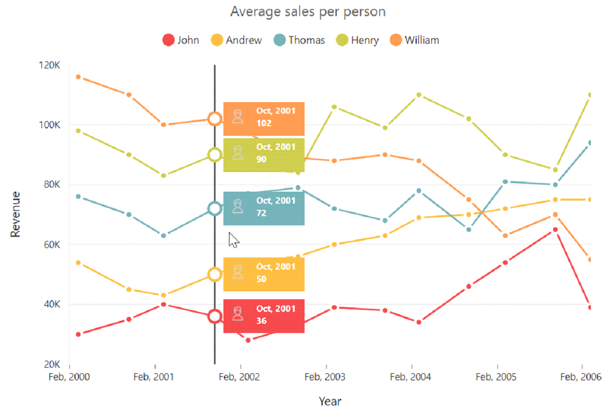

# User Interactions

## Tooltip

### Enable tooltip for data point

Tooltip for the data points can be enabled by using the **Visible** option of the **Tooltip** in the series.



<ej-chart id="chartContainer">
    // ...
    <e-chart-series>
        <e-series>
            <e-chart-tooltip visible="true"></e-chart-tooltip>
        </e-series>
    </e-chart-series>
    // ...
</ej-chart>



### Format the tooltip 

Tooltip displays the data that is specified by the **Format** option of the tooltip. The default value of the format option is **#point.x# : #point.y#**. Here, **#point.x#** is the placeholder for x value of the point, and **#point.y#** is the placeholder for y value of the point.

You can also use **#series.<optionname>#** to placeholder to display the value of an option in corresponding series and use **#point.<optionname>#** as placeholder to display the value of an option in the corresponding point.



<ej-chart id="chartContainer">
    // ...
    <e-chart-series>
        <e-series>
            <e-chart-tooltip format="#series.name#   #point.x# : #point.y#  (g/kWh)"></e-chart-tooltip>
        </e-series>
    </e-chart-series>
    // ...
</ej-chart>



### Tooltip template

HTML elements can be displayed in the tooltip by using the **Template** option of the tooltip. The template option takes the value of the id attribute of the HTML element. You can use the **#point.x#** and **#point.y#** to placeholders in the HTML element to display the x and y values of the corresponding data point. 

You can also use **#series.<optionname>#** as placeholder to display the value of an option in corresponding series of the tooltip and use **#point.<optionname>#** as placeholder to display the value of an option in the corresponding point for the tooltip, which is displayed.
  



<!-- Create Tooltip template here -->

            
 
 
  

    

        

            <label id="efpercentage">&nbsp;#point.y#% </label>
            <label id="ef">Efficiency </label>
        

    

<ej-chart id="chartContainer">
    // ...
    <e-chart-series>
        <e-series>
            <e-chart-tooltip template="Tooltip"></e-chart-tooltip>
        </e-series>
    </e-chart-series>
    // ...
</ej-chart>



#### Tooltip template animation

You can enable animation by setting the **EnableAnimation** to true. Tooltip animates when the mouse moves from one data point to another point. The **Duration** property in tooltip specifies the time taken to animate the tooltip. The duration is set to 500ms, by default.

N> Tooltip is animated only if the template is specified for tooltip.



<ej-chart id="chartContainer">
    // ...
    <e-chart-series>
        <e-series>
            <e-chart-tooltip enable-animation="true" duration="1000ms"></e-chart-tooltip>
        </e-series>
    </e-chart-series>
    // ...
</ej-chart>



### Customize the appearance of tooltip   

The **Fill** and **Border** options are used to customize the background color and border of the tooltip, respectively. The **Font** option in the tooltip is used to customize the font of the tooltip's text.



<ej-chart id="chartContainer">
    // ...
    <e-chart-series>
        <e-series>
            <e-chart-tooltip fill="#FF9933">
            </e-chart-tooltip>
        </e-series>
    </e-chart-series>
    // ...
</ej-chart>



#### Tooltip with rounded corners

The options *RX* and *RY* are used to customize the corner radius of the tooltip's rectangle.



<ej-chart id="chartContainer">
    // ...
    <e-chart-series>
        <e-series>
            <e-chart-tooltip rx="50" ry="50">
            </e-chart-tooltip>
        </e-series>
    </e-chart-series>
    // ...
</ej-chart>



## Zooming and panning

### Enable zooming

You can zoom the chart in the following two ways:

* When the **Zooming.Enable** option is set to true, you can zoom the chart by using the rubber band selection.

* When the **Zooming.EnableMouseWheel** option is set to true, you can zoom the chart on mouse wheel scrolling.

* When **Zooming.EnablePinching** option is set to *true*, you can zoom the chart through pinch gesture.

N> Pinch zooming is supported only in browsers that support multi-touch gestures. Currently, Internet Explorer 10, Internet Explorer 11, Google Chrome, and Opera browsers support multi-touch in desktop devices.



<ej-chart id="chartContainer">
    // ...
    <e-zooming enable="true"></e-zooming>
    // ...
</ej-chart>



After zooming the chart, a zooming toolbar will appear with options to zoom, pan, and reset. Selecting the Pan option will allow to pan the chart and selecting the Reset option will allow reset the zoomed chart.

### Types of zooming

The **Type** option in zooming specifies whether the chart is allowed to scale along with horizontal axis(X), vertical axis(Y), or both axes(X,Y). The default value is "X,Y" (both axis).



<ej-chart id="chartContainer">
    // ...
    <e-zooming enable="true" type="x"></e-zooming>
    // ...
</ej-chart>



### Customizing zooming toolbar

You can choose the items to be displayed in the zooming toolbar by specifying the **ToolBarItems** property.



@{ 
    List<string> items = new List<string>() { "reset”, “zoomIn", "zoomOut" };
}
<ej-chart id="chartContainer">
    // ...
    <e-zooming enable="true" toolbar-items="items"></e-zooming>
    // ...
</ej-chart>



### Enable scrollbar

Chart provides scrollbar support to view other portions of chart area, which is not shown in the view port. By setting **EnableScrollbar** option to true in **Zooming**, you can view the other portions.  



<ej-chart id="chartContainer">
    // ...
    <e-zooming enable="true" enable-scrollbar="true"></e-zooming>
    // ...
</ej-chart>



## Crosshair

Crosshair is used to view the value of an axis at mouse position or touch contact point. 

### Enable crosshair and crosshair label

Crosshair can be enabled by using the **Visible** option in the crosshair. Crosshair label for an axis can be enabled by using the **Visible** option of CrosshairLabel in the corresponding axis.



<ej-chart id="chartContainer">
    // ...
    <e-primary-x-axis><e-crosshair-label visible="true"></e-crosshair-label></e-primary-x-axis>
    <e-primary-y-axis><e-crosshair-label visible="true"></e-crosshair-label></e-primary-y-axis>
    <e-crosshair visible="true"></e-crosshair>
    // ...
</ej-chart>



### Customize the crosshair line and crosshair label

The Fill and Border options of the **CrosshairLabel** are used to customize the background color and border of the crosshair label, respectively. Color and width of the crosshair line can be customized by using the **Line** option in the Crosshair.



 <ej-chart id="chartContainer">
    // ...
    <e-primary-x-axis><e-crosshair-label visible="true" fill="red"></e-crosshair-label><e-border color="green" width="2"></e-border></e-primary-x-axis>
    <e-crosshair visible="true"><e-line color="grey" width="2"></e-line></e-crosshair>
    // ...
</ej-chart>



## Trackball

Trackball is used to track a data point close to the mouse position or touch contact point. Trackball marker indicates the closest point. Trackball tooltip displays the information about the point.

### Enable trackball

Trackball can be enabled by setting the **Visible** option of the crosshair to true and Type as **Trackball**. The default value of type is **Crosshair**.



<ej-chart id="chartContainer">
    // ...
    <e-crosshair visible="true" type="Trackball"></e-crosshair>
    // ...
</ej-chart>



#### Customize trackball marker and trackball line

Shape and size of the trackball marker can be customized by using the **Shape** and **Size** options of the crosshair marker. Color and width of the trackball line can be customized by using the **Line** option in the crosshair.



<ej-chart id="chartContainer">
    // ...
    <e-crosshair visible="true" type="Trackball">
        <e-line color="#800000" width="2"></e-line>
        <e-marker visible="true" shape="Pentagon">
            <e-Size height="9" width="9">
            </e-Size>
        </e-marker>
    </e-crosshair>
    // ...
</ej-chart>



### Format trackball tooltip

X and Y values, which were displayed in the trackball tooltip are formatted based on its axis **LabelFormat**.  



<ej-chart id="chartContainer">
    // ...
    <e-primary-x-axis label-format="MMM, yyyy">      
    </e-primary-x-axis>
    <e-primary-y-axis label-format="{value}K">
    </e-primary-y-axis>
    <e-crosshair visible="true">
    </e-crosshair>
    // ...
</ej-chart>



You can show the trackball tooltip in two modes by using **trackballTooltipSettings**.

1.	Grouping
2.	Float



<ej-chart id="chartContainer">
    // ...
    <e-crosshair visible="true" type="Trackball">
        <e-trackball-tooltip-settings rx="3" ry="3" fill="whitesmoke" mode="Grouping">
            <e-border width="1" color="grey"></e-border>
        </e-trackball-tooltip-settings>
    </e-crosshair>
    // ...
</ej-chart>



#### Trackball tooltip template:
Trackball tooltip template is used to display the tooltip in customized template format. You can define the desired template in css style. You can enable the **toolTipTemplate**  by using the following code snippet.



<ej-chart id="chartContainer">
    // ...
    <e-crosshair visible="true" type="Trackball">
        <e-trackball-tooltip-settings tooltipTemplate="template" mode="Float">
        </e-trackball-tooltip-settings>
    </e-crosshair>
    // ...
</ej-chart>



## Highlight

Chart provides highlighting support for the series and data points on mouse hover. To enable the highlighting option, set the **Enable** property to true in the **HighlightSettings** of the series.

N> When hovering the mouse on the data points, the corresponding series legend also will be highlighted.



<ej-chart id="chartContainer">
    // ...
    <e-chart-series>
        <e-series>
            <e-highlight-settings enable="true"></e-highlight-settings>
        </e-series>
    </e-chart-series>
    // ...
</ej-chart>



### Highlight mode

You can set three different highlight modes for the highlighting data point and series by using the **Mode** property of the **HighlightSettings**.

* Series
* Points
* Cluster

**Series mode**

To highlight all the data points of the specified series, set the **Series** value to the Mode option in the **HighlightSettings**. 



<ej-chart id="chartContainer">
    // ...
    <e-chart-series>
        <e-series>
            <e-highlight-settings mode="Series"></e-highlight-settings>
        </e-series>
    </e-chart-series>
    // ...
</ej-chart>



**Point mode**

To highlight a single point, set the **Point** value to the Mode option.



<ej-chart id="chartContainer">
    // ...
    <e-chart-series>
        <e-series>
            <e-highlight-settings mode="Point"></e-highlight-settings>
        </e-series>
    </e-chart-series>
    // ...
</ej-chart>



**Cluster mode**

To highlight the points that corresponds to the same index in all the series, set the **Cluster** value to the Mode option.



<ej-chart id="chartContainer">
    // ...
    <e-chart-series>
        <e-series>
            <e-highlight-settings mode="Cluster"></e-highlight-settings>
        </e-series>
    </e-chart-series>
    // ...
</ej-chart>



### Customize the highlight styles

To customize the highlighted series, use the Color, Border, and Opacity options in the **HighlightSettings**.



<ej-chart id="chartContainer">
    // ...
    <e-chart-series>
        <e-series>
            <e-highlight-settings opacity="0.5" color="green">
                <e-border color="red" width="1.5"></e-border>
            </e-highlight-settings>
        </e-series>
    </e-chart-series>
    // ...
</ej-chart>



### Patterns to highlight

Chart provides pattern support for highlighting the data by setting the value to the **Pattern** property of the **HighlightSettings**. The different types of highlight patterns are follows:

1.	Chessboard
2.	Crosshatch
3.	Dots
4.	Pacman
5.	Grid
6.	Turquoise
7.	Star
8.	Triangle
9.	Circle
10.	Tile
11.	HorizontalDash
12.	VerticalDash
13.	Rectangle
14.	Box
15.	VerticalStripe
16.	HorizontalStripe
17.	Bubble
18.	DiagonalBackward
19.	DiagonalForward 



<ej-chart id="chartContainer">
    // ...
    <e-chart-series>
        <e-series>
            <e-highlight-settings pattern="Chessboard">
            </e-highlight-settings>
        </e-series>
    </e-chart-series>
    // ...
</ej-chart>



#### Custom pattern

To create a custom pattern for highlighting the data points, set the pattern type as **Custom**, and add the custom pattern ID in the **CustomPattern** option of the HighlightSettings.



<svg>
    <pattern id="dots_a" patternUnits="userSpaceOnUse" width="6" height="6">
        <rect x="0" y="0" width="6" height="6" transform="translate(0,0)" fill="black" opacity="1"></rect>
        <path d='M 3 -3 L -3 3 M 0 6 L 6 0 M 9 3 L 3 9'stroke-width="1" stroke="white"></path>
    </pattern>
</svg>
<ej-chart id="chartContainer">
    // ...
    <e-chart-series>
        <e-series>
            <e-highlight-settings pattern="Custom" custom-pattern="dots_a" enable="true">
            </e-highlight-settings>
        </e-series>
    </e-chart-series>
    // ...
</ej-chart>



## Selection

Chart provides selection support for the series and data points on mouse click. To enable the selection option, set the **Enable** property to true in the **SelectionSettings** of the series.

N> When mouse is clicked on the data points, the corresponding series legend also will be selected.



<ej-chart id="chartContainer">
    // ...
    <e-chart-series>
        <e-series>
            <e-selection-settings enable="true">
            </e-selection-settings>
        </e-series>
    </e-chart-series>
    // ...
</ej-chart>



### Selection mode

You can set four different selection modes for highlighting the data point and series by using the **Mode** property of the **SelectionSettings**.

* Series
* Points
* Cluster
* Range

**Series mode**

To select all the data points of the specified series, set the **Series** value to Mode in the **SelectionSettings**.



<ej-chart id="chartContainer">
    // ...
    <e-chart-series>
        <e-series>
            <e-selection-settings mode="Series" pattern="Chessboard" enable="true">
            </e-selection-settings>
        </e-series>
    </e-chart-series>
    // ...
</ej-chart>



**Point mode**

To highlight a single point, set the **Point** value to the Mode. 



<ej-chart id="chartContainer">
    // ...
    <e-chart-series>
        <e-series>
            <e-selection-settings mode="Point" enable="true">
            </e-selection-settings>
        </e-series>
    </e-chart-series>
    // ...
</ej-chart>



**Cluster mode**

To select the points that corresponds to the same index in all the series, set the **Cluster** value to Mode.



<ej-chart id="chartContainer">
    // ...
    <e-chart-series>
        <e-series>
            <e-selection-settings mode="Cluster" enable="true">
            </e-selection-settings>
        </e-series>
    </e-chart-series>
    // ...
</ej-chart>



**Range mode**

To fetch the selected area data points value, set the **selectionSettings** Mode to **Range** in the chart series. The selection rectangle can be drawn as horizontally, vertically, or in both directions by using **RangeType** property, and selected data are returned as an array collection in the **RangeSelected** event.  



<ej-chart id="chartContainer" range-selected="rangeSelection">
    // ...
    <e-chart-series>
        <e-series>
            <e-selection-settings mode="Range" range-type="XY" enable="true">
            </e-selection-settings>
        </e-series>
    </e-chart-series>
    // ...
</ej-chart>

 
 
   

//event to fetch the selected data point values
rangeSelection:function (sender){
var selectedData = sender.data.selectedDataCollection;
//...
}



### Selection type

You can set two different selection types for selecting the data point and series on mouse click by using the **Type** property of the **SelectionSettings**. 

* Single 
* Multiple 

**Single type**

To select a data point or a series on mouse click based on the **SelectionSettings.Mode**, set **SelectionSettings.Type** to **Single** in the series.



<ej-chart id="chartContainer">
    // ...
    <e-chart-series>
        <e-series>
            <e-selection-settings mode="Series" type="Single" enable="true">
            </e-selection-settings>
        </e-series>
    </e-chart-series>
    // ...
</ej-chart>



**Multiple type**

For selecting multiple data points or series on mouse click, set **SelectionSettings.Type** to **Multiple** in the series.



<ej-chart id="chartContainer">
    // ...
    <e-chart-series>
        <e-series>
            <e-selection-settings mode="Series" type="Multiple" enable="true">
            </e-selection-settings>
        </e-series>
    </e-chart-series>
    // ...
</ej-chart>



### Customizing selection styles

To customize the selection styles, use Color, Border and Opacity options in the SelectionSettings.



<ej-chart id="chartContainer">
    // ...
    <e-chart-series>
        <e-series>
            <e-selection-settings enable="true" opacity="0.5" color="red">
                <e-border color="red" width="1.5"></e-border>
            </e-selection-settings>
        </e-series>
    </e-chart-series>
    // ...
</ej-chart>



### Patterns for selection

Chart provides pattern support for the data selection by setting the value to **Pattern** property of **SelectionSettings**. The different types of selection patterns are follows:

1.	Chessboard
2.	Crosshatch
3.	Dots
4.	Pacman
5.	Grid
6.	Turquoise
7.	Star
8.	Triangle
9.	Circle
10.	Tile
11.	HorizontalDash
12.	VerticalDash
13.	Rectangle
14.	Box
15.	VerticalStripe
16.	HorizontalStripe
17.	Bubble
18.	DiagonalBackward
19.	DiagonalForward 



<ej-chart id="chartContainer">
    // ...
    <e-chart-series>
        <e-series>
            <e-selection-settings enable="true" pattern="DiagonalForward">
            </e-selection-settings>
        </e-series>
    </e-chart-series>
    // ...
</ej-chart>



#### Custom pattern

To create a custom pattern for selecting the data points, set the **Pattern** type to **Custom**, and add custom pattern ID in the **CustomPattern** option of the **SelectionSettings**.



<svg>
    <pattern id="dots_a" patternUnits="userSpaceOnUse" width="6" height="6">
        <rect x="0" y="0" width="6" height="6" transform="translate(0,0)" fill="black" opacity="1"></rect>
        <path d='M 3 -3 L -3 3 M 0 6 L 6 0 M 9 3 L 3 9'stroke-width="1" stroke="white"></path>
    </pattern>
</svg>
<ej-chart id="chartContainer">
    // ...
    <e-chart-series>
        <e-series>
            <e-selection-settings enable="true" pattern="Custom" custom-pattern="dots_a">
            </e-selection-settings>
        </e-series>
    </e-chart-series>
    // ...
</ej-chart>



### Handling series selection

To get the series information when selecting the specific series, subscribe to the **SeriesRegionClick** event, and set the **SelectionSettings.Mode** to Series.



<ej-chart id="chartContainer" series-region-click="seriesSelection">
    // ...
    <e-chart-series>
        <e-series>
            <e-selection-settings enable="true" mode="Series">
            </e-selection-settings>
        </e-series>
    </e-chart-series>
    // ...
</ej-chart>





function seriesSelection(sender) {
    //Get Series information on series selection
    var seriesData = sender.series;
}



### Selection on load

You can select the point/series programmatically on chart load by setting series and point index in the **selectedDataPointIndexes** property.



<ej-chart id="chartContainer">
    // ...
    <e-selected-data-point-indexes>
        <e-selected-data-point-index series-index="0" point-index="2"></e-selected-data-point-index>
        <e-selected-data-point-index series-index="1" point-index="4"></e-selected-data-point-index>
    </e-selected-data-point-indexes>
    // ...
</ej-chart>



## Data editing

Chart provides support to change the location of the rendered points. This can be done by dragging the point and dropping it on another location in chart. To enable the data editing, set the **enable** property to true in the **dragSettings** of the series.



<ej-chart id="chartContainer">
    // ...
    <e-common-series-options><e-drag-options enable="true"></e-drag-options></e-common-series-options>
    // ...
</ej-chart>



### Customize dragging direction

To drag the point along x and y axes, specify type to xy in **dragSettings**. To drag along x axis alone, specify the type to x. To drag along y axis, specify type as y.



<ej-chart id="chartContainer">
    // ...
    <e-common-series-options><e-drag-options type="Y"></e-drag-options></e-common-series-options>
    // ...
</ej-chart>



