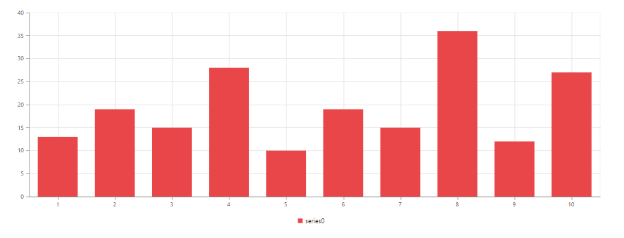

# Working with Data

## Local Data

The local data can be provided to chart by using the following two ways:

1. Bind the data to chart by using the **DataSource** property of the series, and then map the X and Y values with *XName* and *YName* properties, respectively.

N> For **OHLC** type series, you should map four data source fields, namely *High*, *Low*, *Open*, and *Close* to bind the data source. For **bubble** series, you should map the *Size* field along with the *XName* and *YName* properties. 



    <ej-chart id="chart" load="onChartLoad"></ej-chart>





var chartData = [
          { month: 'Jan', sales: 35 }, { month: 'Feb', sales: 28 },  { month: 'Mar', sales: 34 },
          { month: 'Apr', sales: 32 },{ month: 'May', sales: 40 },{ month: 'Jun', sales: 32 },
          { month: 'Jul', sales: 35 },  { month: 'Aug', sales: 55 }, { month: 'Sep', sales: 38 },
          { month: 'Oct', sales: 30 }, { month: 'Nov', sales: 25 }, { month: 'Dec', sales: 32 }];
          
    function onChartLoad(sender) {
        sender.model.series[0].dataSource = chartData;
        sender.model.series[0].xName = "month";
        sender.model.series[0].yName = "sales";
    }
   


2. You can also plot the data to chart by using **Points** option in the series. By using this option, you can customize each and every point in the data.



<ej-chart id="chart">
    <e-chart-series>
        <e-series>
            <e-points>
                <e-point x="John" y="10000"></e-point>
                <e-point x="Jake" y="12000"></e-point>
                <e-point x="Petter" y="18000"></e-point>
                <e-point x="James" y="11000"></e-point>
                <e-point x="Mary" y="9700"></e-point>
            </e-points>
        </e-series>
    </e-chart-series>
</ej-chart>



## Remote Data

The remote data can be provided to the chart by using the DataManager option. You can use the **query** property of the series to filter the data from the data source.


    <ej-chart id="container">
            <e-chart-series>
                <e-series type="Column" query="ej.Query().from('Orders').take(10)" x-name="ShipCity" y-name="Freight" >
                    <e-datamanager url="http://mvc.syncfusion.com/Services/Northwnd.svc/" cross-domain="true"></e-datamanager>
                </e-series>
            </e-chart-series>
        </ej-chart>


