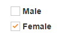
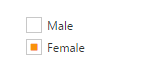
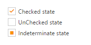
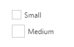
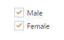
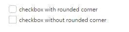

# Easy customization

## Checked state

Using checked property, you can set the state of Checkbox. When checked property is true then tick mark is displayed and Checkbox is in checked state. When it is false, the tick mark is not displayed is in non tri-state and Checkbox is in unchecked state. When you want to use this checked property, then checkbox should be in non Tri-state and enable-tri-state property should be false.



/*ej-Tag Helper code to render CheckBox*/

@*Add the code in CSHTML page to configure and initialize the control*@

@* set the state for non Tri-state checkbox using Checked property*@

    <ej-check-box id="checkbox" checked="false" />
    <label for="checkbox_unchecked" class="clslab">Male</label>

     
    <ej-check-box id="checkbox1" checked="true" />
    <label for="checkbox_checked" class="clslab">Female</label>





/*Razor code to render CheckBox*/

    @{ Html.EJ().CheckBox("checkbox").Checked(false).Render();}
    <label for="checkbox_unchecked" class="clslab">Male</label>

    @{ Html.EJ().CheckBox("checkbox1").Checked(true).Render();}
    <label for="checkbox_checked" class="clslab">Female</label>



N> To render the CheckBox Control you can use either Razor or Tag helper code as given in the above code snippet.

Execute the above code to render the following output.

Checkbox in binary states
{:.caption}

## Enable Tri-State

Sometimes, it is essential for you to represent the answer in partially true state. To represent the partially true types, an indeterminate state option is present. The state between checked and unchecked state is called indeterminate state. For example, a Checkbox presented to select files to send via [FTP](http://en.wikipedia.org/wiki/File_Transfer_Protocol) can use a [tree view](http://en.wikipedia.org/wiki/Tree_view) so that files can be selected one at a time, or by folder. When only some of the files in a folder are selected, then the checkbox for that folder could be in indeterminate state.

When you enable Tri-state, then the Checkbox includes the indeterminate state. The Checkbox has three states. Enable the enable-tri-state  property specifies to enable or disable the Tri-State option for Checkbox. 

The following steps explains you the details about rendering the Checkbox with Tri-state options.



/*ej-Tag Helper code to render CheckBox*/

@*Add the code in CSHTML page to configure and initialize the control*@

@* Enable or disable the Tri-state using enable-tri-stat property *@

    <ej-check-box id="checkbox" enable-tri-state="false" text="Male"/>
     
    <ej-check-box id="checkbox1" text="Female" enable-tri-state="true" />





/*Razor code to render CheckBox*/

    @{ Html.EJ().CheckBox("checkbox11").EnableTriState(false).Text("Male").Render();}
     
    @{ Html.EJ().CheckBox("checkbox12").EnableTriState(true).Text("Female").Render();}



Execute the above code to render the following output.

Checkbox with Non-Tri state and Tri-state
{:.caption}

## Check State

You require an option to set indeterminate state for Checkbox. By using check-state property, you can set any state that is illustrated in following table. Before using this property, enable the tristate for Checkbox. enable-tri-state property is set true.

_List of check states_

<table>
<tr>
<td>
Check</td><td>
Check box will be in checked state</td></tr>
<tr>
<td>
Uncheck</td><td>
Check box will be in un-checked state</td></tr>
<tr>
<td>
Indeterminate</td><td>
Check box will be in indeterminate state</td></tr>
</table>

The following steps explains you the details about rendering the Checkbox with specified checked state, when the checkbox is in tri-state.



/*ej-Tag Helper code to render CheckBox*/

@*Add the code in CSHTML page to configure and initialize the control*@

@*set the state of Tri-state checkbox using CheckState property*@

    <ej-check-box id="checkbox" enable-tri-state="true" text="Checked state" check-state="@CheckState.Check"/>
     
    <ej-check-box id="checkbox1" text="UnChecked state" enable-tri-state="true"  check-state="@CheckState.Uncheck"/>
     
    <ej-check-box id="checkbox2" text="Indeterminate state" enable-tri-state="true" check-state="@CheckState.Indeterminate" />





/*Razor code to render CheckBox*/

    @{ Html.EJ().CheckBox("checkbox").EnableTriState(true).Text("Checked state").CheckState(CheckState.Check).Render();}
     
    @{ Html.EJ().CheckBox("checkbox1").EnableTriState(true).Text("UnChecked state").CheckState(CheckState.Uncheck).Render();}
     
    @{ Html.EJ().CheckBox("checkbox2").EnableTriState(true).Text("Indeterminate state").CheckState(CheckState.Indeterminate).Render();}



Execute the above code to render the following output.

Checkbox in three different states
{:.caption}

## Checkbox Size

You can render Checkbox in different sizes. The following table contains some predefined size option for rendering a Checkbox in easiest way. Each size option has different height and width. Mainly it avoids the complexity in rendering Checkbox with complex CSS class. 

_List of checkbox size_

<table>
<tr>
<td>
Small</td><td>
Creates checkbox with Built-in small size height, width specified.</td></tr>
<tr>
<td>
Medium</td><td>
Creates checkbox with Built-in medium size height, width specified.</td></tr>
</table>

The following steps explains you the details about rendering the Checkbox with different size.



/*ej-Tag Helper code to render CheckBox*/

@*Add the code in CSHTML page to configure and initialize the control*@

@* set the size of checkbox using Size property *@

  <ej-check-box id="checkbox"  text="Small" size="@Size.Small" />
     
<ej-check-box id="checkbox1" text="Medium" size="@Size.Medium" />





/*Razor code to render CheckBox*/

    @{ Html.EJ().CheckBox("checkbox").Text("small").Size(Size.Small).Render();}
     
    @{ Html.EJ().CheckBox("checkbox1").Text("Medium").Size(Size.Medium).Render();}



Execute the above code to render the following output.

Checkbox in different sizes
{:.caption}

## Text

It specifies the text content for Checkbox. In previous programs, separate label for each Checkbox is created. You can also set the text for checkbox using text property. Therefore, it is not essential to add label tag for each checkbox in HTML code.

The following steps explains you the details about rendering the Checkbox with text content and without writing label tag



/*ej-Tag Helper code to render CheckBox*/

@*Add the code in CSHTML page to configure and initialize the control*@

@*set text for checkbox using text property *@
    <ej-check-box id="checkbox"  text="Male" />
     
    <ej-check-box id="checkbox1" text="Female"  />





/*Razor code to render CheckBox*/

    @{ Html.EJ().CheckBox("checkbox").Text("Male").Render();}
     
    @{ Html.EJ().CheckBox("checkbox1").Text("Female").Render();}



Execute the above code to render the following output.

Checkbox with text content
{:.caption}

## Rounded corner for checkbox

Specifies the corner of Checkbox in rounded shape. Checkbox doesn’t have rounded corner by default. To set rounded corner, you can enable show-rounded-corner property.

The following steps explains you the details about rendering the Checkbox with rounded corner.



/*ej-Tag Helper code to render CheckBox*/

@*Add the code in CSHTML page to configure and initialize the control*@

@*set the rounded corner for checkbox *@

    <ej-check-box id="checkbox"  text="checkbox with rounded corner" show-rounded-corner="true" />
     
    <ej-check-box id="checkbox1" text="checkbox without rounded corner" show-rounded-corner="false"  />





/*Razor code to render CheckBox*/

    @{ Html.EJ().CheckBox("checkbox").Text("checkbox with rounded corner").ShowRoundedCorner(true).Render();}
     
    @{ Html.EJ().CheckBox("checkbox1").Text("checkbox without rounded corner").ShowRoundedCorner(false).Render();}



Execute the above code to render the following output.

Checkbox with non-rounded & rounded corner
{:.caption}

## Styles Customization

CheckBox allows you to customize its appearance by using user-defined CSS and custom skin options such as colors and backgrounds. To apply custom themes, use  **CssClass** property. CssClass property sets the root class for CheckBox theme.

By using this CssClass, you can override the existing styles under the theme style sheet. The theme style sheet applies theme-specific styles like colors and backgrounds. From the root class, you can customize the CheckBox control theme.

In the following example, the border color and border width of the active CheckBox is customized through the custom classes to create the success, and danger indication with CheckBox.



    <ej-check-box id="check1" text="Primary" size="Medium" checked="true" css-class="success">
    <ej-check-box id="check2" text="Danger" size="Medium" checked="true" css-class="danger">







