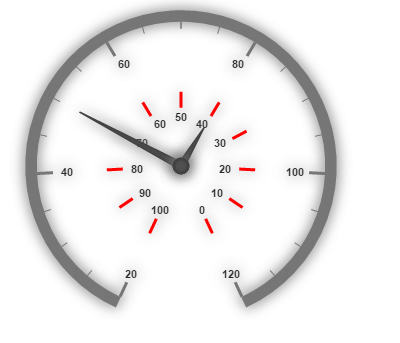

# Scales

Scales are the basic functional block of the Circular Gauge. By customizing the scales, the appearance of the Gauge can be improved. The functional blocks of Circular Gauge are 

* Pointers
* Labels
* CustomLabels
* Indicators
* Ticks
* Ranges
* Sub gauges.

## Adding Scale Collection

Scale collection is directly added to the Gauge object. Refer the following code example to add scale collection in Gauge control.



<ej-circular-gauge id="circulargauge" >
<e-circular-scale-collections>
<e-circular-scales radius="130">
</e-circular-scales>
</e-circular-scale-collections>
</ej-circular-gauge>



Execute the above code to render the following output.

Circular Gauge with scale radius.
{:.caption}

## Scale Customization

### Colors and Border

* The Scale border is modified with the object called `e-border`. It has two border property namely color and width which are used to customize the border color of the scale and border width of the scale. 
* Setting the background color improves the look and feel of the Circular Gauge. You can customize the background color of the scale using `background-color`. 



<ej-circular-gauge id="circulargauge" >
<e-circular-scale-collections>
<e-circular-scales radius="130" background-color="red" show-scale-bar="true">
// setting the border for the scales 
<e-border color="blue" width="3"></e-border>
<e-pointer-collections>
<e-pointers length="80" ></e-pointers>
</e-pointer-collections>
</e-circular-scales>
</e-circular-scale-collections>
</ej-circular-gauge>



Execute the above code to render the following output.

Circular Gauge with customized scale border
{:.caption}

### Pointer Cap

* Pointer cap is a circular shape element that is located at the center of the Circular Gauge. The pointer cap is one of the cynosure of the Circular Gauge. By customizing the pointer cap, Gauge style is improved. The pointer cap is modified with the object `pointer-cap`. 
* It contains `radius`, `border-color`, `border-width`, `e-gradient` and `background-color` properties. The property radius is used to set the radius for the pointer cap. interiorGradient is used to provide the gradient effects to the pointer cap.


<ej-circular-gauge id="circulargauge">
<e-circular-scale-collections>
<e-circular-scales >
<e-pointer-cap radius="10" border-width="4" border-color="blue" background-color="red">
</e-pointer-cap>
</e-circular-scales>
</e-circular-scale-collections>
</ej-circular-gauge>



Execute the above code to render the following output.

Circular Gauge with customized pointer cap
{:.caption}

### Appearance

* Circular Gauge contains two types of scale direction such as clockwise and counter clockwise. You can set them by enumerable property called direction. And you can set the minimum and maximum values for the scale with the properties minimum and maximum. The two properties minorIntervalValue and majorIntervalValue are the values used to set interval value for the ticks and labels. 
* The radius property is used to set the radius value for the circular scale and the size property is used to set the scale bar width. You can also adjust the Opacity of the scale with the property opacity. The value for opacity lies between 0 and 1. You can also give some shadow effects for the scale by using the property shadowOffset. The property startAngle is used to set starting position of the scale at certain angle and sweepAngle is used to shrink or expand the scale to certain angle. 



<ej-circular-gauge id="circulargauge" >
<e-circular-scale-collections>
<e-circular-scales radius="130" background-color="red" show-scale-bar="true" size="30" minimum="20"
maximum="120" major-interval-value="20" minor-interval-value="5" shadow-offset="20" opacity="0.5" direction="@Directions.CounterClockwise">
</e-circular-scales>
</e-circular-scale-collections>
</ej-circular-gauge>



Execute the above code to render the following output.

Circular Gauge with customized scale values
{:.caption}

### Enable/Disable properties

You can enable / disable properties in Circular Gauge using some properties in scale collection. The showIndicators property is used to enable/disable the indicators. show-labels, show-ticks, show-ranges, show-pointers ans show-scale-bar are used to enable/ disable labels, ticks, ranges, pointers and scale bar respectively. 

## Multiple Scales

You can set Multiple scales for a single Circular Gauge control by using an array of scale objects. Each scale object is independent of each other. The following code example refers to two scale objects in a Gauge.



<ej-circular-gauge id="circulargauge">
<e-circular-scale-collections>
// first scale
<e-circular-scales show-scale-bar="true" size="10" radius="150" minimum="20" maximum="120" major-interval-value="20" minor-interval-value="5" direction="@Directions.Clockwise" shadow-offset="20">
<e-pointer-collections>
<e-pointers value="50" length="150"></e-pointers>
</e-pointer-collections>
</e-circular-scales>
// second scale
<e-circular-scales show-scale-bar="false" size="10" radius="80" major-interval-value="10" direction="@Directions.CounterClockwise" shadow-offset="5" opacity="0.5">
<e-tick-collections>
<e-ticks color="red"></e-ticks>
</e-tick-collections>
<e-pointer-collections>
<e-pointers value="40" length="50" distance-from-scale="-30"></e-pointers>
</e-pointer-collections>
</e-circular-scales>
</e-circular-scale-collections>
</ej-circular-gauge>



Execute the above code to render the following output.

Circular Gauge with multiples scales
{:.caption}

