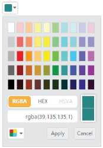
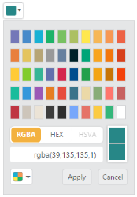
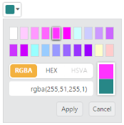
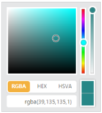
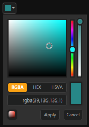
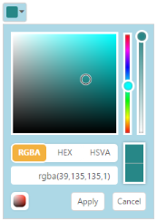

# Appearance and Styling

## modelType

The ColorPicker allows you to define the model type to be displayed in control at initial time by using the property _ModelType_. 

The ModelType property is Enum type and its default value is default.

_List of modelType_

<table>
<tr>
<th>
ModelType</th><th>
Syntax</th><th>
Description</th></tr>
<tr>
<td>
Default</td><td>
ModelType(ModelType.Default)</td><td>
Control rendered with both model. You can switch to palette or picker model.</td></tr>
<tr>
<td>
Picker</td><td>
ModelType(ModelType.Picker)</td><td>
Control rendered with picker model only.</td></tr>
<tr>
<td>
Palette</td><td>
ModelType(ModelType.Palette)</td><td>
Control rendered with palette model only.</td></tr>
</table>

In the following code example, the ColorPicker popup model type is set as Palette when you drop down the ColorPicker popup.

1. In the CSHTML page, configure the ColorPicker widget as follows.



/*ej-Tag Helper code to render ColorPicker*/

@*In the CSHTML page, add the Html helpers to render ColorPicker widget*@

 <ej-color-picker id="colorPicker" value="#278787" model-type="Palette"></ej-color-picker>





/*Razor code to render ColorPicker*/

    @{Html.EJ().ColorPicker("colorPicker").Value("#278787").ModelType(ModelType.Palette).Render(); }



N> To render the ColorPicker Control you can use either Razor or Tag helper code as given in the above code snippet.

The following screenshot displays the output of the above code example.

ColorPicker rendered with Palette Model
{:.caption}

## Palette

The ColorPicker allow you to define the palette type to be displayed in control at initial time by using the Palette property. The Palette property is Enum type and its default value is BasicPalette.

_List of palette_

<table>
<tr>
<th>
Palette</th><th>
Syntax</th><th>
Description</th><th>
Dependent Property</th></tr>
<tr>
<td>
BasicPalette</td><td>
Palette(PaletteType.BasicPalette)</td><td>
The palette model rendered with predefined color values.</td><td rowspan = "2">
ModelType(ModelType.Palette)</td></tr>
<tr>
<td>
CustomPalette</td><td>
Palette(PaletteType.CustomPalette)</td><td>
The palette model renders with the specified custom color values.</td></tr>
</table>

## BasicPalette

The BasicPalette type renders with predefined color values. The BasicPalette model has 12 different preset patterns. Each pattern consists of 50 colors and over 600 colors are available by default. 

## PresetType

The ColorPicker control allows you to define the preset model to be rendered initially in palette type. This can be achieved by using the “PresetType” property. Totally 12 types of presets are available.

The PresetType property is Enum type and its default value is “Basic”.

_Property Table_

<table>
<tr>
<th>
PresetType</th><th>
Syntax</th><th>
Dependent Property</th></tr>
<tr>
<td>
Basic</td><td>
PresetType(PresetsType.Basic)</td><td rowspan = "12">
Palette(PaletteType.BasicPalette)</td></tr>
<tr>
<td>
MonoChrome</td><td>
PresetType(PresetsType.MonoChrome)</td></tr>
<tr>
<td>
FlatColors</td><td>
PresetType(PresetsType.FlatColors)</td></tr>
<tr>
<td>
SeaWolf</td><td>
PresetType(PresetsType.SeaWolf)</td></tr>
<tr>
<td>
WebColors</td><td>
PresetType(PresetsType.WebColors)</td></tr>
<tr>
<td>
Sandy</td><td>
PresetType(PresetsType.Sandy)</td></tr>
<tr>
<td>
PinkShades</td><td>
PresetType(PresetsType.PinkShades)</td></tr>
<tr>
<td>
Misty</td><td>
PresetType(PresetsType.Misty)</td></tr>
<tr>
<td>
Citrus</td><td>
PresetType(PresetsType.Citrus)</td></tr>
<tr>
<td>
Vintage</td><td>
PresetType(PresetsType.Vintage)</td></tr>
<tr>
<td>
MoonLight</td><td>
PresetType(PresetsType.MoonLight)</td></tr>
<tr>
<td>
CandyCrush</td><td>
PresetType(PresetsType.CandyCrush)</td></tr>
</table>

1. In the CSHTML page, configure the ColorPicker widget as follows.



/*ej-Tag Helper code to render ColorPicker*/

@*In the CSHTML page, add the Html helpers to render ColorPicker widget*@

 <ej-color-picker id="colorPicker" value="#278787" model-type="Palette" preset-type="FlatColors"></ej-color-picker>





/*Razor code to render ColorPicker*/

    @{Html.EJ().ColorPicker("colorPicker").Value("#278787").ModelType(ModelType.Palette).PresetType(PresetsType.FlatColors).Render(); }



The following screenshot displays the output of the above code example.

ColorPicker with Presets
{:.caption}

## CustomPalette

The ColorPicker control allows you to define the custom colors in the palette model by using Palette property. Custom palettes are created by passing a comma delimited string of HEX values or an array of colors in Custom property. The CustomPalette model is only applicable when you set ModelType as Palette.

The CustomPalette property is a dependent property of Palette and ModelType property.

1. In the CSHTML page, configure the ColorPicker widget as follows.



/*ej-Tag Helper code to render ColorPicker*/

@*In the CSHTML page, add the Html helpers to render ColorPicker widget*@

@{List<String> colors = new List<string>() { "ffffff", "ffccff", "ff99ff", "ff66ff", "ff33ff", "ff00ff", "ccffff", "ccccff", "cc99ff", "cc66ff", "cc33ff", "cc00ff", "99ffff", "99ccff", "9999ff", "9966ff", "9933ff", "9900ff", "ffffcc", "ffcccc" };}

<ej-color-picker id="colorPicker" value="#278787" model-type="Palette" preset-type="FlatColors" custom="colors"></ej-color-picker>





/*Razor code to render ColorPicker*/

@{List<String> colors = new List<string>() { "ffffff", "ffccff", "ff99ff", "ff66ff", "ff33ff", "ff00ff", "ccffff", "ccccff", "cc99ff", "cc66ff", "cc33ff", "cc00ff", "99ffff", "99ccff", "9999ff", "9966ff", "9933ff", "9900ff", "ffffcc", "ffcccc" };}

    @{Html.EJ().ColorPicker("colorPicker").Value("#278787").ModelType(ModelType.Palette).Palette(PaletteType.CustomPalette).Custom(colors).Render(); }



The following screenshot displays the output of the above code example.

ColorPicker with Customized Colors
{:.caption}

## DisplayInline

The ColorPicker control allows you to embed the popup in the order of DOM element flow by using the DisplayInline property. Using DisplayInline property to make ColorPicker popup always in visible state. Also associate ColorPicker with 
 element instead of input. 

The DisplayInline property is Boolean type and its default value is false.

The following steps explain you how to get the ColorPicker popup in DisplayInline state.

1. In the CSHTML page, configure the ColorPicker widget as follows.



/*ej-Tag Helper code to render ColorPicker*/

@*In the CSHTML page, add the Html helpers to render ColorPicker widget*@

  <ej-color-picker id="colorPicker" value="#278787" display-inline="true" tag-name="div"></ej-color-picker>





/*Razor code to render ColorPicker*/

    @{Html.EJ().ColorPicker("colorPicker").Value("#278787").DisplayInline(true).TagName("div").Render();}



The following screenshot displays the output of the above code example.

ColorPicker in Display Inline
{:.caption}

## Theme Support

The ColorPicker control supports rich appearance. It supports 12 different themes of Essential ASP.NET MVC and bootstrap themes. To use these twelve themes, refer the themes files in HTML page. 

You require two style sheets to apply styles to ColorPicker control; one ej.widgets.core.min.css and one ej.theme.min.css. When you use ej.widgets.all.min.css then, it is not necessary to use ej.widgets.core.min.css and ej.theme.min.css because ej.widgets.all.min.css is a combination of these two.

The core style sheet applies styles related to positioning and size, but are not related to the color scheme and always require the control to look correct and function properly. The theme style sheet applies theme-specific styles like colors and backgrounds.

### The following list is the twelve themes supported by ColorPicker:

* default-theme
* flat-azure-dark
* flat-lime
* flat-lime-dark
* flat-saffron
* flat-saffron-dark
* gradient-azure
* gradient-azure-dark
* gradient-lime
* gradient-lime-dark
* gradient-saffron
* gradient-saffron-dark

1. In the CSHTML page, configure the ColorPicker widget with built in theme support.



/*ej-Tag Helper code to render ColorPicker*/

@*In the CSHTML page, add the Html helpers to render ColorPicker widget*@

<!doctype html>

<html>

<head>

    <title>Essential Studio for JavaScript : ColorPicker – Built-in ThemeSupport</title>

    <meta name="viewport" content="width=device-width, initial-scale=1.0" charset="utf-8"  />

    <link href="http://cdn.syncfusion.com/js/web/flat-saffron-dark/ej.web.all-latest.min.css" rel="stylesheet" />

    

    

</head>

<body>

    

         <ej-color-picker id="colorPicker" value="#278787"></ej-color-picker>

    
                    

</body>

</html>



N> jQuery.easing external dependency has been removed from version 14.3.0.49 onwards. Kindly include this jQuery.easing dependency for versions lesser than 14.3.0.49 in order to support animation effects.



/*Razor code to render ColorPicker*/

   

    
    @{Html.EJ().ColorPicker("colorPicker").Value("#278787").Render(); }

   
                    



The following screenshot displays the output of the above code example.

ColorPicker with Theme Support
{:.caption}

## CustomCss

The ColorPicker control also allows you to customize its appearance using user-defined CSS and custom skin options such as colors and backgrounds. To apply custom themes use the CssClass property. CssClass property sets the root class for ColorPicker theme.

Using this property you can override the existing styles under the theme style sheet. The theme style sheet applies theme-specific styles like colors and backgrounds. In the following example, the value of CssClass property is set as Light-Blue. Light-Blue is added as root class to ColorPicker control at the runtime. From this root class you can customize the ColorPicker control theme.

1. In the CSHTML page, configure the ColorPicker widget as follows.
   
   ~~~ cshtml

    /*ej-Tag Helper code to render ColorPicker*/

		@*In the CSHTML page, add the Html helpers to render ColorPicker widget*@

		  <ej-color-picker id="colorPicker" value="#278787" css-class="Light-Blue"></ej-color-picker>

   ~~~



/*Razor code to render ColorPicker*/

    @{Html.EJ().ColorPicker("colorPicker").Value("#278787").CssClass("Light-Blue").Render(); }	



   {:.prettyprint }

2. Custom CSS Styles.




The following screenshot displays the output of above steps.

ColorPicker with Custom Theme
{:.caption}
