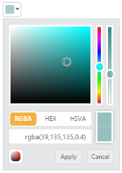
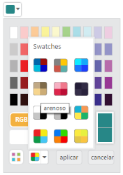

# Configure Values

## OpacityValue

The ColorPicker control allows you to change the opacity value by using the OpacityValue property. The selected color opacity is adjusted by using the OpacityValue. 

The OpacityValue property is Number type and its default value is 100.

1. In the CSHTML page, configure the ColorPicker widget as follows.



/*ej-Tag Helper code to render ColorPicker*/

@*In the CSHTML page, add the Html helpers to render ColorPicker widget*@

  <ej-color-picker id="colorPicker" value="#278787" opacity-value="40"></ej-color-picker>





/*Razor code to render ColorPicker*/

    @{Html.EJ().ColorPicker("colorPicker").Value("#278787").OpacityValue(40).Render();}



N> To render the ColorPicker Control you can use either Razor or Tag helper code as given in the above code snippet.

The following screenshot displays the output of the above code example.

ColorPicker with Opacity Value
{:.caption}

## Button and TooltipText

### ButtonText

The ColorPicker control allows you to define the text to be displayed in button elements. You can specify the text by using ButtonText property. In ColorPicker control, popup contains two button elements “Apply” and “Cancel”.

To configure the ButtonText property for the button elements, use the corresponding default values listed in the following table.

_List of Button elements_

<table>
<tr>
<th>
Element</th><th>
Default value</th></tr>
<tr>
<td>
Apply</td><td>
Apply</td></tr>
<tr>
<td>
Cancel</td><td>
Cancel</td></tr>
</table>

#### TooltipText

The ColorPicker control consists of more number of sub controls and elements. To provide some information about each element and sub control, you can use the tooltip concept and you can achieve this by using TooltipText property.

To configure the TooltipText, use the following listed elements and its corresponding default value.

_List of Tooltip elements_

<table>
<tr>
<th>
Element</th><th>
Default value</th></tr>
<tr>
<td>
Switcher</td><td>
Switcher</td></tr>
<tr>
<td>
AddButton</td><td>
Add Color</td></tr>
<tr>
<td>
Basic</td><td>
Basic</td></tr>
<tr>
<td>
MonoChrome</td><td>
Mono Chrome</td></tr>
<tr>
<td>
FlatColors</td><td>
Flat Colors</td></tr>
<tr>
<td>
SeaWolf</td><td>
Sea Wolf</td></tr>
<tr>
<td>
WebColors</td><td>
Web Colors</td></tr>
<tr>
<td>
Sandy</td><td>
Sandy</td></tr>
<tr>
<td>
PinkShades</td><td>
Pink Shades</td></tr>
<tr>
<td>
Misty</td><td>
Misty</td></tr>
<tr>
<td>
Vintage</td><td>
Vintage</td></tr>
<tr>
<td>
MoonLight</td><td>
Moon Light</td></tr>
<tr>
<td>
CandyCrush</td><td>
Candy Crush</td></tr>
<tr>
<td>
CurrentColor</td><td>
Current Color</td></tr>
<tr>
<td>
SelectedColor</td><td>
Selected Color</td></tr>
<tr>
<td>
Citrus</td><td>
Citrus</td></tr>
</table>

When it is necessary to set the button text and TooltipText values in Spanish culture, the ColorPicker allow you to define the culture values to ButtonText and TooltipText property. The following section explains on how to define the Spanish culture values to ColorPicker control.

1. In the CSHTML page, configure the ColorPicker widget as follows.



/*ej-Tag Helper code to render ColorPicker*/

@*In the CSHTML page, add the Html helpers to render ColorPicker widget*@

 <ej-color-picker id="colorPicker" value="#278787">
        <e-color-picker-button-text apply="aplicar" cancel="cancelar"/>
        <e-color-picker-tooltip-text sandy="arenoso"/>
    </ej-color-picker>
  





/*Razor code to render ColorPicker*/

    @{Html.EJ().ColorPicker("colorPicker4").Value("#278787").ColorPickerButtonText(color => color.Apply("aplicar").Cancel("cancelar")).ColorPickerTooltipText(tooltip => tooltip.Sandy("arenoso")).Render();}



The following screenshot displays the output of the above code example.

ColorPicker with Culture Support
{:.caption}
