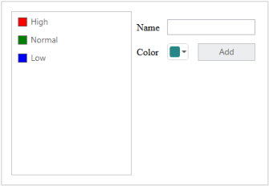
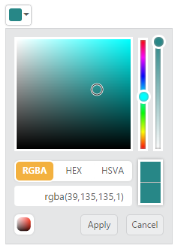
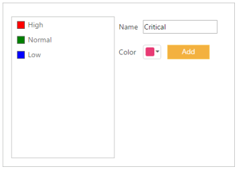
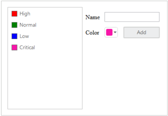

# Getting Started

This section briefly explains the essential steps required to render a ColorPicker in an ASP.NET Core application.

## Create your first ColorPicker

The Essential ColorPicker control provides support for selecting the colors from different sources such as palettes, picker or custom palettes. Colorpicker supports three formats such as RGB, HSV and HEXCODE.

In this example, you will learn how to customize ColorPicker control in a category Application, in which a new category can be added along with a color chosen from ColorPicker. 

ColorPicker 
{:.caption}

Creating category application involves the following steps:

* Create ColorPicker control
* Initialize the other widgets
* Add Value to ListBox Control

### Create ColorPicker Control

1. [Getting Started](/aspnet-core/getting-started) section explains about basic system requirements and the steps to configure the Syncfusion Components in an ASP.net core application.

    After successfully adding the necessary dependencies in your solution, make sure to build the solution, so that the necessary assembly files are compiled properly before using it in your project.

2. Add the following code to the corresponding view page for rendering the ColorPicker widget.



/*ej-Tag Helper code to render ColorPicker*/

        <ej-color-picker id="CategoryColor" value="#278787"></ej-color-picker>

  



/*Razor code to render ColorPicker*/

    @{ Html.EJ().ColorPicker("CategoryColor").Value("#278787").Render();}



N> To render the ColorPicker Control you can use either Razor or Tag helper code as given in the above code snippet.

The above code will render a simple Colorpicker control as shown below.

    

### Initialize the other widgets

To add the priority value to the ListBox, the text value is obtained from the input element and color for each priority is received by ColorPicker control. To add a new priority value to ListBox control, click the Add button.

You can refer to the following link for more information on rendering ListBox control.

<http://help.syncfusion.com>

1. The following code example is used to create the Priority form using ListBox control and ColorPicker control.

~~~ html

/*ej-Tag Helper code to render ColorPicker*/

            

                

                    

                        

                            <ul id="ColorValues">

                                <li>High</li>

                                <li>Normal</li>

                                <li>Low</li>

                            </ul>

                             @*Assign default value and client side event*@
                            <ej-list-box id="selectPriority" target-id="ColorValues" create="initListboxObj"></ej-list-box>

                        
  

                    

                

                

                    <table class="prop-grid">

                        <tr class="row">

                            <td class="column">
                                Name

                            </td>

                            <td class="column">

                                <input type="text" id="categoryName" />

                            </td>

                        </tr>

                        <tr class="row">

                            <td class="column">
                                Color

                            </td>

                            <td class="column">

                                @*Colorpicker element*@
                                @*Assign default value and bind client side event*@
                                <ej-color-picker id="CategoryColor" value="#278787" create="initColorObj"></ej-color-picker>

                            </td>

                            <td class="column">

                                @*Add button for to add new category*@
                                <ej-button id="AddCategory" text="Add" width="82px" height="28px" type="Button" click="addCategory" />
                            </td>

                        </tr>

                        <tr class="row"></tr>

                    </table>

                

            

        

~~~



/*Razor code to render ColorPicker*/

    

        

            

                

                    <ul id="ColorValues1">

                        <li>High</li>

                        <li>Normal</li>

                        <li>Low</li>

                    </ul>

                    @*Assign default value and client side event*@
                    @{ Html.EJ().ListBox("selectPriority").TargetID("ColorValues1").Render(); }
                

            

        

        

            <table class="prop-grid">

                <tr class="row">

                    <td class="column">
                        Name

                    </td>

                    <td class="column">

                        <input type="text" id="categoryName" />

                    </td>

                </tr>

                <tr class="row">

                    <td class="column">
                        Color

                    </td>

                    <td class="column">

                        @*Colorpicker element*@
                        @*Assign default value and bind client side event*@
    @{ Html.EJ().ColorPicker("CategoryColor").Value("#278787").ClientSideEvents(e => e.Create("initColorObj")).Render(); }
                          </td>

                    <td class="column">

                        @*Add button for to add new category*@
    @{Html.EJ().Button("AddCategory").Text("Add").Width("82px").Height("28px").Type(ButtonType.Button).ClientSideEvents(events => events.Click("addCategory")).Render(); }
                    </td>

                </tr>

                <tr class="row"></tr>

            </table>

        

    



2. Add the following style section to align form fields.

    

    

3. Get the instance of ListBox and Colorpicker controls.

~~~ javascript

        
~~~

4. Run the above code to render the following output.

Color Picker control
{:.caption}

### Add value to ListBox Control 

1. Category can be added to the ListBox upon Button click. The following script section define the click event for the button element.

~~~ javascript

            
~~~

2. The following screenshot illustrates the resultant output after you click Add button.

Value from Color Picker control
{:.caption}
