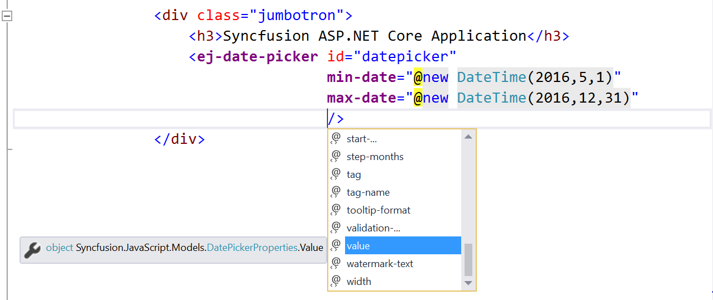

# Core Concepts

## Basics

### API Configuration

Using tag helper methods we can set values to Syncfusion Widget properties during or after the creation.

In the above example, minimum & maximum range defined for DatePicker component. 

### Wiring Client Side Events

Client side events can be wired in the same way as properties. But here all the client side events are grouped into **“ClientSideEvents”** Action method

1. Specify the client side event name in string format.

   For example:
   
   ~~~ cshtml
   
        <ej-date-picker id="datepicker"
                        min-date="@new DateTime(2016,5,1)"
                        max-date="@new DateTime(2016,12,31)"
                        value="@DateTime.Now.AddDays(1)"
                        change="datepicker_change"
                        select="datepicker_select">
        </ej-date-picker>
   ~~~

2. Declare the client side events in Script sections

   ~~~ cshtml
			
	@section scripts{

		

	}

   ~~~
   
### Invoking methods

Syncfusion JavaScript widget client side methods can be accessed via their client side object. You can access the client side object via jQuery.data() utility method.   

1. Create server side component in CSHTML

   ~~~ cshtml
   
        <ej-date-picker id="datepicker"
                        min-date="@new DateTime(2016,5,1)"
                        max-date="@new DateTime(2016,12,31)"
                        value="@DateTime.Now.AddDays(1)">
        </ej-date-picker>

   ~~~
   
2. Access the client side object using jQuery.data() as shown below

   ~~~ cshtml
   
	

   
   ~~~

3. Access the method from client side object as like properties access as show below

   ~~~ cshtml
		
	
			
   ~~~
   
## Globalization

As per MSDN, “Globalization involves designing and developing a world-ready app that supports localized interfaces and regional data for users in the multiple cultures”.

The **ejGlobalize** plugin provides options parse numeric, currency and date values using culture file. The **assets/scripts/i18n** contains more than 350 cultures currently. You can load the particular culture into application using **setCulture** method.

The Internationalize any of our Syncfusion components/page into particular culture, please follow the below steps

1. Add the reference ej.globalize.min.js script into your application. 

   N> **ej.globalize.min.js** library already avails in within **ej.web.all.min.js** file, therefore it is not necessary to externally refer it in your application if you have referred **ej.web.all.min.js** already. For version lower than 13.4.0.53 refer **jQuery.globalize.min.js** along with **ej.web.all.min.js**

2. Add the required culture file into page which is located in **assets/scripts/i18n**.

   ~~~ cshtml
   
        >
        
		
   ~~~

3. Set the culture by using  **setCulture()** method. Here we used French (fr-FR) culture as current culture   

   ~~~ cshtml
   
	

   ~~~
   
4. Use **format()** method to format the object like numbers, date, price etc…   

   ~~~ cshtml
   
	

   ~~~

### Dynamic globalization

Find the steps to globalize the ASP.NET Core application from below

1. Specify the target culture in **web.config** file under **<system.web>** root

   ~~~ xml
   
	<system.web>
	<globalization uiCulture="fr-FR" culture="fr-FR" enableClientBasedCulture="true"/>
	</system.web>

   ~~~

2. Load the culture file based on current culture which is specified in **web.config** as shown in below

   ~~~ cshtml
   
	
			
   ~~~

3. Access the current culture using System.Globalization.CultureInfo and set the culture to ej.globalize widget.

   ~~~ cshtml
   
	

   ~~~
   
## Localization

Localization is the process of customizing an application for given language and region.

Find the steps to configure the Syncfusion Components to particular language from below

1. Specify the target culture in **web.config** file under **<system.web>** root

   ~~~ xml
   
	<system.web>
	    <globalization uiCulture="fr-FR" culture="fr-FR" enableClientBasedCulture="true"/>
	</system.web>

   ~~~

2. Load the globalize culture file from **i18n** folder dynamically using below codes 

   ~~~ cshtml
   
	

   ~~~
   
   
3. Download and refer the Syncfusion UI component localized text from [ej-global](https://github.com/syncfusion/ej-global/tree/master/localetexts) repository.

   
   
   
4. Load the Localized text file from local texts folder as like previous step   

   ~~~ cshtml
   
	

   ~~~	

5. Set the culture to Syncfusion UI components using **Locale** helper method as shown in below
  
  
   ~~~ cshtml
  
        <ej-date-picker id="datepicker"
                        min-date="@new DateTime(2016,5,1)"
                        max-date="@new DateTime(2016,12,31)"
                        locale="@System.Globalization.CultureInfo.CurrentCulture.Name.ToString()"
                        change="datepicker_change"
                        select="datepicker_select">
        </ej-date-picker>
   ~~~
   
6. Compile and execute the application. You can able to see the below output in the browser

## Accessibility

All the Essential JS UI widgets provide built-in compliance with the WAI-ARIA specifications. This ensures that the widgets work properly with assistive technologies. [WAI-ARIA](https://www.w3.org/WAI/PF/aria-practices/) compliance for the widgets have been achieved by providing proper keyboard navigation support as well as by defining the required ARIA attributes to the DOM elements.    

For example, the ejButton widget, when created through JavaScript code will render in the web browser with HTML DOM elements (along with the assigned built-in ARIA attributes) as shown below,



<ej-button id="button11" text="Login" size="Normal" show-rounded-corner="true"/>



When the above code is executed on the browser, the button widget will render with the following equivalent HTML DOM attributes created for it,



<button type="Submit" id="button11" class="e-button e-js e-btn-normal e-btn e-select e-widget e-txt e-corner" tabindex="" role="button" aria-describedby="Login" aria-disabled="false">Login</button>



Here, aria-describedby is the ARIA property assigned to the Syncfusion button widget so that the button description is notified to the user through assistive technologies.

Likewise, aria-disabled is one of the ARIA state assigned to the button, which states that if none of the button actions are currently available, then the button is said to be in an aria-disabled state.

## Client Side Validation

To perform the validation for EJ form controls, please refer following steps.

**Step 1:** First you need to include [jquery.validate](http://www.nuget.org/packages/jQuery.Validation/#) (1.15.0) script in your Layout.cshtml page.

**Step 2:** After adding this script file, you can validate the EJ form controls in same way as you perform the jQuery validation for HTML form elements. But here you have to do some little bit configuration along with that.  Let we discuss about it.

If validation gets fail, you have to place the error message in proper position using “errorPlacement” API which is available in default settings of jQuery validation. Also built-in “error” class will be added to corresponding form element. Here you have to specify a custom class with your own style using “errorClass” API. These are the common settings for all of our EJ form controls.

And some of our EJ form controls contains the form values in hidden element for its functionality purpose and these hidden elements are not validated by default. If you want to include the hidden elements in jQuery validation, you have to set “[]” in “ignore” API of “$.validator.setDefaults”.  Refer following list to find out the EJ form controls, which contains the value in hidden element.

* Checkbox
* MaskEdit
* NumericTextbox
* CurrencyTextbox
* PercentageTextbox
* RTE
* Dropdownlist

Please refer following code block to configure the above mentioned jQuery validation settings.

   ~~~ cshtml

    

   ~~~

Up to 13.4.0.58 version, above specified jQuery validation settings were configured in source level of EJ form controls. Since 14.1.0.41 release onwards, above specified settings has been removed from source and it need to be specified in sample level in order to improve the customization of this validation.

**Step 3:** After configuring above jQuery validation settings, you have to specify the validation rules and messages using the APIs (“validation-rules”, “validation-message”), which is available in the validation supportable EJ controls. 

   ~~~ cshtml

        @{
            // defining validation rule required
            Dictionary<string, object> rule = new Dictionary<string, object>();
            rule.Add("required",true);
            // defining validation message for required
            Dictionary<string, object> messages = new Dictionary<string, object>();
            messages.Add("required", "Value Required");
        }

        <form>
            <ej-date-picker id="datepicker" validation-rules="rule" validation-message="messages">
            </ej-date-picker>
        <form>

   ~~~