# Behavior Settings

## Decimal Places

DecimalPlaces property specifies number of values allowed after the decimal point.The default value of DecimalPlaces property is 0 i.e., by default you cannot specify decimal value in CurrencyTextBox. We need to add this property to allow decimal values. To set the DecimalPlaces to “-1”, that allows the decimals without any limit in CurrencyTextBox control.

### Configure Decimal Places

1. In the View page add the below code and configure the DecimalPlaces property as follows.



    <ej-currency-text-box id="currency" value="555" decimal-places="4"/>



The output is as follows.

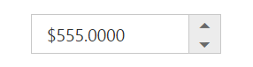

CurrencyTextBox with decimalPlaces
{:.caption}

## Persistence Support

  CurrencyTextBox provides state maintenance support. You can maintain the previous changes made in the control after a page loads.

### Configure Persistence Support 

In the View page add the below code and configure the EnablePersistence property as follows.



    <ej-currency-text-box id="currency" value="33" enable-persistence="true"/>



   Output of CurrencyTextBox with EnablePersistence is as follows. 

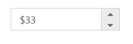

CurrencyTextBox at initial load
{:.caption}

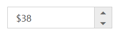

CurrencyTextBox after changing the value and after page refresh 
{:.caption}

## Strict Mode Support

CurrencyTextBox allows you to use the strict mode option by setting the EnableStrictMode property. You can set the MinValue and MaxValue to the controls to enable strict mode functionality. Default value of this property is false. When the textbox value exceeds the MaxValue, it restricts the exceeded value and returns the MaxValue. Likewise when the textbox value goes below MinValue, it restricts the new value and returns the MinValue. When this property is enabled, it will not restrict the specified value and an error class will be added to indicate wrong value is provided to the textbox.

### Configure Strict Mode Support 

In the View page add the below code and configure the EnableStrictMode property. 



    <ej-currency-text-box id="currency" value="10" min-value="-1" max-value="8" enable-strict-mode="true"/>



Output when EnableStrictMode is “true” is as follows.

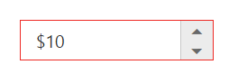

Currency with EnableStrictMode
{:.caption}

## Enabled or Disabled

CurrencyTextBox has an option to enable or disable its element. You can set the Enabled property as “false” to enable the Textbox controls.
Also you can enable/disable the **CurrencyTextBox** by using [enable](https://help.syncfusion.com/api/js/ejtextboxes#methods:enable) and [disable](https://help.syncfusion.com/api/js/ejtextboxes#methods:disable) methods.

### Configure Enabled or Disabled 

In the View page add the below code and configure the Enabled property.



    <ej-currency-text-box id="currency" value="3" enabled="false"/>



Output when Enabled is “true” and when Enabled is “false”.

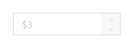

CurrencyTextBox with enabled as false
{:.caption}

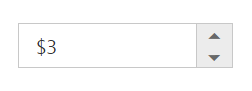

CurrencyTextBox with enabled as true
{:.caption}

## Adjusting Textbox Size

CurrencyTextBox size can be modified by using the Height and Width properties. 

### Configure Height and Width 

In the View page add the below code and configure the Height and Width property.



    <ej-currency-text-box id="currency" value="1" width="100px" height="50px"/>



 Output of CurrencyTextBox after setting “Height” and “Width” is as follows.

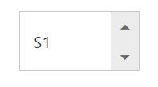

CurrencyTextBox with height and width 
{:.caption}                         

## Increment Step

The IncrementStep property is used to increase or decrease the amount of value in the Currency textbox. 

### Configure Increment Step

In the View page add the below code and configure the IncrementStep property.



    <ej-currency-text-box id="currency" value="1" increment-step="4"/>



Output of Currency textbox with IncrementStep is as follows.

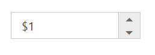

CurrencyTextBox at initial load
{:.caption}

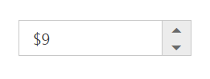

CurrencyTextBox after increasing two step
{:.caption}

## Define Name

When you have placed the CurrencyTextBox in a form, the Name property is used to send the field value at form submission. The default value of the Name property is null.

### Configure Name

In the View page add the below code and configure the Name property.   



    <ej-currency-text-box id="currency" name="Currency"/>



## Define Value

The value of CurrencyTextBox can be assigned by using the Value property. The default value for Value property is null.
You can get the value of **CurrencyTextBox** by using [getValue](https://help.syncfusion.com/api/js/ejtextboxes#methods:getvalue) method.

### Configure Value

 In the View page add the below code, and configure the Value property.  



    <ej-currency-text-box id="currency" value="33"/>



Output of CurrencyTextBox with the value property is as follows.

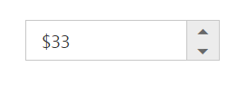

CurrencyTextBox with value
{:.caption}

## Define MaxValue and MinValue

### MaxValue

The maximum limit value can be assigned to the CurrencyTextBox by using the MaxValue property. The default value of MaxValue property is 1.7976931348623157e+308. 

### MinValue

The minimum limit value can be assigned to the CurrencyTextBox by using the MinValue property. The default value of MinValue property is -1.7976931348623157e+308.

### Configure MaxValue and MinValue

In the View page add the below code and configure the MinValue and MaxValue property.  .  



    <ej-currency-text-box id="currency" value="4" min-value="-3" max-value="4"/>



Output of CurrencyTextBox with MaxValue and MinValue is as follows.

CurrencyTextBox with maxValue
{:.caption}

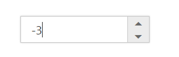

CurrencyTextBox with minValue
{:.caption}

## Read Only Support

CurrencyTextBox supports read only option. When you enable the ReadOnly property to the control, the value cannot be changed in the CurrencyTextBox. You can set the ReadOnly property as “true” to enable this option.

### Configure Read Only

In the View page add the below code and configure the ReadOnly property.



    <ej-currency-text-box id="currency" value="3" read-only="true"/>



 Output of CurrencyTextBox when ReadOnly is “true” is as follows. CurrencyTextBox values cannot be edited or changed.

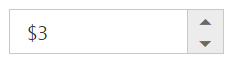

CurrencyTextBox with readOnly
{:.caption}

## Appearance

### Theme

CurrencyTextBox control’s style and appearance can be controlled based on CSS classes. In order to apply styles you need to refer 2 files namely, ej.widgets.core.min.css and ej.theme.min.css. If the file ej.web.all.min.css is referred, then it is not necessary to include the files ej.widgets.core.min.css and ej.theme.min.css in your project, as ej.web.all.min.css is the combination of these two. 

By default, there are 17 themes support available namely:

* bootstrap
* flat-azure
* flat-azure-dark
* fat-lime
* flat-lime-dark
* flat-saffron
* flat-saffron-dark
* gradient-azure
* gradient-azure-dark
* gradient-lime
* gradient-lime-dark
* gradient-saffron
* gradient-saffron-dark
* high-contrast-01
* high-contrast-02
* material
* office-365

### CSS Class

The CSS can be customized by using the CssClass in the CurrencyTextBox. You can customize the CurrencyTextBox with CssClass property to appear like your desired control.

### Configure CSS Class

In the View page add the below code and configure the CssClass property. 



    <ej-currency-text-box id="currency" value="3" css-class="customCss"/>



1. Customize the CSS properties in custom CSS class.





Output of CurrencyTextBox after applying CssClass is as follows.

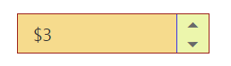

CurrencyTextBox with cssClass
{:.caption}

## Rounded Corner Support

CurrencyTextBox provides you with rounded corner support whose appearance is different from normal textbox controls.

### Configure Rounded Corner Support

In the View page add the below code and configure the ShowRoundedCorner property. 



    <ej-currency-text-box id="currency" value="3" show-rounded-corner="true"/>


Output of CurrencyTextBox when ShowRoundedCorner is “true”.

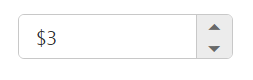

CurrencyTextBox with ShowRoundedCorner
{:.caption}

## Spin Button Support

CurrencyTextBox provides you the option as to whether to display the spin button in the widget or remove it from the control by using showSpinButton property.

### Configure Spin Button

In the View page add the below code and configure the ShowSpinButton property. 



    <ej-currency-text-box id="currency" value="3" show-spin-button="false"/>



Output of CurrencyTextBox when ShowSpinButton is “false”.

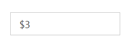

CurrencyTextBox with ShowSpinButton is false
{:.caption}

## Water Mark Text Support

The CurrencyTextBox provide water mark text support. You can display the initial value in the control by water mark.

### Configure Water Mark Text

In the View page add the below code and configure the ShowSpinButton property.



    <ej-currency-text-box id="currency" watermark-text="Currency"/>



Output of CurrencyTextBox after applying WaterMarkText is as follows.

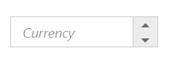

CurrencyTextBox with watermark text
{:.caption}