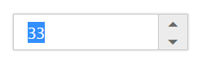

# Keyboard Interaction

With the keyboard navigation enabled in the CurrencyTextBox control, it is possible to control the actions with the provided shortcut keys. Almost all the CurrencyTextBox functionality that are done through mouse can be controlled with shortcut keys.

The various keyboard shortcuts available within the CurrencyTextBox control are discussed in the following table. 

<table>
<tr>
<th>
Shortcut Key</th><th>
Description</th></tr>
<tr>
<td>
{{ '[Access key](http://en.wikipedia.org/wiki/Access_key)' | markdownify }} + j</td><td>
Focuses the control</td></tr>
<tr>
<td>
Up</td><td>
Increments the value</td></tr>
<tr>
<td>
Down</td><td>
Decrements the value</td></tr>
<tr>
<td>
Tab</td><td>
Focus the next element</td></tr>
</table>

## Configuring Keyboard Navigation

The following steps explain the implementation of keyboard interaction in CurrencyTextBox.

In the View page add the below code. Set the access key property to the CurrencyTextBox for focusing the control while key is pressed. We need to use ‘HtmlAttributes’ property to add the ”access key” attribute to the Editor elements. ‘HtmlAttributes’ property is used to add HTML attributes like, id, class etc.. to the components. We need to use IDictionary<string,object> to specify the HTML attributes. Please check the below code.



@{IDictionary<string, object> currencyAttribute = new Dictionary<string, object>();

currencyAttribute.Add("accesskey", "j");

}

<ej-currency-text-box id="currency" name="currency" value="33" html-attributes="currencyAttribute"/>



Run the above example and press [Access key](http://en.wikipedia.org/wiki/Access_key) + j key to focus the CurrencyTextBox widget. Perform provided functionality by using keyboard shortcuts.

CurrencyTextBox focused with keyboard shortcut
{:.caption}