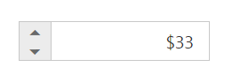

# RTL Support

CurrencyTextBox provides RTL (Right-To-Left) support. The alignment of CurrencyTextBox can be changed from Left-To-Right into Right-To-Left.

## Enable RTL

In the View page add the below code and configure the EnableRTL property.



    <ej-currency-text-box id="currency" value="33" enable-rtl="true"/>



Output of CurrencyTextBox when EnableRTL is “true” is as follows. 

CurrencyTextBox with enableRTL
{:.caption}