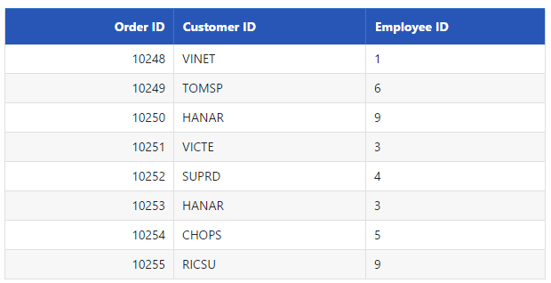
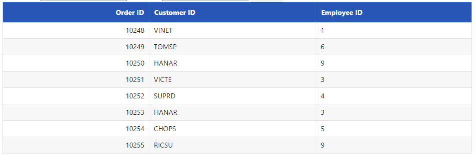
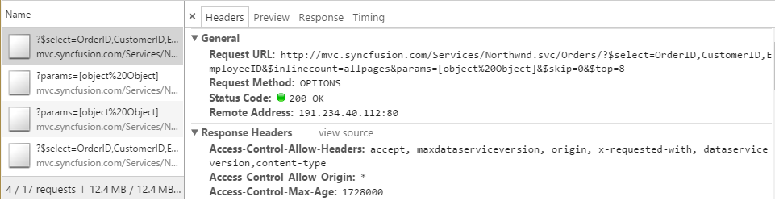
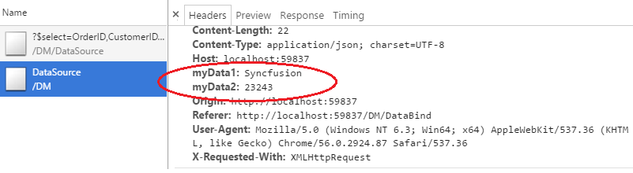
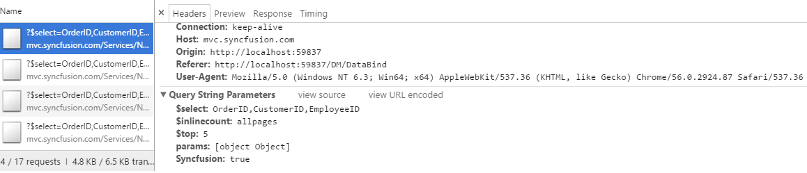
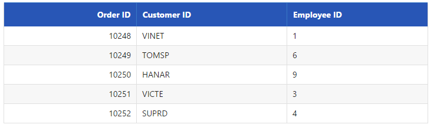
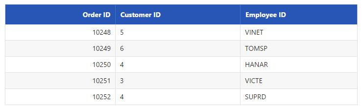

# Advanced Functionalities

## Offline Support

Offline support allows data-bound Syncfusion UI widgets to function without active server connection. Users can continue working with the data.

With offline as true, the DataManager requests the server only once and further data manipulation operation can be done at client side itself.

In the following code example, the offline property of the DataManager is set as true.





    /*ej-Tag Helper code to render DataManager*/
    <ej-grid id="FlatGrid">
        <e-datamanager url="//mvc.syncfusion.com/Services/Northwnd.svc/Orders?$top=45" offline="true"></e-datamanager>
        <e-columns>
            <e-column field="OrderID" header-text="Order ID" text-align="Right" width="70"></e-column>
            <e-column field="CustomerID" header-text="Customer ID" width="80"></e-column>
            <e-column field="EmployeeID" header-text="Employee ID" text-align="Left" width="75"></e-column>
        </e-columns>
    </ej-grid>





    /*Razor code to render DataManager*/
    @{Html.EJ().DataManager("FlatData").URL("http://mvc.syncfusion.com/Services/Northwnd.svc/Orders").Offline(true).Render();} 
    @{Html.EJ().Grid<object>("myGrid")
                .DataManagerID("FlatData")
                .Query("new ej.Query().select(['OrderID', 'CustomerID', 'EmployeeID']).page(2, 8)")
                .Columns(col =>
                {
                    col.Field("OrderID").HeaderText("Order ID").IsPrimaryKey(true).TextAlign(TextAlign.Right).Width(75).Add();
                    col.Field("CustomerID").HeaderText("Customer ID").Width(80).Add();
                    col.Field("EmployeeID").HeaderText("Employee ID").TextAlign(TextAlign.Right).Width(75).Add();
                }).Render();
    }



 

 

## Load on demand

Load on demand is powerful technique to reduce band width size of consuming data. It allow you to retrieve the required range of data alone from the server and this feature helps you when the server contains large amount of data.

You can use the following code example for implementing load on demand using DataManager.





    /*ej-Tag Helper code to render DataManager*/
    <ej-grid id="FlatGrid" query="new ej.Query().select(['OrderID', 'CustomerID', 'EmployeeID']).page(1,8)">
        <e-datamanager url="//mvc.syncfusion.com/Services/Northwnd.svc/Orders"></e-datamanager>
        <e-columns>
            <e-column field="OrderID" header-text="Order ID" text-align="Right" width="70"></e-column>
            <e-column field="CustomerID" header-text="Customer ID" width="80"></e-column>
            <e-column field="EmployeeID" header-text="Employee ID" text-align="Left" width="75"></e-column>
        </e-columns>
    </ej-grid>





    /*Razor code to render DataManager*/
    @{Html.EJ().DataManager("FlatData").URL("http://mvc.syncfusion.com/Services/Northwnd.svc/Orders").Render();} 

    @{Html.EJ().Grid<object>("myGrid")
                .DataManagerID("FlatData")
                .Query("new ej.Query().select(['OrderID', 'CustomerID', 'EmployeeID']).page(2, 8)")
                .Columns(col =>
                {
                    col.Field("OrderID").HeaderText("Order ID").IsPrimaryKey(true).TextAlign(TextAlign.Right).Width(75).Add();
                    col.Field("CustomerID").HeaderText("Customer ID").Width(80).Add();
                    col.Field("EmployeeID").HeaderText("Employee ID").TextAlign(TextAlign.Right).Width(75).Add();
                }).Render();
    }





The result of the above code example is illustrated as follows.

 

Load on demand {:.caption}

The request and the response for the above code is send as follows.

 

Demanded data {:.caption}

## Custom Request Headers

You can add custom request headers using **DataManager** and the headers can be added to the request headers in three ways that is illustrated in the following code example.

### Adding Custom Request Headers to every Request using headers

You can add custom request headers to every request made by the **DataManager** using the `headers` property. Refer to the following code example for setting the custom request headers using the `headers` property.



    /*ej-Tag Helper code to render DataManager*/
    <ej-grid id="FlatGrid" allow-sorting="true" allow-paging="true">
        <e-datamanager url="DataSource" headers='new List<Dictionary<string, object>> { new Dictionary<string, object>() { { "myData", 3232323 } } }'></e-datamanager>
        <e-columns>
            <e-column field="OrderID" header-text="Order ID" text-align="Right" width="75"></e-column>
            <e-column field="CustomerID" header-text="Customer ID" width="80"></e-column>
            <e-column field="EmployeeID" header-text="Employee ID" text-align="Left" width="75"></e-column>
            <e-column field="Freight" header-text="Freight" format="{0:C2}" text-align=Right width="75"></e-column>
            <e-column field="OrderDate" header-text="Order Date" format="{0:MM/dd/yyyy}" text-align=Right width="80"></e-column>
            <e-column field="ShipCity" header-text="Ship City" width="110"></e-column>
        </e-columns>
    </ej-grid>



The above method generates the request header with custom header as follows.

 

### Adding Custom Request Headers to every Request using pre-request callback **beforeSend**

You can set the custom headers using pre-request callback **beforeSend** as follows. The **setRequestHeader** method can be used to modify the **XMLHTTPRequest**.





    /*Razor code to render DataManager*/
    @{Html.EJ().DataManager("FlatData").URL("DataSource").Render();} 

    @{ Html.EJ().Grid<object>("myGrid")
                .DataManagerID("FlatData")
                .Query("new ej.Query().select(['OrderID', 'CustomerID', 'EmployeeID']).page(2, 8)")
                .Columns(col =>
                {
                    col.Field("OrderID").HeaderText("Order ID").IsPrimaryKey(true).TextAlign(TextAlign.Right).Width(75).Add();
                    col.Field("CustomerID").HeaderText("Customer ID").Width(80).Add();
                    col.Field("EmployeeID").HeaderText("Employee ID").TextAlign(TextAlign.Right).Width(75).Add();
                }).Render();
    }





    





The above method generates the request header with custom header as follows.

### Adding Custom Request Headers using **addParams** method

You can use the addParams method of ej.Query class, to add custom parameter to the data request.





    /*ej-Tag Helper code to render DataManager*/
    <ej-grid id="FlatGrid" query="new ej.Query().select(['OrderID', 'CustomerID', 'EmployeeID']).take(5).addParams('Syncfusion', true)">
        <e-datamanager url="//mvc.syncfusion.com/Services/Northwnd.svc/Orders"></e-datamanager>
        <e-columns>
            <e-column field="OrderID" header-text="Order ID" text-align="Right" width="70"></e-column>
            <e-column field="CustomerID" header-text="Customer ID" width="80"></e-column>
            <e-column field="EmployeeID" header-text="Employee ID" text-align="Left" width="75"></e-column>
        </e-columns>
    </ej-grid>





    /*Razor code to render DataManager*/
    @{Html.EJ().DataManager("FlatData").URL("http://mvc.syncfusion.com/Services/Northwnd.svc/Orders").Render();} 

    @{Html.EJ().Grid<object>("myGrid")
                .DataManagerID("FlatData")
                .Query("new ej.Query().select(['OrderID', 'CustomerID', 'EmployeeID']).page(2, 8).addParams('Syncfusion', true)")
                .Columns(col =>
                {
                    col.Field("OrderID").HeaderText("Order ID").IsPrimaryKey(true).TextAlign(TextAlign.Right).Width(75).Add();
                    col.Field("CustomerID").HeaderText("Customer ID").Width(80).Add();
                    col.Field("EmployeeID").HeaderText("Employee ID").TextAlign(TextAlign.Right).Width(75).Add();

                }).Render();
    }





The custom parameter will be passed along with the data request of the grid as follows.

 

## Cross domain & JSONP

The **DataManager** contains support for creating cross domain request, you can achieve this by using `crossDomain` and `jsonp` property of the **DataManager**. The following code example illustrate on how to create cross domain request. 





    /*ej-Tag Helper code to render DataManager*/
    <ej-grid id="FlatGrid" query="new ej.Query().select(['OrderID', 'CustomerID', 'EmployeeID']).take(5).addParams('Syncfusion', true)">
        <e-datamanager url="//mvc.syncfusion.com/Services/Northwnd.svc/Orders" cross-domain="true"></e-datamanager>
        <e-columns>
            <e-column field="OrderID" header-text="Order ID" text-align="Right" width="70"></e-column>
            <e-column field="CustomerID" header-text="Customer ID" width="80"></e-column>
            <e-column field="EmployeeID" header-text="Employee ID" text-align="Left" width="75"></e-column>
        </e-columns>
    </ej-grid>





    /*Razor code to render DataManager*/
    @{Html.EJ().DataManager("FlatData").URL("http://mvc.syncfusion.com/Services/Northwnd.svc/Orders").CrossDomain(true).Render();}

    @{Html.EJ().Grid<object>("myGrid")
                .DataManagerID("FlatData")
                .Query("new ej.Query().select(['OrderID', 'CustomerID', 'EmployeeID']).page(2, 8).addParams('Syncfusion', true)")
                .Columns(col =>
                {
                    col.Field("OrderID").HeaderText("Order ID").IsPrimaryKey(true).TextAlign(TextAlign.Right).Width(75).Add();
                    col.Field("CustomerID").HeaderText("Customer ID").Width(80).Add();
                    col.Field("EmployeeID").HeaderText("Employee ID").TextAlign(TextAlign.Right).Width(75).Add();

                }).Render();
    }





Result of above code example is illustrated as follows.

  

## HTML Table

Other than **JSON** and **Remote** datasource, the **DataManager** can also fetch and use data from **HTML** element. You can achieve this by using the **table** property of the **DataManager**. The **DataManager** can fetch data from the **HTML** table element.

Refer to the following code example for the **HTML** element binding using **DataManager**.





    





    /*ej-Tag Helper code to render DataManager*/
    <ej-grid id="FlatGrid">
        <e-datamanager table="#_table1"></e-datamanager>
        <e-columns>
            <e-column field="OrderID" header-text="Order ID" text-align="Right" width="70"></e-column>
            <e-column field="CustomerID" header-text="Customer ID" width="80"></e-column>
            <e-column field="EmployeeID" header-text="Employee ID" text-align="Left" width="75"></e-column>
        </e-columns>
    </ej-grid>





    /*Razor code to render DataManager*/
    @{Html.EJ().DataManager("FlatData").Table("#_table1").Render();}

    @{Html.EJ().Grid<object>("myGrid")
                .DataManagerID("FlatData")
                .Columns(col =>
                {
                    col.Field("OrderID").HeaderText("Order ID").IsPrimaryKey(true).TextAlign(TextAlign.Right).Width(75).Add();
                    col.Field("CustomerID").HeaderText("Customer ID").Width(80).Add();
                    col.Field("EmployeeID").HeaderText("Employee ID").TextAlign(TextAlign.Right).Width(75).Add();

                }).Render();
    }





The result of the above code example is illustrated as follows.

  
	