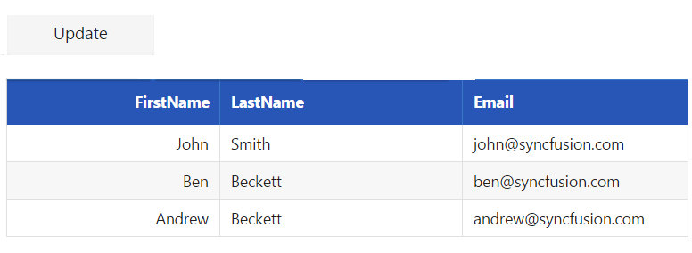
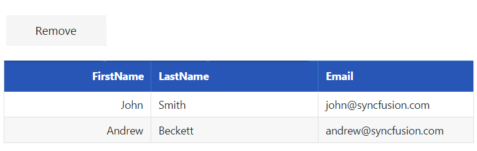
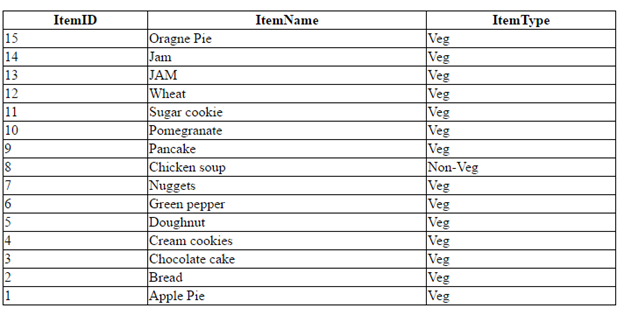

# CRUD Data Operations

The DataManager fully supports the CRUD (Create, Read, Update, Destroy) data operations. However, it must be combined with some user interface or another Syncfusion UI widget such as the Grid, ListView, etc.

## Local CRUD Operations

The information in this section is applicable to scenarios, in which the data is already available on the client, or when it is you that is going to take care of its retrieval and submission. In other words, DataManager will not make any HTTP requests on its own.

### Insert

The insert method of the data manager is used to add a new record to the table. The JSON data passed as a parameter to the insert method that is inserted to the data source of the data manager.





    /*ej-Tag Helper code to render DataManager*/
    <e-datamanager id="myData" json="(IEnumerable<object>)ViewBag.datasource"></e-datamanager>

    <ej-grid id="FlatGrid">
        <e-columns>
            <e-column field="FirstName" header-text="FirstName" text-align="Right" width="70"></e-column>
            <e-column field="LastName" header-text="LastName" width="80"></e-column>
            <e-column field="Email" header-text="Email" text-align="Left" width="75"></e-column>
        </e-columns>
    </ej-grid>
    

    /*Razor code to render DataManager*/
    @{Html.EJ().DataManager("myData").Json((IEnumerable<object>)ViewBag.datasource).Render();}

    @{Html.EJ().Grid<object>("FlatGrid")
            .DataManagerID("myData")
            .Query("new ej.Query()")
            .Columns(col =>
            {
                col.Field("FirstName").HeaderText("FirstName").IsPrimaryKey(true).TextAlign(TextAlign.Right).Width(75).Add();
                col.Field("LastName").HeaderText("LastName").Width(80).Add();
                col.Field("Email").HeaderText("Email").TextAlign(TextAlign.Right).Width(75).Add();
            }).Render();
    }





    <ej-button id="insert"
           size="Large" show-rounded-corner="true" text="Insert" click="onInsert" />





    





 

### Update

The update method is used to update the modified changes made to a record in the data source of the DataManager.





    /*ej-Tag Helper code to render DataManager*/
    <e-datamanager id="myData" json="(IEnumerable<object>)ViewBag.datasource"></e-datamanager>

    <ej-grid id="FlatGrid">
        <e-columns>
            <e-column field="FirstName" header-text="FirstName" text-align="Right" width="70"></e-column>
            <e-column field="LastName" header-text="LastName" width="80"></e-column>
            <e-column field="Email" header-text="Email" text-align="Left" width="75"></e-column>
        </e-columns>
    </ej-grid>
    

    /*Razor code to render DataManager*/
    @{Html.EJ().DataManager("myData").Json((IEnumerable<object>)ViewBag.datasource).Render();}

    @{Html.EJ().Grid<object>("FlatGrid")
            .DataManagerID("myData")
            .Query("new ej.Query()")
            .Columns(col =>
            {
                col.Field("FirstName").HeaderText("FirstName").IsPrimaryKey(true).TextAlign(TextAlign.Right).Width(75).Add();
                col.Field("LastName").HeaderText("LastName").Width(80).Add();
                col.Field("Email").HeaderText("Email").TextAlign(TextAlign.Right).Width(75).Add();
            }).Render();
    }





    <ej-button id="update"
           size="Large" show-rounded-corner="true" text="Update" click="onUpdate" />





    





 

### Remove

The remove function receives the items to be deleted in the Data Table. The function should remove the provided items from the data source of the DataManager.





    /*ej-Tag Helper code to render DataManager*/
    <e-datamanager id="myData" json="(IEnumerable<object>)ViewBag.datasource"></e-datamanager>

    <ej-grid id="FlatGrid">
        <e-columns>
            <e-column field="FirstName" header-text="FirstName" text-align="Right" width="70"></e-column>
            <e-column field="LastName" header-text="LastName" width="80"></e-column>
            <e-column field="Email" header-text="Email" text-align="Left" width="75"></e-column>
        </e-columns>
    </ej-grid>
    

    /*Razor code to render DataManager*/
    @{Html.EJ().DataManager("myData").Json((IEnumerable<object>)ViewBag.datasource).Render();}

    @{Html.EJ().Grid<object>("FlatGrid")
            .DataManagerID("myData")
            .Query("new ej.Query()")
            .Columns(col =>
            {
                col.Field("FirstName").HeaderText("FirstName").IsPrimaryKey(true).TextAlign(TextAlign.Right).Width(75).Add();
                col.Field("LastName").HeaderText("LastName").Width(80).Add();
                col.Field("Email").HeaderText("Email").TextAlign(TextAlign.Right).Width(75).Add();
            }).Render();
    }





    <ej-button id="remove"
           size="Large" show-rounded-corner="true" text="Remove" click="onRemove" />





    





 

## Remote CRUD Operations

The information in this section is applicable to scenarios, in which the data should be retrieved from and submitted to a remote data service via HTTP requests made by the DataManager.
CRUD operations with remote data rely on server code to perform the read, update, create and destroy actions. Instead of configuring client functions, the DataManager defines remote service URLs and the expected format in which data should be sent and received. Theoretically, it is possible to use remote CRUD operations with transport functions, similar to the above examples that use local data, but this is rarely required.

Each of the CRUD operation settings—read, update, create, destroy—provides some common settings that need to be set accordingly:

* The client request type can be "get" or "post".
* Additional optional headers parameters can be sent to the server if needed.
* The client request and expected server response dataType can be "json", "jsonp", "odata", etc.

### Insert

The insert method of the data manager is used to add a new record to the table. The JSON data passed as a parameter to the insert method that is inserted to the data source of the data manager.





    /*ej-Tag Helper code to render DataManager*/
    <e-datamanager id="myData" url="/api/Orders" adaptor="WebApiAdaptor" cross-domain="true"></e-datamanager>

    <ej-grid id="FlatGrid">
        <e-columns>
            <e-column field="OrderID" header-text="Order ID" text-align="Right" width="70"></e-column>
            <e-column field="CustomerID" header-text="Customer ID" width="80"></e-column>
            <e-column field="EmployeeID" header-text="Employee ID" text-align="Left" width="75"></e-column>
        </e-columns>
    </ej-grid>

    

    /*Razor code to render DataManager*/
    @{Html.EJ().DataManager("myData").URL("/api/Orders").Adaptor(AdaptorType.WebApiAdaptor).Render();}

    @{Html.EJ().Grid<object>("FlatGrid")
            .DataManagerID("myData")
            .Query("new ej.Query().select(['OrderID', 'CustomerID', 'EmployeeID']).take(5)")
            .Columns(col =>
            {
                col.Field("OrderID").HeaderText("Order ID").IsPrimaryKey(true).TextAlign(TextAlign.Right).Width(75).Add();
                col.Field("CustomerID").HeaderText("Customer ID").Width(80).Add();
                col.Field("EmployeeID").HeaderText("Employee ID").TextAlign(TextAlign.Right).Width(75).Add();
            }).Render();
    }





    <ej-button id="insert"
           size="Large" show-rounded-corner="true" text="Insert" click="onInsert" />





    





 

### Update

The update method is used to update the modified changes made to a record in the data source of the DataManager.





    /*ej-Tag Helper code to render DataManager*/
    <e-datamanager id="myData" url="/api/Orders" adaptor="WebApiAdaptor" cross-domain="true"></e-datamanager>

    <ej-grid id="FlatGrid">
        <e-columns>
            <e-column field="OrderID" header-text="Order ID" text-align="Right" width="70"></e-column>
            <e-column field="CustomerID" header-text="Customer ID" width="80"></e-column>
            <e-column field="EmployeeID" header-text="Employee ID" text-align="Left" width="75"></e-column>
        </e-columns>
    </ej-grid>

    

    /*Razor code to render DataManager*/
    @{Html.EJ().DataManager("myData").URL("/api/Orders").Adaptor(AdaptorType.WebApiAdaptor).Render();}

    @{Html.EJ().Grid<object>("FlatGrid")
            .DataManagerID("myData")
            .Query("new ej.Query().select(['OrderID', 'CustomerID', 'EmployeeID']).take(5)")
            .Columns(col =>
            {
                col.Field("OrderID").HeaderText("Order ID").IsPrimaryKey(true).TextAlign(TextAlign.Right).Width(75).Add();
                col.Field("CustomerID").HeaderText("Customer ID").Width(80).Add();
                col.Field("EmployeeID").HeaderText("Employee ID").TextAlign(TextAlign.Right).Width(75).Add();
            }).Render();
    }





    <ej-button id="update"
           size="Large" show-rounded-corner="true" text="Update" click="onUpdate" />





    





### Remove

The remove action submits the data items that should be deleted, or just its IDs. 





    /*ej-Tag Helper code to render DataManager*/
    <e-datamanager id="myData" url="/api/Orders" adaptor="WebApiAdaptor" cross-domain="true"></e-datamanager>

    <ej-grid id="FlatGrid">
        <e-columns>
            <e-column field="OrderID" header-text="Order ID" text-align="Right" width="70"></e-column>
            <e-column field="CustomerID" header-text="Customer ID" width="80"></e-column>
            <e-column field="EmployeeID" header-text="Employee ID" text-align="Left" width="75"></e-column>
        </e-columns>
    </ej-grid>

    

    /*Razor code to render DataManager*/
    @{Html.EJ().DataManager("myData").URL("/api/Orders").Adaptor(AdaptorType.WebApiAdaptor).Render();}

    @{Html.EJ().Grid<object>("FlatGrid")
            .DataManagerID("myData")
            .Query("new ej.Query().select(['OrderID', 'CustomerID', 'EmployeeID']).take(5)")
            .Columns(col =>
            {
                col.Field("OrderID").HeaderText("Order ID").IsPrimaryKey(true).TextAlign(TextAlign.Right).Width(75).Add();
                col.Field("CustomerID").HeaderText("Customer ID").Width(80).Add();
                col.Field("EmployeeID").HeaderText("Employee ID").TextAlign(TextAlign.Right).Width(75).Add();
            }).Render();
    }





    <ej-button id="remove"
           size="Large" show-rounded-corner="true" text="Remove" click="onRemove" />





    





