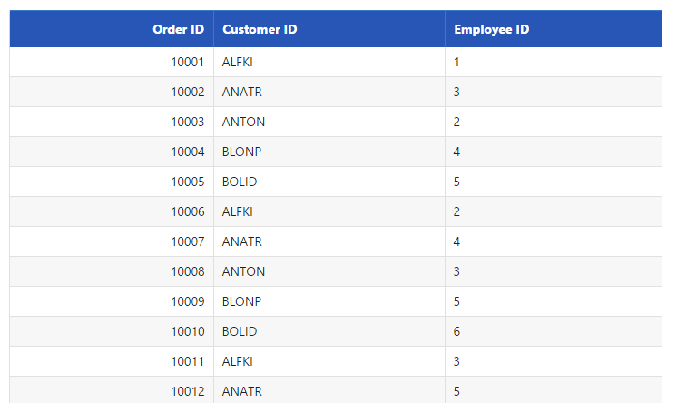
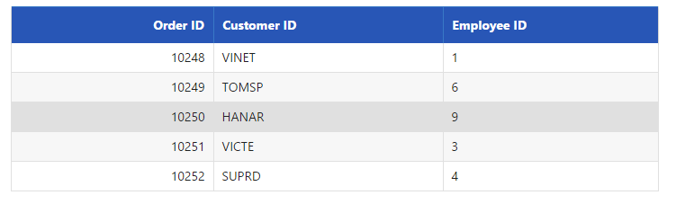
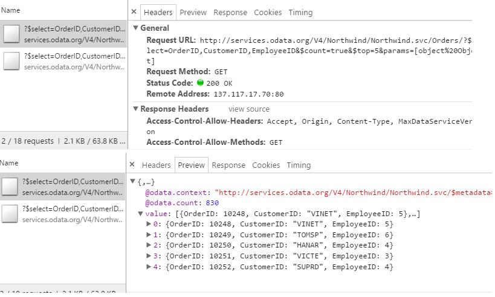
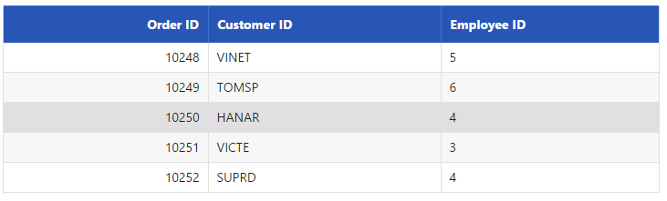
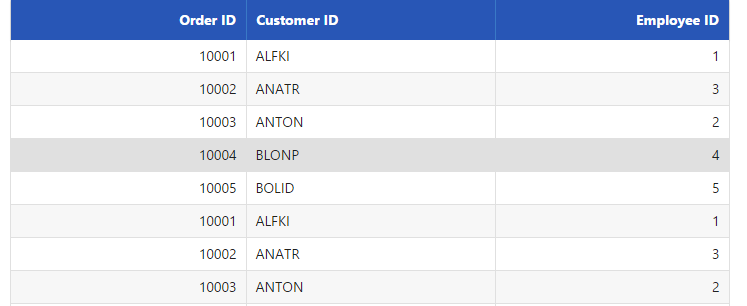

# Data Binding

## JSON

A data source can be bound to a Grid through the DataManager. The DataManager supports JSON array binding. It is useful to bind records in a client-side by using JSON data that is very helpful in Single Page Application (SPA) and in feature rich web application. To achieve this, you can refer to the following code example.





    public static List<OrderDetails> order = new List<OrderDetails>();
    public IActionResult DataBind()
    {
        BindDataSource();
        ViewBag.datasource = order;
        return View();
    }
    public void BindDataSource()
    {
        int code = 10000;
        for (int i = 1; i < 10; i++)
        {
            order.Add(new OrderDetails(code + 1, "ALFKI", i + 0, 2.3 * i, "Berlin"));
            order.Add(new OrderDetails(code + 2, "ANATR", i + 2, 3.3 * i, "Madrid"));
            order.Add(new OrderDetails(code + 3, "ANTON", i + 1, 4.3 * i, "Cholchester"));
            order.Add(new OrderDetails(code + 4, "BLONP", i + 3, 5.3 * i, "Marseille"));
            order.Add(new OrderDetails(code + 5, "BOLID", i + 4, 6.3 * i, "Tsawassen"));
            code += 5;
        }
    }
    public class OrderDetails
    {
        public OrderDetails()
        {

        }
        public OrderDetails(int OrderID, string CustomerId, int EmployeeId, double Freight, string ShipCity)
        {
            this.OrderID = OrderID;
            this.CustomerID = CustomerId;
            this.EmployeeID = EmployeeId;
            this.Freight = Freight;
            this.ShipCity = ShipCity;
        }

        public int? OrderID { get; set; }
        public string CustomerID { get; set; }
        public int? EmployeeID { get; set; }
        public double? Freight { get; set; }
        public string ShipCity { get; set; }
    }





    /*ej-Tag Helper code to render DataManager*/
    <e-datamanager id="myData" json="(IEnumerable<object>)ViewBag.datasource"></e-datamanager>

    <ej-grid id="FlatGrid" >
        <e-columns>
            <e-column field="OrderID" header-text="Order ID" text-align="Right" width="70"></e-column>
            <e-column field="CustomerID" header-text="Customer ID" width="80"></e-column>
            <e-column field="EmployeeID" header-text="Employee ID" text-align="Left" width="75"></e-column>
        </e-columns>
    </ej-grid>
    





    /*Razor code to render DataManager*/
    @{Html.EJ().DataManager("FlatData").Json((IEnumerable<object>)ViewBag.datasource).Render();}

    @{Html.EJ().Grid<object>("myGrid")
        .DataManagerID("FlatData")
        .Query("new ej.Query()")
        .Columns(col =>
        {
            col.Field("OrderID").HeaderText("Order ID").IsPrimaryKey(true).TextAlign(TextAlign.Right).Width(75).Add();
            col.Field("CustomerID").HeaderText("Customer ID").Width(80).Add();
            col.Field("EmployeeID").HeaderText("Employee ID").TextAlign(TextAlign.Right).Width(75).Add();
        }).Render();
    }





The result of the above code example is illustrated as follows.

 

## REST Services

### OData binding

**OData** is standardized protocol for creating and consuming data. You can retrieve data from OData service using **DataManager.** You can refer to the following code example of remote Data binding using OData service.





    /*ej-Tag Helper code to render DataManager*/
    <e-datamanager id="myData" url="http://mvc.syncfusion.com/Services/Northwnd.svc/Orders/" cross-domain="true"></e-datamanager>

    <ej-grid id="FlatGrid" >
        <e-columns>
            <e-column field="OrderID" header-text="Order ID" text-align="Right" width="70"></e-column>
            <e-column field="CustomerID" header-text="Customer ID" width="80"></e-column>
            <e-column field="EmployeeID" header-text="Employee ID" text-align="Left" width="75"></e-column>
        </e-columns>
    </ej-grid>
    





    /*Razor code to render DataManager*/
    @{Html.EJ().DataManager("FlatData").URL("http://mvc.syncfusion.com/Services/Northwnd.svc/Orders/").CrossDomain(true).Render();}

    @{Html.EJ().Grid<object>("myGrid")
        .DataManagerID("FlatData")
        .Query("new ej.Query().select(['OrderID', 'CustomerID', 'EmployeeID']).take(5)")
        .Columns(col =>
        {
            col.Field("OrderID").HeaderText("Order ID").IsPrimaryKey(true).TextAlign(TextAlign.Right).Width(75).Add();
            col.Field("CustomerID").HeaderText("Customer ID").Width(80).Add();
            col.Field("EmployeeID").HeaderText("Employee ID").TextAlign(TextAlign.Right).Width(75).Add();
        }).Render();
    }





The result of the above code example is illustrated as follows.

 

## OData V4

The OData v4 is an improved version of OData protocols and the **DataManager** can also retrieve and consume OData v4 services.  For more details on OData v4 Services, refer the [odata documentation](http://www.odata.org/documentation/).

You can refer to the following code example for consuming OData v4 services and bind the result to the simple **HTML** table. In the the following code, `crossDomain` is enabled to make cross domain request.





    /*ej-Tag Helper code to render DataManager*/
    <e-datamanager id="myData" url="http://services.odata.org/V4/Northwind/Northwind.svc/Orders/" adaptor="ODataV4Adaptor" cross-domain="true"></e-datamanager>

    <ej-grid id="FlatGrid" >
        <e-columns>
            <e-column field="OrderID" header-text="Order ID" text-align="Right" width="70"></e-column>
            <e-column field="CustomerID" header-text="Customer ID" width="80"></e-column>
            <e-column field="EmployeeID" header-text="Employee ID" text-align="Left" width="75"></e-column>
        </e-columns>
    </ej-grid>
    





    /*Razor code to render DataManager*/
    @{Html.EJ().DataManager("FlatData").URL("http://services.odata.org/V4/Northwind/Northwind.svc/Orders/").CrossDomain(true).Adaptor(AdaptorType.ODataV4Adaptor).Render();}

    @{Html.EJ().Grid<object>("myGrid")
        .DataManagerID("FlatData")
        .Query("new ej.Query().select(['OrderID', 'CustomerID', 'EmployeeID']).take(5)")
        .Columns(col =>
        {
            col.Field("OrderID").HeaderText("Order ID").IsPrimaryKey(true).TextAlign(TextAlign.Right).Width(75).Add();
            col.Field("CustomerID").HeaderText("Customer ID").Width(80).Add();
            col.Field("EmployeeID").HeaderText("Employee ID").TextAlign(TextAlign.Right).Width(75).Add();
        }).Render();
    }





The request and response to the service from the **DataManager** is illustrated as follows.

 

 _OData v4 request and response_

The result of the above code example is illustrated as follows.

 

 _OData v4 binding_

## WebAPI binding

The Web API is a programmatic interface to define the request and response messages system that is mostly exposed in **JSON** or **XML**. The **DataManager** contains default adaptor to handle the Web API request and responses. The **WebApiAdaptor** is discussed briefly in the Adaptor section.

Refer to the following code example for consuming Web API data using ej.DataManager.





    namespace WebApplication1.Controllers
    {
        [Route("api/[controller]")]
        public class OrdersController : Controller
        {
            public static List<OrderDetails> order = new List<OrderDetails>();
            // GET: api/values
            [HttpGet]
            public JsonResult Get()
            {
                int code = 10000;
                for (int i = 1; i < 2; i++)
                {
                    order.Add(new OrderDetails(code + 1, "ALFKI", i + 0, 2.3 * i, "Berlin"));
                    order.Add(new OrderDetails(code + 2, "ANATR", i + 2, 3.3 * i, "Madrid"));
                    order.Add(new OrderDetails(code + 3, "ANTON", i + 1, 4.3 * i, "Cholchester"));
                    order.Add(new OrderDetails(code + 4, "BLONP", i + 3, 5.3 * i, "Marseille"));
                    order.Add(new OrderDetails(code + 5, "BOLID", i + 4, 6.3 * i, "Tsawassen"));
                    code += 5;
                }
                var list = order.ToList();
                return JSON(new { result = list, count = list.Count });
            }
            public class OrderDetails
            {
                public OrderDetails()
                {

                }
                public OrderDetails(int OrderID, string CustomerId, int EmployeeId, double Freight, string ShipCity)
                {
                    this.OrderID = OrderID;
                    this.CustomerID = CustomerId;
                    this.EmployeeID = EmployeeId;
                    this.Freight = Freight;
                    this.ShipCity = ShipCity;
                }

                public int? OrderID { get; set; }
                public string CustomerID { get; set; }
                public int? EmployeeID { get; set; }
                public double? Freight { get; set; }
                public string ShipCity { get; set; }
            }
        }
    }
    




    /*ej-Tag Helper code to render DataManager*/
    <e-datamanager id="myData" url="/api/Orders" adaptor="WebApiAdaptor" cross-domain="true"></e-datamanager>

    <ej-grid id="FlatGrid" >
        <e-columns>
            <e-column field="OrderID" header-text="Order ID" text-align="Right" width="70"></e-column>
            <e-column field="CustomerID" header-text="Customer ID" width="80"></e-column>
            <e-column field="EmployeeID" header-text="Employee ID" text-align="Left" width="75"></e-column>
        </e-columns>
    </ej-grid>
    





    /*Razor code to render DataManager*/

    @{Html.EJ().DataManager("FlatData").URL("/api/Orders").Adaptor(AdaptorType.WebApiAdaptor).Render();}

    @{Html.EJ().Grid<object>("myGrid")
            .DataManagerID("FlatData")
            .Query("new ej.Query().select(['OrderID', 'CustomerID', 'EmployeeID']).take(5)")
            .Columns(col =>
            {
                col.Field("OrderID").HeaderText("Order ID").IsPrimaryKey(true).TextAlign(TextAlign.Right).Width(75).Add();
                col.Field("CustomerID").HeaderText("Customer ID").Width(80).Add();
                col.Field("EmployeeID").HeaderText("Employee ID").TextAlign(TextAlign.Right).Width(75).Add();
            }).Render();
    }





The result for the above code example is illustrated as follows.

 

_Web API data binding_

## Complex Data Sorting

You can perform a data operation based on nested column data and bind to the data control. Here, if you want to perform the server side data operation for the nested dataSource like sorting, grouping, filtering, searching, take, or skip then we have to define the generic type of dataSource.



 <ej-grid id="FlatGrid" allow-paging="true" allow-sorting="true" >
        <e-datamanager json="ViewBag.data"  adaptor="remoteSaveAdaptor"></e-datamanager>
          <e-toolbar-settings show-toolbar="true" toolbar-items="@(new List<string>() {"add","edit","delete","update","cancel" })"></e-toolbar-settings>
         <e-columns>
            <e-column field="orderID" header-text="Order ID" text-align="Right" width="75"></e-column>
            <e-column field="customerID" header-text="Customer ID" width="80"></e-column>
            <e-column field="employeeID" header-text="Employee ID" text-align="Left" width="75"></e-column>
            <e-column field="freight" header-text="Freight" text-align="Right" width="75"></e-column>

            <e-column field="shipCity" header-text="Ship City" width="75"></e-column>
           <e-column field="customer.0.customerNumber" header-text="Customer Number0" width="60"></e-column>
    <e-column field="customer.0.otherAddress" header-text="Customer Address2 0" width="60"></e-column>
    <e-column field="customer.1.customerNumber" header-text="Customer Number1" width="60"></e-column>
    <e-column field="customer.1.otherAddress" header-text="Customer Address2 1" width="60"></e-column>

        </e-columns>
           </ej-grid>





       public IActionResult About()
        {  
            BindDataSource();
            ViewBag.data = order;
            return View();
        }
      public void BindDataSource()
        {
            int code = 10000;
            Customer[] cs = { new Customer { customerNumber = 4, otherAddress = "Hello" }, new Customer { customerNumber = 986, otherAddress = "bOther" } };
          Customer[] cos = { new Customer { otherAddress = "a", customerNumber = 5 }, new Customer { customerNumber = 777, otherAddress = "other" } };

            for (int i = 1; i < 10; i++)
            {
                order.Add(new Orders(code + 1, "ALs", i + 0, 2.3 * i, new DateTime(1991, 05, 15), "Berlin", true,cs));
                order.Add(new Orders(code + 2, "ANATR", i + 2, 3.3 * i, new DateTime(1990, 04, 04), "Madrid", false,cos));
                order.Add(new Orders(code + 3, "ANTON", i + 1, 4.3 * i, new DateTime(1957, 11, 30), "Cholchester", false,cs));
                order.Add(new Orders(code + 4, "BLONP", i + 3, 5.3 * i, new DateTime(1930, 10, 22), "Marseille", true,cos));
                order.Add(new Orders(code + 5, "BOLID", i + 4, 6.3 * i, new DateTime(1953, 02, 18), "Tsawassen", true,cos));
                code += 5;
            }
            Sort sortingObject = new Sort();
            IEnumerable<Orders> List = order;
            sortingObject.Name = "customer.0.otherAddress";
            sortingObject.Direction = "ascending";
            List<Sort> listToSort = new List<Sort>();
            listToSort.Add(sortingObject);
            Syncfusion.JavaScript.DataSources.DataOperations operation = new Syncfusion.JavaScript.DataSources.DataOperations();
            List = operation.PerformSorting(List, listToSort);
            order = List.Cast<Orders>().ToList();

        }



