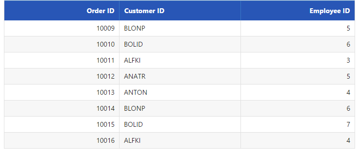
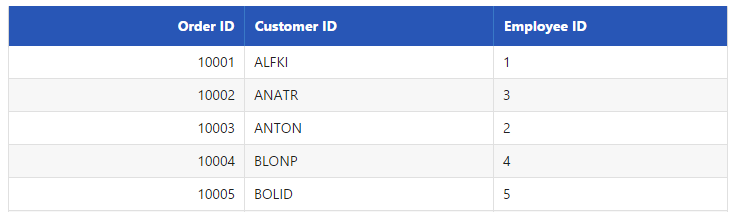
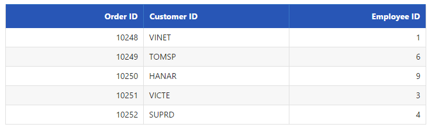
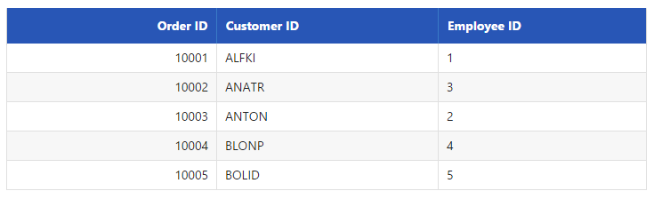
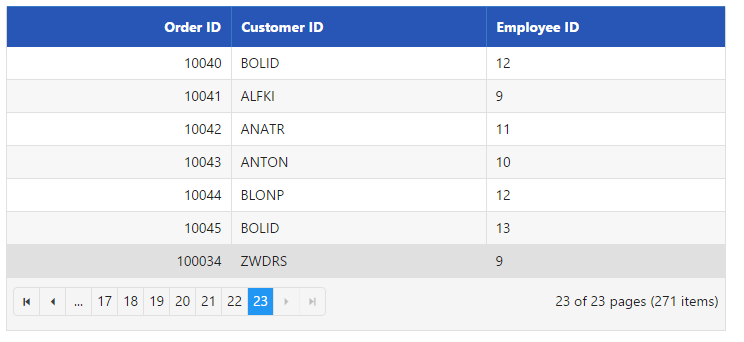
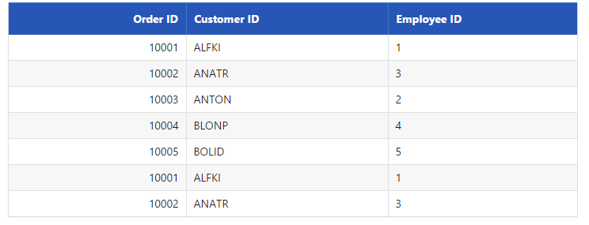

# Data Adaptors

**DataManger** uses adaptors to process data. There are three types of adaptors in **DataManger**. They are

* JSON Adaptor

* URL Adaptor

* OData Adaptor

Here, you can learn when and how each adaptor is used.

## JSON Adaptor

**JSONAdaptor** is used to process **JSON** data. It contains methods to process the given **JSON** data based on the queries. 

**JSONAdaptor** has the following unique in-built methods, 

<table>
    <tr>
        <th> Properties  </th>
        <th> Parameters  </th>
        <th> Description   </th>
    </tr>
     <tr>
        <td> processQuery(ds, query) </td>
        <td> 
            <table>
                <tr>  <td> dm </td> <td> Object </td> <td> ej.DataManager object </td> </tr>
                <tr>  <td> query </td> <td> ej.Query </td> <td>  Sets the default query for the data source </td> </tr>
            </table>
        </td>
        <td> Used to prepare query string for the request data </td>
    </tr>
    <tr>
        <td> processResponse(data, ds, query, xhr) </td>
         <td> 
            <table>
                <tr>  <td> data </td> <td> Object </td> <td>  JSON data or JSON array </td> </tr>
                <tr>  <td> ds </td> <td> Object </td> <td> ej.DataManager object </td> </tr>
                <tr>  <td> query </td> <td> ej.Query </td> <td>  Sets the default query for the data source </td> </tr>
                <tr>  <td> xhr </td> <td> Object </td> <td> XMLHTTPRequest object </td> </tr>
            </table>
        </td>
        <td> Used to precess the response which is return from the Data Source </td>
    </tr>
    <tr>
        <td> insert(dm, data) </td>
        <td> 
            <table>
                <tr>  <td> data </td> <td> Object </td> <td>  JSON data or JSON array </td> </tr>
                <tr>  <td> dm </td> <td> Object </td> <td> ej.DataManager object </td> </tr>
            </table>
        </td>
        <td> Inserts a data item in the data table. </td>
    </tr>
    <tr>
        <td> remove(dm, keyField, value, tableName) </td>
        <td> 
            <table>
                <tr>  <td> dm </td> <td> Object </td> <td>  ej.DataManager object </td> </tr>
                <tr>  <td> keyField </td> <td> String </td> <td> KeyColumn to find the data </td> </tr>
                <tr>  <td> String </td> <td> Object </td> <td> Specified value for the keyField</td> </tr>
                <tr>  <td> tableName </td> <td> String </td> <td> Name of the source table </td> </tr>
            </table>
        </td>
        <td> It is used to remove the data from the dataSource </td>
    </tr>
    <tr>
        <td> update(dm, keyField, value, tableName) </td>
        <td> 
            <table>
                <tr>  <td> dm </td> <td> Object </td> <td>  ej.DataManager object </td> </tr>
                <tr>  <td> keyField </td> <td> String </td> <td> KeyColumn to find the data </td> </tr>
                <tr>  <td> String </td> <td> Object </td> <td> Specified value for the keyField</td> </tr>
                <tr>  <td> tableName </td> <td> String </td> <td> Name of the source table </td> </tr>
            </table>
        </td>
        <td> Updates existing record and saves the changes to the table.. </td>
    </tr>
</table>

The following code example illustrates on how to use **JSONAdaptor**.





    public static List<OrderDetails> order = new List<OrderDetails>();
    public IActionResult DataAdaptors()
    {
        BindDataSource();
        ViewBag.datasource = order;
        return View();
    }
    public void BindDataSource()
    {
        int code = 10000;
        for (int i = 1; i < 10; i++)
        {
            order.Add(new OrderDetails(code + 1, "ALFKI", i + 0, 2.3 * i, "Berlin"));
            order.Add(new OrderDetails(code + 2, "ANATR", i + 2, 3.3 * i, "Madrid"));
            order.Add(new OrderDetails(code + 3, "ANTON", i + 1, 4.3 * i, "Cholchester"));
            order.Add(new OrderDetails(code + 4, "BLONP", i + 3, 5.3 * i, "Marseille"));
            order.Add(new OrderDetails(code + 5, "BOLID", i + 4, 6.3 * i, "Tsawassen"));
            code += 5;
        }
    }
    public class OrderDetails
    {
        public OrderDetails()
        {

        }
        public OrderDetails(int OrderID, string CustomerId, int EmployeeId, double Freight, string ShipCity)
        {
            this.OrderID = OrderID;
            this.CustomerID = CustomerId;
            this.EmployeeID = EmployeeId;
            this.Freight = Freight;
            this.ShipCity = ShipCity;
        }

        public int? OrderID { get; set; }
        public string CustomerID { get; set; }
        public int? EmployeeID { get; set; }
        public double? Freight { get; set; }
        public string ShipCity { get; set; }
    }





    /*ej-Tag Helper code to render DataManager*/
    <ej-grid id="FlatGrid">
        <e-datamanager json="(IEnumerable<object>)ViewBag.datasource" adaptor="JsonAdaptor"></e-datamanager>
        <e-columns>
            <e-column field="OrderID" header-text="Order ID" text-align="Right" width="70"></e-column>
            <e-column field="CustomerID" header-text="Customer ID" width="80"></e-column>
            <e-column field="EmployeeID" header-text="Employee ID" text-align="Left" width="75"></e-column>
        </e-columns>
    </ej-grid>





    /*Razor code to render DataManager*/
    @{Html.EJ().DataManager("FlatData").Json((IEnumerable<object>)ViewBag.datasource).Adaptor(AdaptorType.JsonAdaptor).Render();}

    @{Html.EJ().Grid<object>("myGrid")
                .DataManagerID("FlatData")
                .Query("new ej.Query().select(['OrderID', 'CustomerID', 'EmployeeID']).page(2, 8)")
                .Columns(col =>
                {
                    col.Field("OrderID").HeaderText("Order ID").IsPrimaryKey(true).TextAlign(TextAlign.Right).Width(75).Add();
                    col.Field("CustomerID").HeaderText("Customer ID").Width(80).Add();
                    col.Field("EmployeeID").HeaderText("Employee ID").TextAlign(TextAlign.Right).Width(75).Add();
                }).Render();
    }





The result of above code example is illustrated as follows.

 

## URL Adaptor

URL Adaptor of **DataManager** can be used when you are required to use remote service to retrieve data. It interacts with server-side for all **DataManager** Queries and **CRUD** operations. 

**UrlAdaptor** has the following unique in-built methods, 

<table>
    <tr>
        <th> Properties  </th>
        <th> Parameters  </th>
        <th> Description   </th>
    </tr>
     <tr>
        <td> processQuery(dm, query, hierarchyFilters) </td>
        <td> 
            <table>
                <tr>  <td> dm </td> <td> Object </td> <td> ej.DataManager object </td> </tr>
                <tr>  <td> query </td> <td> ej.Query </td> <td>  Sets the default query for the data source </td> </tr>
                <tr>  <td> hierarchyFilters </td> <td> ej.Query </td> <td> The hierarchical query can be provided by using the hierarchical function.  </td> </tr>
            </table>
        </td>
        <td> Used to prepare query string for the request data </td>
    </tr>
    <tr>
        <td> processResponse(data, ds, query, xhr, request, changes) </td>
         <td> 
            <table>
                <tr>  <td> data </td> <td> Object </td> <td>  JSON data or JSON array of Result</td> </tr>
                <tr>  <td> ds </td> <td> Object </td> <td> ej.DataManager object </td> </tr>
                <tr>  <td> query </td> <td> ej.Query </td> <td>  Sets the default query for the data source </td> </tr>
                <tr>  <td> xhr </td> <td> Object </td> <td> XMLHTTPRequest object </td> </tr>
                <tr>  <td> request </td> <td> Object </td> <td>  request object to the Data Source </td> </tr>
                <tr>  <td> changes </td> <td> Object </td> <td> Specified changes to the Data Source </td> </tr>
            </table>
        </td>
        <td> Used to precess the response which is return from the Data Source </td>
    </tr>
    <tr>
        <td> insert(dm, data, tableName, query) </td>
        <td> 
            <table>
                <tr>  <td> data </td> <td> Object </td> <td>  JSON data or JSON array </td> </tr>
                <tr>  <td> dm </td> <td> Object </td> <td> ej.DataManager object </td> </tr>
                <tr>  <td> tableName </td> <td> String </td> <td> Name of the source table </td> </tr>
                <tr>  <td> query </td> <td> ej.Query </td> <td>  Sets the default query for the data source </td> </tr>
            </table>
        </td>
        <td> Inserts a data item in the data table. </td>
    </tr>
    <tr>
        <td> remove(dm, keyField, value, tableName, query) </td>
        <td> 
            <table>
                <tr>  <td> dm </td> <td> Object </td> <td>  ej.DataManager object </td> </tr>
                <tr>  <td> keyField </td> <td> String </td> <td> KeyColumn to find the data </td> </tr>
                <tr>  <td> String </td> <td> Object </td> <td> Specified value for the keyField</td> </tr>
                <tr>  <td> tableName </td> <td> String </td> <td> Name of the source table </td> </tr>
                <tr>  <td> query </td> <td> ej.Query </td> <td>  Sets the default query for the data source </td> </tr>
            </table>
        </td>
        <td> It is used to remove the data from the dataSource </td>
    </tr>
    <tr>
        <td> update(dm, keyField, value, tableName, query) </td>
        <td> 
            <table>
                <tr>  <td> dm </td> <td> Object </td> <td>  ej.DataManager object </td> </tr>
                <tr>  <td> keyField </td> <td> String </td> <td> KeyColumn to find the data </td> </tr>
                <tr>  <td> String </td> <td> Object </td> <td> Specified value for the keyField</td> </tr>
                <tr>  <td> tableName </td> <td> String </td> <td> Name of the source table </td> </tr>
                <tr>  <td> query </td> <td> ej.Query </td> <td>  Sets the default query for the data source </td> </tr>
            </table>
        </td>
        <td> Updates existing record and saves the changes to the table.. </td>
    </tr>
</table>

Now, in the following code example the data is retrieved from **MVC** **Controller**. 





    public static List<OrderDetails> order = new List<OrderDetails>();
    public IActionResult DataAdaptors()
    {
        return View();
    }
    public JsonResult DataSource()
    {
        int code = 10000;
        for (int i = 1; i < 10; i++)
        {
            order.Add(new OrderDetails(code + 1, "ALFKI", i + 0, 2.3 * i, "Berlin"));
            order.Add(new OrderDetails(code + 2, "ANATR", i + 2, 3.3 * i, "Madrid"));
            order.Add(new OrderDetails(code + 3, "ANTON", i + 1, 4.3 * i, "Cholchester"));
            order.Add(new OrderDetails(code + 4, "BLONP", i + 3, 5.3 * i, "Marseille"));
            order.Add(new OrderDetails(code + 5, "BOLID", i + 4, 6.3 * i, "Tsawassen"));
            code += 5;
        }
        var list = order.ToList();
        return Json(new { result = list, count = list.Count });
    }
    public class OrderDetails
    {
        public OrderDetails()
        {

        }
        public OrderDetails(int OrderID, string CustomerId, int EmployeeId, double Freight, string ShipCity)
        {
            this.OrderID = OrderID;
            this.CustomerID = CustomerId;
            this.EmployeeID = EmployeeId;
            this.Freight = Freight;
            this.ShipCity = ShipCity;
        }

        public int? OrderID { get; set; }
        public string CustomerID { get; set; }
        public int? EmployeeID { get; set; }
        public double? Freight { get; set; }
        public string ShipCity { get; set; }
    }





    /*ej-Tag Helper code to render DataManager*/
    <ej-grid id="FlatGrid"  query="new ej.Query().select(['OrderID', 'CustomerID', 'EmployeeID']).take(5)">
        <e-datamanager url="DataSource" adaptor="UrlAdaptor" ></e-datamanager>
        <e-columns>
            <e-column field="OrderID" header-text="Order ID" text-align="Right" width="75"></e-column>
            <e-column field="CustomerID" header-text="Customer ID" width="80"></e-column>
            <e-column field="EmployeeID" header-text="Employee ID" text-align="Left" width="75"></e-column>
        </e-columns>
    </ej-grid>





    /*Razor code to render DataManager*/
    @{Html.EJ().Grid<object>("myGrid")
            .DataManagerID("FlatData")
            .Query("new ej.Query().select(['OrderID', 'CustomerID', 'EmployeeID']).take(5)")
            .Columns(col =>
            {
                col.Field("OrderID").HeaderText("Order ID").IsPrimaryKey(true).TextAlign(TextAlign.Right).Width(75).Add();
                col.Field("CustomerID").HeaderText("Customer ID").Width(80).Add();
                col.Field("EmployeeID").HeaderText("Employee ID").TextAlign(TextAlign.Right).Width(75).Add();
            }).Render();
    }





N> MVC now serializes JSON with camel case names by default in ASP.NET Core.  
In previous milestones, MVC's JSON serialization used Json.NET's default naming convention. This maintained C# property names in the JSON. 
In 1.0.0, MVC uses camel case names by default. This matches most JSON naming conventions. 
To restore previous naming strategy  
If you have case-sensitive clients that cannot be easily updated, change your Startup from  
> services.AddMvc();
to  
> services.AddMvc().AddJsonOptions(options => options.SerializerSettings.ContractResolver = new DefaultContractResolver());

The result of the above code example is illustrated as follows.

 

## OData Adaptor

**OData** Adaptor that is extended from **UrlAdaptor**, is used for consuming data through OData Service. You can use the following code example to use **OData** adaptor.

**ODataAdaptor** has the following unique in-built methods, 

<table>
    <tr>
        <th> Properties  </th>
        <th> Parameters  </th>
        <th> Description   </th>
    </tr>
    <tr>
        <td> processResponse(data, ds, query, xhr, request, changes) </td>
         <td> 
            <table>
                <tr>  <td> data </td> <td> Object </td> <td>  JSON data or JSON array </td> </tr>
                <tr>  <td> ds </td> <td> Object </td> <td> ej.DataManager object </td> </tr>
                <tr>  <td> query </td> <td> ej.Query </td> <td>  Sets the default query for the data source </td> </tr>
                <tr>  <td> xhr </td> <td> Object </td> <td> XMLHTTPRequest object </td> </tr>
                <tr>  <td> request </td> <td> Object </td> <td>  request object to the Data Source </td> </tr>
                <tr>  <td> changes </td> <td> Object </td> <td> Specified changes to the Data Source </td> </tr>
            </table>
        </td>
        <td> Used to precess the response which is return from the Data Source </td>
    </tr>
     <tr>
        <td> insert(dm, data, tableName) </td>
        <td> 
            <table>
                <tr>  <td> data </td> <td> Object </td> <td>  JSON data or JSON array </td> </tr>
                <tr>  <td> dm </td> <td> Object </td> <td> ej.DataManager object </td> </tr>
                <tr>  <td> tableName </td> <td> String </td> <td> Name of the source table </td> </tr>
            </table>
        </td>
        <td> Inserts a data item in the data table. </td>
    </tr>
    <tr>
        <td> remove(dm, keyField, value, tableName) </td>
        <td> 
            <table>
                <tr>  <td> dm </td> <td> Object </td> <td>  ej.DataManager object </td> </tr>
                <tr>  <td> keyField </td> <td> String </td> <td> KeyColumn to find the data </td> </tr>
                <tr>  <td> String </td> <td> Object </td> <td> Specified value for the keyField</td> </tr>
                <tr>  <td> tableName </td> <td> String </td> <td> Name of the source table </td> </tr>
            </table>
        </td>
        <td> It is used to remove the data from the dataSource </td>
    </tr>
    <tr>
        <td> update(dm, keyField, value, tableName) </td>
        <td> 
            <table>
                <tr>  <td> dm </td> <td> Object </td> <td>  ej.DataManager object </td> </tr>
                <tr>  <td> keyField </td> <td> String </td> <td> KeyColumn to find the data </td> </tr>
                <tr>  <td> String </td> <td> Object </td> <td> Specified value for the keyField</td> </tr>
                <tr>  <td> tableName </td> <td> String </td> <td> Name of the source table </td> </tr>
            </table>
        </td>
        <td> Updates existing record and saves the changes to the table.. </td>
    </tr>
</table>





    /*ej-Tag Helper code to render DataManager*/
    <ej-grid id="FlatGrid" query="new ej.Query().select(['OrderID', 'CustomerID', 'EmployeeID']).take(5)">
        <e-datamanager url="http://mvc.syncfusion.com/Services/Northwnd.svc/Orders/" adaptor="ODataAdaptor"></e-datamanager>
        <e-columns>
            <e-column field="OrderID" header-text="Order ID" text-align="Right" width="75"></e-column>
            <e-column field="CustomerID" header-text="Customer ID" width="80"></e-column>
            <e-column field="EmployeeID" header-text="Employee ID" text-align="Left" width="75"></e-column>
        </e-columns>
    </ej-grid>





    /*Razor code to render DataManager*/
    @{Html.EJ().DataManager("FlatData").URL("http://mvc.syncfusion.com/Services/Northwnd.svc/Orders/").Adaptor(AdaptorType.ODataAdaptor).Render();}

    @{Html.EJ().Grid<object>("myGrid")
            .DataManagerID("FlatData").ClientSideEvents(e => e.Create("onCreate"))
            .Query("new ej.Query().select(['OrderID', 'CustomerID', 'EmployeeID']).take(5)")
            .Columns(col =>
            {
                col.Field("OrderID").HeaderText("Order ID").IsPrimaryKey(true).TextAlign(TextAlign.Right).Width(75).Add();
                col.Field("CustomerID").HeaderText("Customer ID").Width(80).Add();
                col.Field("EmployeeID").HeaderText("Employee ID").TextAlign(TextAlign.Right).Width(75).Add();
            }).Render();
    }





The result of the above code example is illustrated as follows.

 

## WebAPI Adaptor

**WebApi** Adaptor, extended from **ODataAdaptor**, of **DataManager** is used for retrieving data from WebApi service. 

**WebApiAdaptor** has the following unique in-built methods, 

<table>
    <tr>
        <th> Properties  </th>
        <th> Parameters  </th>
        <th> Description   </th>
    </tr>
    <tr>
        <td> processResponse(data, ds, query, xhr, request, changes) </td>
         <td> 
            <table>
                <tr>  <td> data </td> <td> Object </td> <td>  JSON data or JSON array </td> </tr>
                <tr>  <td> ds </td> <td> Object </td> <td> ej.DataManager object </td> </tr>
                <tr>  <td> query </td> <td> ej.Query </td> <td>  Sets the default query for the data source </td> </tr>
                <tr>  <td> xhr </td> <td> Object </td> <td> XMLHTTPRequest object </td> </tr>
                <tr>  <td> request </td> <td> Object </td> <td>  request object to the Data Source </td> </tr>
                <tr>  <td> changes </td> <td> Object </td> <td> Specified changes to the Data Source </td> </tr>
            </table>
        </td>
        <td> Used to precess the response which is return from the Data Source </td>
    </tr>
     <tr>
        <td> insert(dm, data, tableName) </td>
        <td> 
            <table>
                <tr>  <td> data </td> <td> Object </td> <td>  JSON data or JSON array </td> </tr>
                <tr>  <td> dm </td> <td> Object </td> <td> ej.DataManager object </td> </tr>
                <tr>  <td> tableName </td> <td> String </td> <td> Name of the source table </td> </tr>
            </table>
        </td>
        <td> Inserts a data item in the data table. </td>
    </tr>
    <tr>
        <td> remove(dm, keyField, value, tableName) </td>
        <td> 
            <table>
                <tr>  <td> dm </td> <td> Object </td> <td>  ej.DataManager object </td> </tr>
                <tr>  <td> keyField </td> <td> String </td> <td> KeyColumn to find the data </td> </tr>
                <tr>  <td> String </td> <td> Object </td> <td> Specified value for the keyField</td> </tr>
                <tr>  <td> tableName </td> <td> String </td> <td> Name of the source table </td> </tr>
            </table>
        </td>
        <td> It is used to remove the data from the dataSource </td>
    </tr>
    <tr>
        <td> update(dm, keyField, value, tableName) </td>
        <td> 
            <table>
                <tr>  <td> dm </td> <td> Object </td> <td>  ej.DataManager object </td> </tr>
                <tr>  <td> keyField </td> <td> String </td> <td> KeyColumn to find the data </td> </tr>
                <tr>  <td> String </td> <td> Object </td> <td> Specified value for the keyField</td> </tr>
                <tr>  <td> tableName </td> <td> String </td> <td> Name of the source table </td> </tr>
            </table>
        </td>
        <td> Updates existing record and saves the changes to the table.. </td>
    </tr>
</table>

Refer to the following code example.





    public class OrdersController : Controller
    {
        public static List<OrderDetails> order = new List<OrderDetails>();
        // GET: api/values
        [HttpGet]
        public JsonResult Get()
        {
            int code = 10000;
            for (int i = 1; i < 2; i++)
            {
                order.Add(new OrderDetails(code + 1, "ALFKI", i + 0, 2.3 * i, "Berlin"));
                order.Add(new OrderDetails(code + 2, "ANATR", i + 2, 3.3 * i, "Madrid"));
                order.Add(new OrderDetails(code + 3, "ANTON", i + 1, 4.3 * i, "Cholchester"));
                order.Add(new OrderDetails(code + 4, "BLONP", i + 3, 5.3 * i, "Marseille"));
                order.Add(new OrderDetails(code + 5, "BOLID", i + 4, 6.3 * i, "Tsawassen"));
                code += 5;
            }
            var list = order.ToList();
            return Json(new { result = list, count = list.Count });
        }
        public class OrderDetails
        {
            public OrderDetails()
            {

            }
            public OrderDetails(int OrderID, string CustomerId, int EmployeeId, double Freight, string ShipCity)
            {
                this.OrderID = OrderID;
                this.CustomerID = CustomerId;
                this.EmployeeID = EmployeeId;
                this.Freight = Freight;
                this.ShipCity = ShipCity;
            }

            public int? OrderID { get; set; }
            public string CustomerID { get; set; }
            public int? EmployeeID { get; set; }
            public double? Freight { get; set; }
            public string ShipCity { get; set; }
        }
    }





    /*ej-Tag Helper code to render DataManager*/
    <ej-grid id="FlatGrid" query="new ej.Query().select(['OrderID', 'CustomerID', 'EmployeeID'])">
        <e-datamanager url="/api/Orders" adaptor="WebApiAdaptor"></e-datamanager>
        <e-columns>
            <e-column field="OrderID" header-text="Order ID" text-align="Right" width="75"></e-column>
            <e-column field="CustomerID" header-text="Customer ID" width="80"></e-column>
            <e-column field="EmployeeID" header-text="Employee ID" text-align="Left" width="75"></e-column>
        </e-columns>
    </ej-grid>





    /*Razor code to render DataManager*/
    @{Html.EJ().DataManager("FlatData").URL("/api/Orders").Adaptor(AdaptorType.WebApiAdaptor).Render();}

    @{Html.EJ().Grid<object>("myGrid")
            .DataManagerID("FlatData")
            .Query("new ej.Query().select(['OrderID', 'CustomerID', 'EmployeeID'])")
            .Columns(col =>
            {
                col.Field("OrderID").HeaderText("Order ID").IsPrimaryKey(true).TextAlign(TextAlign.Right).Width(75).Add();
                col.Field("CustomerID").HeaderText("Customer ID").Width(80).Add();
                col.Field("EmployeeID").HeaderText("Employee ID").TextAlign(TextAlign.Right).Width(75).Add();
            }).Render();
    }





Result of the above code example is illustrated as follows.

 

## RemoteSave Adaptor

**RemoteSaveAdaptor**, extended from **JsonAdaptor** of **DataManager**, is used for binding local data and performs all **DataManager** queries in client-side. It interacts with server-side only for **CRUD** operations to pass the modified records. 

**JSONAdaptor** has the following unique in-built methods, 

<table>
    <tr>
        <th> Properties  </th>
        <th> Parameters  </th>
        <th> Description   </th>
    </tr>
    <tr>
        <td> insert(dm, data, tableName, query) </td>
        <td> 
            <table>
                <tr>  <td> data </td> <td> Object </td> <td>  JSON data or JSON array </td> </tr>
                <tr>  <td> dm </td> <td> Object </td> <td> ej.DataManager object </td> </tr>
                <tr>  <td> tableName </td> <td> String </td> <td> Name of the source table </td> </tr>
                <tr>  <td> query </td> <td> ej.Query </td> <td>  Sets the default query for the data source </td> </tr>
            </table>
        </td>
        <td> Inserts a data item in the data table. </td>
    </tr>
    <tr>
        <td> remove(dm, keyField, value, tableName, query) </td>
        <td> 
            <table>
                <tr>  <td> dm </td> <td> Object </td> <td>  ej.DataManager object </td> </tr>
                <tr>  <td> keyField </td> <td> String </td> <td> KeyColumn to find the data </td> </tr>
                <tr>  <td> String </td> <td> Object </td> <td> Specified value for the keyField</td> </tr>
                <tr>  <td> tableName </td> <td> String </td> <td> Name of the source table </td> </tr>
                <tr>  <td> query </td> <td> ej.Query </td> <td>  Sets the default query for the data source </td> </tr>
            </table>
        </td>
        <td> It is used to remove the data from the dataSource </td>
    </tr>
    <tr>
        <td> update(dm, keyField, value, tableName, query) </td>
        <td> 
            <table>
                <tr>  <td> dm </td> <td> Object </td> <td>  ej.DataManager object </td> </tr>
                <tr>  <td> keyField </td> <td> String </td> <td> KeyColumn to find the data </td> </tr>
                <tr>  <td> String </td> <td> Object </td> <td> Specified value for the keyField</td> </tr>
                <tr>  <td> tableName </td> <td> String </td> <td> Name of the source table </td> </tr>
                <tr>  <td> query </td> <td> ej.Query </td> <td>  Sets the default query for the data source </td> </tr>
            </table>
        </td>
        <td> Updates existing record and saves the changes to the table.. </td>
    </tr>
</table>

Refer to the following code example.





    

        

            

            OrderID
            

            

            <input id="OrderID" class="e-ejinputtext" type="text" value="" />
            

        

        

            

            Customer ID
            

            

            <input id="CustomerID" class="e-ejinputtext" type="text" value="" />
            

        

        

            

            Employee ID
            

            

            <input id="EmployeeID" class="e-ejinputtext" type="text" value="" />
            

        

        

            

            <input type="button" value="Change" />
            <input type="button" value="Add" />
            <input type="button" value="Remove" />
            

        

    

   




    /*ej-Tag Helper code to render DataManager*/

    <e-datamanager id="myData" json="(IEnumerable<object>)ViewBag.datasource" adaptor="remoteSaveAdaptor" insert-url="Insert" update-url="Update" remove-url="Remove"></e-datamanager>

    <ej-grid id="FlatGrid" allow-paging="true">
        <e-columns>
            <e-column field="OrderID" header-text="Order ID" text-align="Right" width="70"></e-column>
            <e-column field="CustomerID" header-text="Customer ID" width="80"></e-column>
            <e-column field="EmployeeID" header-text="Employee ID" text-align="Left" width="75"></e-column>
        </e-columns>
    </ej-grid>

    





    /*Razor code to render DataManager*/
    @{Html.EJ().DataManager("FlatData").Json((IEnumerable<object>)ViewBag.datasource).Adaptor("remoteSaveAdaptor").InsertURL("Insert").UpdateURL("Update").RemoveURL("Remove").Render();}

    @{ Html.EJ().Grid<object>("myGrid")
                            .DataManagerID("FlatData")
                            .Query("new ej.Query()")
                            .Columns(col =>
                            {
                                col.Field("OrderID").HeaderText("Order ID").IsPrimaryKey(true).TextAlign(TextAlign.Right).Width(75).Add();
                                col.Field("CustomerID").HeaderText("Customer ID").Width(80).Add();
                                col.Field("EmployeeID").HeaderText("Employee ID").TextAlign(TextAlign.Right).Width(75).Add();
                            }).Render();
    }
     





    public class HomeController : Controller
    {
        public static IList<EditableOrder> Data()
        {
            IList<EditableOrder> records = (IList<EditableOrder>)System.Web.HttpContext.Current.Session["Orders"];

            if (records == null)
            {
                List<EditableOrder> temp = new List<EditableOrder>();
                for (int i = 1; i <= 5; i++)
                {
                    var order = new EditableOrder() { OrderID = 10247 + i, CustomerID = "Customer" + i, EmployeeID = i };
                    temp.Add(order);
                }
                System.Web.HttpContext.Current.Session["Orders"] = records = temp;
            }
            return records;
        }
        public JsonResult Update(EditableOrder value)
        {

            var record = Data().Where(o => o.OrderID == value.OrderID).FirstOrDefault();
            if (record != null)
            {
                record.OrderID = value.OrderID;
                record.CustomerID = value.CustomerID;
                record.EmployeeID = value.EmployeeID;
            }
            return Json(Data(), JsonRequestBehavior.AllowGet);
        }
        public JsonResult Insert(EditableOrder value)
        {
            Data().Insert(0, value);
            return Json(Data(), JsonRequestBehavior.AllowGet);
        }
        public JsonResult Remove(int key)
        {
            var record = Data().Where(o => o.OrderID == key).FirstOrDefault();
            Data().Remove(record);
            return Json(Data(), JsonRequestBehavior.AllowGet);
        }
    }





## Custom Adaptor

Custom adaptor is a key technique to customize adaptors in **DataManager**. It is useful to write own adaptor. Normally **ej.Adaptor** is base class for all adaptors. Therefore you first inherit **ej.Adaptor** to develop customized one and then you override functionality in custom adaptor with base class. 

The following code example illustrates you on how to create custom adaptor.





    /*ej-Tag Helper code to render DataManager*/
    <e-datamanager id="myData" json="(IEnumerable<object>)ViewBag.datasource"></e-datamanager>

    <ej-grid id="FlatGrid" allow-paging="true">
        <e-columns>
            <e-column field="OrderID" header-text="Order ID" text-align="Right" width="70"></e-column>
            <e-column field="CustomerID" header-text="Customer ID" width="80"></e-column>
            <e-column field="EmployeeID" header-text="Employee ID" text-align="Left" width="75"></e-column>
        </e-columns>
    </ej-grid>

    





    /*Razor code to render DataManager*/
    @{Html.EJ().DataManager("FlatData").Json((IEnumerable<object>)ViewBag.datasource).Render();}

    @{Html.EJ().Grid<object>("myGrid")
                            .DataManagerID("FlatData")
                            .Query("new ej.Query()")
                            .Columns(col =>
                            {
                                col.Field("OrderID").HeaderText("Order ID").IsPrimaryKey(true).TextAlign(TextAlign.Right).Width(75).Add();
                                col.Field("CustomerID").HeaderText("Customer ID").Width(80).Add();
                                col.Field("EmployeeID").HeaderText("Employee ID").TextAlign(TextAlign.Right).Width(75).Add();
                            }).Render();
    }
    





Result of above code example is as follows.

 

Using Custom Adaptor, you can override the existing method of Extended Adaptor, 

<table>
    <tr>
        <th> Properties  </th>
        <th> Description   </th>
    </tr>
    <tr>
        <td> beforeSend </td>
        <td> Custom headers can be set using pre-request callback beforeSend, by using the setRequestHeader method can be used to modify the XMLHTTPRequest </td>
    </tr>
     <tr>
        <td> processQuery </td>
        <td> Used to prepare query string for the request data </td>
    </tr>
    <tr>
        <td> processResponse </td>
        <td> Used to precess the response which is return from the Data Source </td>
    </tr>
    <tr>
        <td> insert </td>
        <td> The insert method of the data manager is used to add a new record to the table </td>
    </tr>
    <tr>
        <td> remove </td>
        <td> The remove action submits the data items that should be deleted </td>
    </tr>
    <tr>
        <td> update </td>
        <td> The update method is used to update the modified changes made to a record in the data source of the DataManager. </td>
    </tr>
</table>

## Cache Adaptor

Cache Adaptor is used to cache the data of the visited pages. It prevents new requests for the previously visited pages. It can be enabled by using the `enableCaching` property. You can configure cache page size and duration of caching by using `cachingPageSize` and `timeTillExpiration` properties of the [`ej.DataManager`](https://help.syncfusion.com/api/js/ejdatamanager# "DataManager"). 

**CacheAdaptor** has the following unique in-built methods, 

<table>
    <tr>
        <th> Properties  </th>
        <th> Parameters  </th>
        <th> Description   </th>
    </tr>
     <tr>
        <td> processQuery(dm, query, hierarchyFilters) </td>
        <td> 
            <table>
                <tr>  <td> dm </td> <td> Object </td> <td> ej.DataManager object </td> </tr>
                <tr>  <td> query </td> <td> ej.Query </td> <td>  Sets the default query for the data source </td> </tr>
                <tr>  <td> hierarchyFilters </td> <td> ej.Query </td> <td> The hierarchical query can be provided by using the hierarchical function.  </td> </tr>
            </table>
        </td>
        <td> Used to prepare query string for the request data </td>
    </tr>
    <tr>
        <td> processResponse(data, ds, query, xhr, request, changes) </td>
         <td> 
            <table>
                <tr>  <td> data </td> <td> Object </td> <td>  JSON data or JSON array </td> </tr>
                <tr>  <td> ds </td> <td> Object </td> <td> ej.DataManager object </td> </tr>
                <tr>  <td> query </td> <td> ej.Query </td> <td>  Sets the default query for the data source </td> </tr>
                <tr>  <td> xhr </td> <td> Object </td> <td> XMLHTTPRequest object </td> </tr>
                <tr>  <td> request </td> <td> Object </td> <td>  Sets the default query for the data source </td> </tr>
                <tr>  <td> changes </td> <td> Object </td> <td> XMLHTTPRequest object </td> </tr>
            </table>
        </td>
        <td> Used to precess the response which is return from the Data Source </td>
    </tr>
    <tr>
        <td> insert(dm, data, tableName) </td>
        <td> 
            <table>
                <tr>  <td> data </td> <td> Object </td> <td>  JSON data or JSON array </td> </tr>
                <tr>  <td> dm </td> <td> Object </td> <td> ej.DataManager object </td> </tr>
                <tr>  <td> tableName </td> <td> String </td> <td> Name of the source table </td> </tr>
            </table>
        </td>
        <td> Inserts a data item in the data table. </td>
    </tr>
    <tr>
        <td> remove(dm, keyField, value, tableName) </td>
        <td> 
            <table>
                <tr>  <td> dm </td> <td> Object </td> <td>  ej.DataManager object </td> </tr>
                <tr>  <td> keyField </td> <td> String </td> <td> KeyColumn to find the data </td> </tr>
                <tr>  <td> String </td> <td> Object </td> <td> Specified value for the keyField</td> </tr>
                <tr>  <td> tableName </td> <td> String </td> <td> Name of the source table </td> </tr>
            </table>
        </td>
        <td> It is used to remove the data from the dataSource </td>
    </tr>
    <tr>
        <td> update(dm, keyField, value, tableName) </td>
        <td> 
            <table>
                <tr>  <td> dm </td> <td> Object </td> <td>  ej.DataManager object </td> </tr>
                <tr>  <td> keyField </td> <td> String </td> <td> KeyColumn to find the data </td> </tr>
                <tr>  <td> String </td> <td> Object </td> <td> Specified value for the keyField</td> </tr>
                <tr>  <td> tableName </td> <td> String </td> <td> Name of the source table </td> </tr>
            </table>
        </td>
        <td> Updates existing record and saves the changes to the table.. </td>
    </tr>
</table>





    namespace WebApplication1.Controllers
    {
        [Route("api/[controller]")]
        public class OrdersController : Controller
        {
            public static List<OrderDetails> order = new List<OrderDetails>();
            // GET: api/values
            [HttpGet]
            public JsonResult Get()
            {
                int code = 10000;
                for (int i = 1; i < 2; i++)
                {
                    order.Add(new OrderDetails(code + 1, "ALFKI", i + 0, 2.3 * i, "Berlin"));
                    order.Add(new OrderDetails(code + 2, "ANATR", i + 2, 3.3 * i, "Madrid"));
                    order.Add(new OrderDetails(code + 3, "ANTON", i + 1, 4.3 * i, "Cholchester"));
                    order.Add(new OrderDetails(code + 4, "BLONP", i + 3, 5.3 * i, "Marseille"));
                    order.Add(new OrderDetails(code + 5, "BOLID", i + 4, 6.3 * i, "Tsawassen"));
                    code += 5;
                }
                var list = order.ToList();
                return Json(new { result = list, count = list.Count });
            }
            public class OrderDetails
            {
                public OrderDetails()
                {

                }
                public OrderDetails(int OrderID, string CustomerId, int EmployeeId, double Freight, string ShipCity)
                {
                    this.OrderID = OrderID;
                    this.CustomerID = CustomerId;
                    this.EmployeeID = EmployeeId;
                    this.Freight = Freight;
                    this.ShipCity = ShipCity;
                }

                public int? OrderID { get; set; }
                public string CustomerID { get; set; }
                public int? EmployeeID { get; set; }
                public double? Freight { get; set; }
                public string ShipCity { get; set; }
            }
        }
    }
    




    /*ej-Tag Helper code to render DataManager*/
    <e-datamanager id="myData" url="/api/Orders" adaptor="WebApiAdaptor" caching-page-size="4" enable-caching="true" time-till-expiration="12000" cross-domain="true"></e-datamanager>

    <ej-grid id="FlatGrid" >
        <e-columns>
            <e-column field="OrderID" header-text="Order ID" text-align="Right" width="70"></e-column>
            <e-column field="CustomerID" header-text="Customer ID" width="80"></e-column>
            <e-column field="EmployeeID" header-text="Employee ID" text-align="Left" width="75"></e-column>
        </e-columns>
    </ej-grid>

    





    /*Razor code to render DataManager*/
    @{Html.EJ().DataManager("FlatData").URL("/api/Orders").Adaptor(AdaptorType.WebApiAdaptor).EnableCaching().CachingPageSize(4).TimeTillExpiration(12000).Render();}

    @{Html.EJ().Grid<object>("myGrid")
            .DataManagerID("FlatData")
            .Query("new ej.Query().select(['OrderID', 'CustomerID', 'EmployeeID']).take(5)")
            .Columns(col =>
            {
                col.Field("OrderID").HeaderText("Order ID").IsPrimaryKey(true).TextAlign(TextAlign.Right).Width(75).Add();
                col.Field("CustomerID").HeaderText("Customer ID").Width(80).Add();
                col.Field("EmployeeID").HeaderText("Employee ID").TextAlign(TextAlign.Right).Width(75).Add();
            }).Render();
    }





Cache Adaptor has the following unique properties, 

<table>
    <tr>
        <th> Properties  </th>
        <th> Description   </th>
    </tr>
    <tr>
        <td> TimeTillExpiration </td>
        <td> Specifies the duration of cached pages in milliseconds </td>
    </tr>
    <tr>
        <td> CachingPageSize </td>
        <td> A number of pages to be cached </td>
    </tr>
</table>