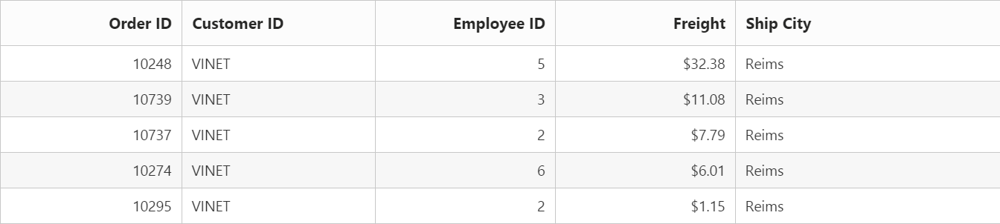
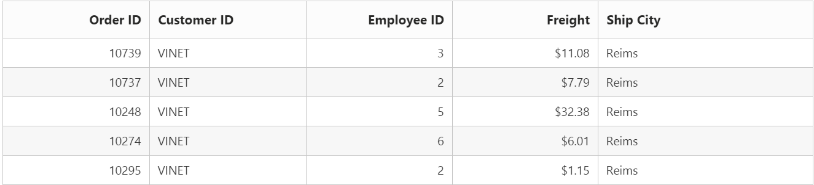
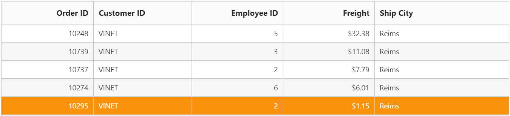
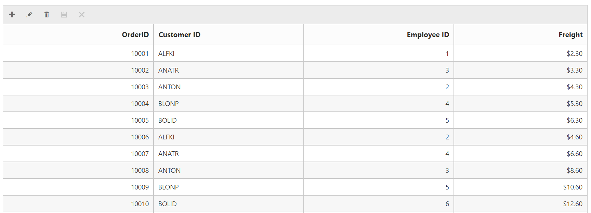

# Getting Started 

## Create your DataManager in the ASP.NET Core

DataManager is used to manage relational data. It supports CRUD (Create, Read, Update, and Destroy) in individual requests and Batch. DataManager uses DataManager control for processing and ej.Query for serving the data. DataManager control communicates with data source and ej.Query generates data queries that are read by DataManager. 

### Configure Demo Application

This section briefly describes how to make a connection to WCF “Northwind” OData service and generate a report with top five orders from customer HANAR with higher Freight charges.  In this application scenario, you can learn how to bind the DataManager to the Grid control to do paging, filtering and sorting with Grid control in the DataManager by using ej.Query.

### Create Connection

To define connection to data source, you can use the DataManager control. The data source can be local or remote. Local data source is the local data and remote data source is any web service. 

In this application, as you have web service for Northwnd database, you can assign the web service URL link to the URL property of DataManager, and you can enable crossDomain to retrieve data from another domain.

 
 
    /*ej-Tag Helper code to render DataManager*/

    <e-datamanager url="//mvc.syncfusion.com/Services/Northwnd.svc/Orders" cross-domain="true"></e-datamanager>



 

    /*Razor code to render DataManager*/

    @{Html.EJ().DataManager("FlatData").URL("http://mvc.syncfusion.com/Services/Northwnd.svc/Orders/").CrossDomain(true).Render();}



N> To render the DataManager Control you can use either Razor or Tag helper code as given in the above code snippet.

You can use the ej.Query to generate the report from web service.

## Binding with Grid Control

You can bind the DataManager with Grid by defining the ID of DataManager in the DataManagerID property of the Grid control.



    /*ej-Tag Helper code to render DataManager*/

    <ej-grid id="FlatGrid" allow-sorting="true" allow-paging="true">
        <e-datamanager url="http://mvc.syncfusion.com/Services/Northwnd.svc/Orders/?$top=45" offline="true"></e-datamanager>
        <e-columns>
            <e-column field="OrderID" header-text="Order ID" text-align="Right" width="75"></e-column>
            <e-column field="CustomerID" header-text="Customer ID" width="80"></e-column>
            <e-column field="EmployeeID" header-text="Employee ID" text-align="Left" width="75"></e-column>
            <e-column field="Freight" header-text="Freight" format="{0:C2}" text-align=Right width="75"></e-column>
            <e-column field="OrderDate" header-text="Order Date" format="{0:MM/dd/yyyy}" text-align=Right width="80"></e-column>
            <e-column field="ShipCity" header-text="Ship City" width="110"></e-column>
        </e-columns>
    </ej-grid>





    /*Razor code to render DataManager*/

    @{Html.EJ().DataManager("FlatData").URL("http://mvc.syncfusion.com/Services/Northwnd.svc/Orders/").CrossDomain(true).Render();}

    @{Html.EJ().Grid<MVCdoc.OrdersView>("FlatGrid")
        .DataManagerID("FlatData") //DataManagerID(DataManager ID)
        .Query("new ej.Query().take(5)")
        .Columns(col =>
        {
            col.Field("OrderID").HeaderText("Order ID").IsPrimaryKey(true).TextAlign(TextAlign.Right).Width(75).Add();
            col.Field("CustomerID").HeaderText("Customer ID").Width(80).Add();
            col.Field("EmployeeID").HeaderText("Employee ID").TextAlign(TextAlign.Right).Width(75).Add();
            col.Field("Freight").HeaderText("Freight").TextAlign(TextAlign.Right).Width(75).Format("{0:C}").Add();
            col.Field("ShipCity").HeaderText("Ship City").Width(110).Add();
        }).Render();
    }



When you run, the following table is displayed.

DataManager with Grid Control
{:.caption}

## Filter

You can generate the Filter query to filter the CustomerID column based on VINET value and it is ran by using the DataManager.

The where function is used to filter the records based on the specified filter condition.

The select property of ejQuery is used to retrieve the specified columns from the data source.



    /*ej-Tag Helper code to render DataManager*/

    <ej-grid id="FlatGrid" allow-sorting="true" allow-paging="true" allow-filtering="true">
        <e-datamanager url="http://mvc.syncfusion.com/Services/Northwnd.svc/Orders/?$top=45" offline="true"></e-datamanager> 
        <e-filter-settings>
            <e-filtered-columns>
                <e-filtered-column field="CustomerID" operator="Equals" value="VINET"></e-filtered-column>
            </e-filtered-columns>
        </e-filter-settings>
        <e-columns>
            <e-column field="OrderID" header-text="Order ID" text-align="Right" width="75"></e-column>
            <e-column field="CustomerID" header-text="Customer ID" width="80"></e-column>
            <e-column field="EmployeeID" header-text="Employee ID" text-align="Left" width="75"></e-column>
            <e-column field="Freight" header-text="Freight" format="{0:C2}" text-align=Right width="75"></e-column>
            <e-column field="OrderDate" header-text="Order Date" format="{0:MM/dd/yyyy}" text-align=Right width="80"></e-column>
            <e-column field="ShipCity" header-text="Ship City" width="110"></e-column>
        </e-columns>
    </ej-grid>





    /*Razor code to render DataManager*/

    @{Html.EJ().DataManager("FlatData").URL("http://mvc.syncfusion.com/Services/Northwnd.svc/Orders/").CrossDomain(true).Render();}

    @{Html.EJ().Grid<MVCdoc.OrdersView>("FlatGrid")
        .DataManagerID("FlatData")
        .Query("new ej.Query().select(['OrderID', 'CustomerID', 'EmployeeID', 'ShipCity', 'Freight']).where('CustomerID', 'equal', 'VINET').take(5)")
        //where(fieldName, operator, value, [ignoreCase])
        .Columns(col =>
        {
            col.Field("OrderID").HeaderText("Order ID").IsPrimaryKey(true).TextAlign(TextAlign.Right).Width(75).Add();
            col.Field("CustomerID").HeaderText("Customer ID").Width(80).Add();
            col.Field("EmployeeID").HeaderText("Employee ID").TextAlign(TextAlign.Right).Width(75).Add();
            col.Field("Freight").HeaderText("Freight").TextAlign(TextAlign.Right).Width(75).Format("{0:C}").Add();
            col.Field("ShipCity").HeaderText("Ship City").Width(110).Add();
        }).Render();
    }



When you run the filter query and bind the result to the Grid, the following table is displayed.

Data with Filtering
{:.caption}

## Sort

You can generate the Sort query to sort the Freight column in descending order and that is executed by using the DataManager. 

The sortBy property of ejQuery is used to sort the records based on the field and direction specified.



    /*ej-Tag Helper code to render DataManager*/

    <ej-grid id="FlatGrid" allow-sorting="true" allow-paging="true" allow-multi-sorting="true">
        <e-datamanager url="http://mvc.syncfusion.com/Services/Northwnd.svc/Orders/?$top=45" offline="true"></e-datamanager> 
    
        <e-sort-settings>
            <e-sorted-columns>
                <e-sorted-column field="Freight" direction="Descending">

                </e-sorted-column>
            </e-sorted-columns>
        </e-sort-settings>
        <e-columns>
            <e-column field="OrderID" header-text="Order ID" text-align="Right" width="75"></e-column>
            <e-column field="CustomerID" header-text="Customer ID" width="80"></e-column>
            <e-column field="EmployeeID" header-text="Employee ID" text-align="Left" width="75"></e-column>
            <e-column field="Freight" header-text="Freight" format="{0:C2}" text-align=Right width="75"></e-column>
            <e-column field="OrderDate" header-text="Order Date" format="{0:MM/dd/yyyy}" text-align=Right width="80"></e-column>
            <e-column field="ShipCity" header-text="Ship City" width="110"></e-column>
        </e-columns>
    </ej-grid>





/*Razor code to render DataManager*/

    @{Html.EJ().DataManager("FlatData").URL("http://mvc.syncfusion.com/Services/Northwnd.svc/Orders/").CrossDomain(true).Render();}

    @{Html.EJ().Grid<MVCdoc.OrdersView>("FlatGrid")
            .DataManagerID("FlatData")
            .Query("new ej.Query().select(['OrderID', 'CustomerID', 'EmployeeID', 'ShipCity', 'Freight']).where('CustomerID', 'equal', 'VINET').sortBy('Freight desc').take(5)")
            //sortBy(field direction)
            .Columns(col =>
            {
                col.Field("OrderID").HeaderText("Order ID").IsPrimaryKey(true).TextAlign(TextAlign.Right).Width(75).Add();
                col.Field("CustomerID").HeaderText("Customer ID").Width(80).Add();
                col.Field("EmployeeID").HeaderText("Employee ID").TextAlign(TextAlign.Right).Width(75).Add();
                col.Field("Freight").HeaderText("Freight").TextAlign(TextAlign.Right).Width(75).Format("{0:C}").Add();
                col.Field("ShipCity").HeaderText("Ship City").Width(110).Add();
            }).Render();
    }



When you run the sort query and bind the result to the table, the following table is displayed.

Data with Sorting
{:.caption}

## Page

You can generate the Paging query to get the top four orders and it is ran by using the DataManager.  

The Page property of ejQuery is used to retrieve the records based on the given pageIndex and pageSize.



    /*ej-Tag Helper code to render DataManager*/

    <ej-grid id="FlatGrid" allow-sorting="true" allow-paging="true" allow-multi-sorting="true">
        <e-datamanager url="http://mvc.syncfusion.com/Services/Northwnd.svc/Orders/?$top=45" offline="true"></e-datamanager> 
        <e-sort-settings>
            <e-sorted-columns>
                <e-sorted-column field="Freight" direction="Descending">
                </e-sorted-column>
            </e-sorted-columns>
        </e-sort-settings>
        <e-page-settings page-count="3" page-size="5">       
        </e-page-settings>
        <e-columns>
            <e-column field="OrderID" header-text="Order ID" text-align="Right" width="75"></e-column>
            <e-column field="CustomerID" header-text="Customer ID" width="80"></e-column>
            <e-column field="EmployeeID" header-text="Employee ID" text-align="Left" width="75"></e-column>
            <e-column field="Freight" header-text="Freight" format="{0:C2}" text-align=Right width="75"></e-column>
            <e-column field="OrderDate" header-text="Order Date" format="{0:MM/dd/yyyy}" text-align=Right width="80"></e-column>
            <e-column field="ShipCity" header-text="Ship City" width="110"></e-column>
        </e-columns>
    </ej-grid>





    /*Razor code to render DataManager*/

    @{Html.EJ().DataManager("FlatData").URL("http://mvc.syncfusion.com/Services/Northwnd.svc/Orders/").CrossDomain(true).Render();}

    @{Html.EJ().Grid<MVCdoc.OrdersView>("FlatGrid")
        .DataManagerID("FlatData")
        .Query("new ej.Query().select(['OrderID', 'CustomerID', 'EmployeeID', 'ShipCity', 'Freight']).where('CustomerID', 'equal', 'VINET').sortBy('Freight desc').page(3,5)")
        //page(pageIndex,pageSize)
        .Columns(col =>
        {

            col.Field("OrderID").HeaderText("Order ID").IsPrimaryKey(true).TextAlign(TextAlign.Right).Width(75).Add();
            col.Field("CustomerID").HeaderText("Customer ID").Width(80).Add();
            col.Field("EmployeeID").HeaderText("Employee ID").TextAlign(TextAlign.Right).Width(75).Add();
            col.Field("Freight").HeaderText("Freight").TextAlign(TextAlign.Right).Width(75).Format("{0:C}").Add();
            col.Field("ShipCity").HeaderText("Ship City").Width(110).Add();
        }).Render();
    }



## Server side operations

Server side operations can be performed based on the queries by using the following query parameters

<table>
<tr>
<th>
Query Params</th><th>
Description</th></tr>
<tr>
<td>
Expand</td><td>
It is used as OData Expand query</td></tr>
<tr>
<td>
RequiresCounts</td><td>
When this property is set as True, the total count of records are included in the result.</td></tr>
<tr>
<td>
Skip</td><td>
Details regarding current page are skipped.</td></tr>
<tr>
<td>
Take</td><td>
Used to take required records from data manager.</td></tr>
<tr>
<td>
Sorted</td><td>
Records return the sorted collection.</td></tr>
<tr>
<td>
Table</td><td>	
It is a data source table name.</td></tr>
<tr>
<td>
Where</td><td>	
Records return the filter collection.</td></tr>
</table>

The query parameters are serialized by the DataManager class and the server-side operations such as sorting, filtering, paging are performed 

Some server side operations available are listed below

* PerformWhereFilter

* PerformSearching

* PerformSorting

* PerformSelect

* PerformSkip

* PerformTake

The below code illustrates how to bind data to editing Grid using **DataOperations**





        public static List<Orders> order = new List<Orders>();
        public void BindDataSource()
        {
            int code = 10000;
            for (int i = 1; i < 10; i++)
            {
                order.Add(new Orders(code + 1, "ALFKI", i + 0, 2.3 * i, new DateTime(1991, 05, 15), "Berlin"));
                order.Add(new Orders(code + 2, "ANATR", i + 2, 3.3 * i, new DateTime(1990, 04, 04), "Madrid"));
                order.Add(new Orders(code + 3, "ANTON", i + 1, 4.3 * i, new DateTime(1957, 11, 30), "Cholchester"));
                order.Add(new Orders(code + 4, "BLONP", i + 3, 5.3 * i, new DateTime(1930, 10, 22), "Marseille"));
                order.Add(new Orders(code + 5, "BOLID", i + 4, 6.3 * i, new DateTime(1953, 02, 18), "Tsawassen"));
                code += 5;
            }
          
        }

        public ActionResult DataSource([FromBody]DataManager dm) {

            IEnumerable data = order;
            DataOperations operation = new DataOperations();
            if (dm.Sorted != null && dm.Sorted.Count > 0) //Sorting
            {
                data = operation.PerformSorting(data, dm.Sorted);
            }
            if (dm.Where != null && dm.Where.Count > 0) //Filtering
            {
                data = operation.PerformWhereFilter(data, dm.Where, dm.Where[0].Operator);
            }
            int count = data.Cast<Orders>().Count();
            if (dm.Skip != 0)
            {
                data = operation.PerformSkip(data, dm.Skip);
            }
            if (dm.Take != 0)
            {
                data = operation.PerformTake(data, dm.Take);
            }
            return Json(new { result = data, count = count });

        }
        public class Orders
        {
            public Orders()
            {

            }
            public Orders(long OrderId, string CustomerId, int EmployeeId, double Freight, DateTime OrderDate, string ShipCity)
            {
                this.OrderID = OrderId;
                this.CustomerID = CustomerId;
                this.EmployeeID = EmployeeId;
                this.Freight = Freight;
                this.OrderDate = OrderDate;
                this.ShipCity = ShipCity;
            }
  
            public long OrderID { get; set; }
            public string CustomerID { get; set; }
            public int EmployeeID { get; set; }
            public double Freight { get; set; }
            public DateTime OrderDate { get; set; }
            public string ShipCity { get; set; }
        }
       
        public IActionResult Index()
        {
            if (order.Count() == 0)
                BindDataSource();
            ViewBag.datasource = order;
            return View();
        }
        //Update the data
        public ActionResult CellEditUpdate([FromBody]CRUDModel<Orders> value)
        {
            var ord = value.Value;
            Orders val = order.Where(or => or.OrderID == ord.OrderID).FirstOrDefault();
            val.OrderID = ord.OrderID;
            val.EmployeeID = ord.EmployeeID;
            val.CustomerID = ord.CustomerID;
            val.Freight = ord.Freight;
            val.OrderDate = ord.OrderDate;
            val.ShipCity = ord.ShipCity;
            return Json(value.Value);
        }
        //insert the record
        public ActionResult CellEditInsert([FromBody]CRUDModel<Orders> value)
        {
            
            order.Insert(0, value.Value);
            return Json(value);
        }
        //Delete the record
        public ActionResult CellEditDelete([FromBody]CRUDModel<Orders> value)
        {
            order.Remove(order.Where(or => or.OrderID == int.Parse(value.Key.ToString())).FirstOrDefault());
            return Json(value);
        }
        




    /*ej-Tag Helper code to render DataManager*/
    <ej-grid id="FlatGrid">
      <e-datamanager id="myData" json="(IEnumerable<object>)ViewBag.datasource" update-url="/Home/CellEditUpdate" insert-url="/Home/CellEditInsert" remove-url="/Home/CellEditDelete"></e-datamanager>
      <e-edit-settings allow-adding="true" allow-editing="true" allow-deleting="true" edit-mode="@(EditMode.Normal)"></e-edit-settings>
      <e-toolbar-settings show-toolbar="true" toolbar-items="@(new List<string> {"add","edit","delete","update","cancel" })"></e-toolbar-settings>
      <e-columns>
        <e-column field="OrderID" header-text="Order ID" text-align="Right" width="70"></e-column>
        <e-column field="CustomerID" header-text="Customer ID" width="80"></e-column>
        <e-column field="EmployeeID" header-text="Employee ID" text-align="Left" width="75"></e-column>
     </e-columns>
    </ej-grid>
    




      @{Html.EJ().Grid<WebApplication8.Controllers.HomeController.Orders>("Editing")
                             .Datasource(ds => ds.URL(@Url.Action("DataSource")).UpdateURL("/Home/CellEditUpdate")
                             .InsertURL("/Home/CellEditInsert").RemoveURL("/Home/CellEditDelete").Adaptor(AdaptorType.UrlAdaptor))
                            .EditSettings(edit => { edit.AllowAdding().AllowDeleting().AllowEditing(); })
                            .AllowSorting(true)
                            .ToolbarSettings(toolbar =>
                                          {
                                              toolbar.ShowToolbar().ToolbarItems(items =>
                                              {
                                                  items.AddTool(ToolBarItems.Add);
                                                  items.AddTool(ToolBarItems.Edit);
                                                  items.AddTool(ToolBarItems.Delete);
                                                  items.AddTool(ToolBarItems.Update);
                                                  items.AddTool(ToolBarItems.Cancel);
                                              });
                                          })
                            .Columns(col =>
                            {
                                col.Field("OrderID").IsPrimaryKey(true).TextAlign(TextAlign.Right).Width(90).ValidationRules(v => v.AddRule("required", true).AddRule("number", true)).Add();
                                col.Field("CustomerID").HeaderText("Customer ID").Width(90).Add();
                                col.Field("EmployeeID").HeaderText("Employee ID").TextAlign(TextAlign.Right).Width(90).Add();
                                col.Field("Freight").HeaderText("Freight").TextAlign(TextAlign.Right).Width(80).EditType(EditingType.Numeric).Format("{0:C}").Add();

                            }).Render();

               }




In this section, you can learn how to enable basic properties available in the DataManager and the usage of the various queries in the DataManager.  

