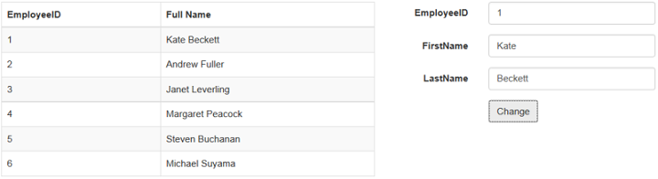

# KO ResultSet

The **DataManager** contains a default method to subscribe the view model properties as KO observable. This is done at the success of the **executeQuery** using the **getKnockoutModel.** You can also provide computed properties to the view model using the getKnockoutModel.

The following code example illustrates on how the model is made observable and updated.





    public IActionResult KOResult()
    {
            List<Employyee> emp = new List<Employyee>();
            emp.Add(new Employyee( 1, "ALFKI","Berlin"));
            emp.Add(new Employyee(2, "ANATR","Madrid"));
            emp.Add(new Employyee(3, "ANTON","Cholchester"));
            emp.Add(new Employyee( 4, "BLONP" ,"Marseille"));
            emp.Add(new Employyee( 5, "BOLID", "Tsawassen"));
        
        ViewBag.empData = emp;
        return View();
    }
    public class Employyee
    {
        public Employyee()
        {

        }
        public Employyee(int EmployeeID, string FirstName, string LastName)
        {
            this.EmployeeID = EmployeeID;
            this.FirstName = FirstName;
            this.LastName = LastName;
            
        }

        public int? EmployeeID { get; set; }
        public string FirstName { get; set; }
        public string LastName { get; set; }
    }





    

        

            

                <table id="table1" class="table table-striped table-bordered" style="width:700px">
                    <thead>
                        <tr>
                            <th>EmployeeID</th>
                            <th>Full Name</th>
                        </tr>
                    </thead>
                    <tbody data-bind="foreach: employees">
                        <tr>
                            <td data-bind="text: EmployeeID"></td>
                            <td data-bind="text: FullName"></td>
                        </tr>
                    </tbody>
                </table>
            

            

                <form class="form-horizontal" role="form">
                    

                        <label class="col-sm-4 control-label">EmployeeID</label>
                        

                            <input type="text" class="form-control" id="empId">
                        

                    

                    

                        <label class="col-sm-4 control-label">FirstName</label>
                        

                            <input type="text" class="form-control" id="first">
                        

                    

                    

                        <label class="col-sm-4 control-label">LastName</label>
                        

                            <input type="text" class="form-control" id="last">
                        

                    

                    

                        

                            <button type="button" id="formsubmit" class="btn btn-default">Change</button>
                        

                    

                </form>
            

        

    





    /*ej-Tag Helper code to render DataManager*/

    <e-datamanager id="myData" json="(IEnumerable<object>)ViewBag.empData"></e-datamanager>

    /*Razor code to render DataManager*/
    @{Html.EJ().DataManager("myData").Json((IEnumerable<object>)ViewBag.empData).Render();}





    





The result of the above code example is illustrated as follows.

Before changing the model, EmployeeID 1 has FullName value as Nancy Davolio. After changing, the result is as follows.

 

