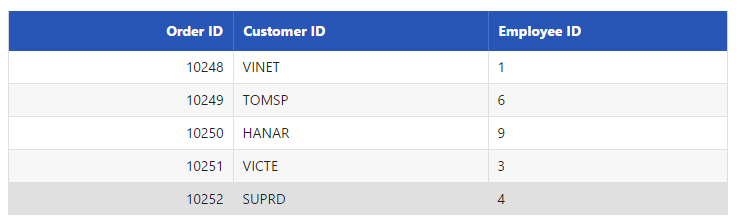
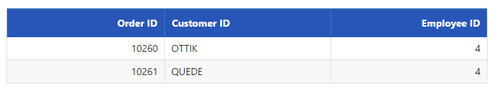
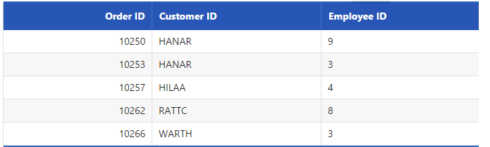
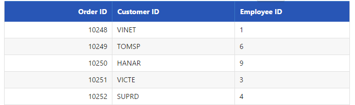
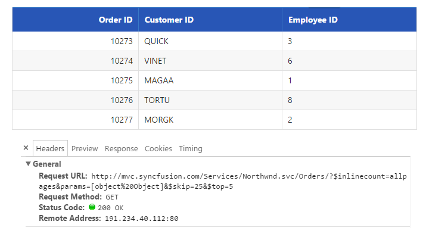

# Paging

Paging is a very important query in **DataManager** that is used to display only some records from the large data source. Here, you can learn the paging query in detail.

## Default

The paging index and the paging size parameters of the paging query determines the number of records to be retrieved from the data source of the **DataManager**.

Refer to the following code example for the paging options.





    /*ej-Tag Helper code to render DataManager*/
    <ej-grid query="new ej.Query().page(1,5)" id="FlatGrid" dataamanager-id="myData">
        <e-datamanager url="http://mvc.syncfusion.com/Services/Northwnd.svc/Orders"></e-datamanager>
        <e-columns>
            <e-column field="OrderID" header-text="Order ID" text-align="Right" width="70"></e-column>
            <e-column field="CustomerID" header-text="Customer ID" width="80"></e-column>
            <e-column field="EmployeeID" header-text="Employee ID" text-align="Left" width="75"></e-column>
        </e-columns>
    </ej-grid>





    /*Razor code to render DataManager*/
    @{Html.EJ().DataManager("FlatData").URL("http://mvc.syncfusion.com/Services/Northwnd.svc/Orders").Render();}

    @{Html.EJ().Grid<object>("myGrid")
        .DataManagerID("FlatData")
        .Query("new ej.Query().page(1,5)")
        .Columns(col =>
        {
            col.Field("OrderID").HeaderText("Order ID").IsPrimaryKey(true).TextAlign(TextAlign.Right).Width(75).Add();
            col.Field("CustomerID").HeaderText("Customer ID").Width(80).Add();
            col.Field("EmployeeID").HeaderText("Employee ID").TextAlign(TextAlign.Right).Width(75).Add();
        }).Render();
    }





Result for the above code example is illustrated as follows.

 

## Dynamic Paging

The paging operation can be dynamically performed using the **DataManager**. With the help of an external button click event, the required page records can be obtained and processed accordingly. The following code example illustrates the dynamic paging.





    pageIndex: <input id="pageindx" type="text" placeholder="pageindex" />
    pageSize:  <input id="pagesize" type="text" placeholder="pagesize" />
    @{Html.EJ().Button("submit").Text("Execute").ClientSideEvents(e => { e.Click("onClick"); }).Render(); }





    /*ej-Tag Helper code to render DataManager*/
    <ej-grid query="new ej.Query().page(1,5)" id="myGrid" dataamanager-id="myData">
        <e-datamanager url="http://mvc.syncfusion.com/Services/Northwnd.svc/Orders"></e-datamanager>
        <e-columns>
            <e-column field="OrderID" header-text="Order ID" text-align="Right" width="70"></e-column>
            <e-column field="CustomerID" header-text="Customer ID" width="80"></e-column>
            <e-column field="EmployeeID" header-text="Employee ID" text-align="Left" width="75"></e-column>
        </e-columns>
    </ej-grid>





    /*Razor code to render DataManager*/
    @{Html.EJ().DataManager("FlatData").URL("http://mvc.syncfusion.com/Services/Northwnd.svc/Orders").Render();}

    @{Html.EJ().Grid<object>("myGrid")
        .DataManagerID("FlatData")
        .Query("new ej.Query().page(1,5)")
        .Columns(col =>
        {
            col.Field("OrderID").HeaderText("Order ID").IsPrimaryKey(true).TextAlign(TextAlign.Right).Width(75).Add();
            col.Field("CustomerID").HeaderText("Customer ID").Width(80).Add();
            col.Field("EmployeeID").HeaderText("Employee ID").TextAlign(TextAlign.Right).Width(75).Add();
        }).Render();
    }





    





Result of above code example is illustrated as follows.

 

## Custom paging

In this section, you can learn how to use customized paging. The following code example illustrates the custom paging.





    /*ej-Tag Helper code to render DataManager*/
    <ej-grid query="new ej.Query().page(1,5).addParams('PageNumber',7).addParams('PageSize',3).where('CustomerID', 'contains', 'A', false)" id="FlatGrid" dataamanager-id="myData">
        <e-datamanager url="http://mvc.syncfusion.com/Services/Northwnd.svc/Orders"></e-datamanager>
        <e-columns>
            <e-column field="OrderID" header-text="Order ID" text-align="Right" width="70"></e-column>
            <e-column field="CustomerID" header-text="Customer ID" width="80"></e-column>
            <e-column field="EmployeeID" header-text="Employee ID" text-align="Left" width="75"></e-column>
        </e-columns>
    </ej-grid>





    /*Razor code to render DataManager*/
    @{Html.EJ().DataManager("FlatData").URL("http://mvc.syncfusion.com/Services/Northwnd.svc/Orders").Render();}

    @{Html.EJ().Grid<object>("myGrid")
        .DataManagerID("FlatData")
        .Query("new ej.Query().page(1,5).addParams('PageNumber',7).addParams('PageSize',3).where('CustomerID', 'contains', 'A', false)")
        .Columns(col =>
        {
            col.Field("OrderID").HeaderText("Order ID").IsPrimaryKey(true).TextAlign(TextAlign.Right).Width(75).Add();
            col.Field("CustomerID").HeaderText("Customer ID").Width(80).Add();
            col.Field("EmployeeID").HeaderText("Employee ID").TextAlign(TextAlign.Right).Width(75).Add();
        }).Render();
    }





Result of above code example is illustrated as follows.

 

## Skip

The `skip` query is used to skip some number of records.





    /*ej-Tag Helper code to render DataManager*/
    <ej-grid query="new ej.Query().skip(820)" id="FlatGrid" dataamanager-id="myData">
        <e-datamanager url="http://mvc.syncfusion.com/Services/Northwnd.svc/Orders"></e-datamanager>
        <e-columns>
            <e-column field="OrderID" header-text="Order ID" text-align="Right" width="70"></e-column>
            <e-column field="CustomerID" header-text="Customer ID" width="80"></e-column>
            <e-column field="EmployeeID" header-text="Employee ID" text-align="Left" width="75"></e-column>
        </e-columns>
    </ej-grid>





    /*Razor code to render DataManager*/
    @{Html.EJ().DataManager("FlatData").URL("http://mvc.syncfusion.com/Services/Northwnd.svc/Orders").Render();}

    @{Html.EJ().Grid<object>("myGrid")
        .DataManagerID("FlatData")
        .Query("new ej.Query().skip(820)")
        .Columns(col =>
        {
            col.Field("OrderID").HeaderText("Order ID").IsPrimaryKey(true).TextAlign(TextAlign.Right).Width(75).Add();
            col.Field("CustomerID").HeaderText("Customer ID").Width(80).Add();
            col.Field("EmployeeID").HeaderText("Employee ID").TextAlign(TextAlign.Right).Width(75).Add();
        }).Render();
    }





Result of the above code example is illustrated as follows.

 

## Take

The `take` query is used to get some certain number of records from the data source of the **DataManager**.





    /*ej-Tag Helper code to render DataManager*/
    <ej-grid query="new ej.Query().take(5)" id="FlatGrid" dataamanager-id="myData">
        <e-datamanager url="http://mvc.syncfusion.com/Services/Northwnd.svc/Orders"></e-datamanager>
        <e-columns>
            <e-column field="OrderID" header-text="Order ID" text-align="Right" width="70"></e-column>
            <e-column field="CustomerID" header-text="Customer ID" width="80"></e-column>
            <e-column field="EmployeeID" header-text="Employee ID" text-align="Left" width="75"></e-column>
        </e-columns>
    </ej-grid>





    /*Razor code to render DataManager*/
    @{Html.EJ().DataManager("FlatData").URL("http://mvc.syncfusion.com/Services/Northwnd.svc/Orders").Render();}

    @{Html.EJ().Grid<object>("myGrid")
        .DataManagerID("FlatData")
        .Query("new ej.Query().take(5)")
        .Columns(col =>
        {
            col.Field("OrderID").HeaderText("Order ID").IsPrimaryKey(true).TextAlign(TextAlign.Right).Width(75).Add();
            col.Field("CustomerID").HeaderText("Customer ID").Width(80).Add();
            col.Field("EmployeeID").HeaderText("Employee ID").TextAlign(TextAlign.Right).Width(75).Add();
        }).Render();
    }





Result of the above code example is illustrated as follows.

 

## RequiresCount

The `requiresCount` query is used to get the count of the total number of records in the data source of the **DataManager**.





    /*ej-Tag Helper code to render DataManager*/
    <ej-grid query="new ej.Query().take(5).requiresCount()" id="FlatGrid" dataamanager-id="myData">
        <e-datamanager url="http://mvc.syncfusion.com/Services/Northwnd.svc/Orders"></e-datamanager>
        <e-columns>
            <e-column field="OrderID" header-text="Order ID" text-align="Right" width="70"></e-column>
            <e-column field="CustomerID" header-text="Customer ID" width="80"></e-column>
            <e-column field="EmployeeID" header-text="Employee ID" text-align="Left" width="75"></e-column>
        </e-columns>
    </ej-grid>





    /*Razor code to render DataManager*/
    @{Html.EJ().DataManager("FlatData").URL("http://mvc.syncfusion.com/Services/Northwnd.svc/Orders").Render();}

    @{Html.EJ().Grid<object>("myGrid")
        .DataManagerID("FlatData")
        .Query("new ej.Query().take(5).requiresCount()")
        .Columns(col =>
        {
            col.Field("OrderID").HeaderText("Order ID").IsPrimaryKey(true).TextAlign(TextAlign.Right).Width(75).Add();
            col.Field("CustomerID").HeaderText("Customer ID").Width(80).Add();
            col.Field("EmployeeID").HeaderText("Employee ID").TextAlign(TextAlign.Right).Width(75).Add();
        }).Render();
    }





Result of the above code example is illustrated as follows.

 

## Range

The `range` query is used to get some particular range of records from the data source of the **DataManager**.





    /*ej-Tag Helper code to render DataManager*/
    <ej-grid query="new ej.Query().range(25,30)" id="FlatGrid" dataamanager-id="myData">
        <e-datamanager url="http://mvc.syncfusion.com/Services/Northwnd.svc/Orders"></e-datamanager>
        <e-columns>
            <e-column field="OrderID" header-text="Order ID" text-align="Right" width="70"></e-column>
            <e-column field="CustomerID" header-text="Customer ID" width="80"></e-column>
            <e-column field="EmployeeID" header-text="Employee ID" text-align="Left" width="75"></e-column>
        </e-columns>
    </ej-grid>





    /*Razor code to render DataManager*/
    @{Html.EJ().DataManager("FlatData").URL("http://mvc.syncfusion.com/Services/Northwnd.svc/Orders").Render();}

    @{Html.EJ().Grid<object>("myGrid")
        .DataManagerID("FlatData")
        .Query("new ej.Query().range(25,30)")
        .Columns(col =>
        {
            col.Field("OrderID").HeaderText("Order ID").IsPrimaryKey(true).TextAlign(TextAlign.Right).Width(75).Add();
            col.Field("CustomerID").HeaderText("Customer ID").Width(80).Add();
            col.Field("EmployeeID").HeaderText("Employee ID").TextAlign(TextAlign.Right).Width(75).Add();
        }).Render();
    }





Result of the above code example is illustrated as follows.

 

