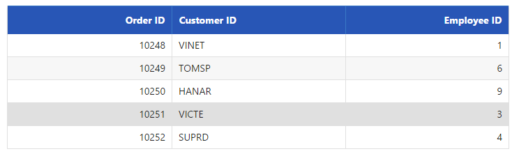
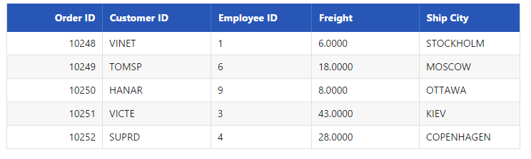
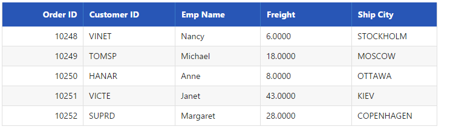

# Query

**DataManager** provides support for multiple queries in order to perform various operations like filtering, sorting, cloning, expanding, searching, grouping etc., in the data source. Here, you can learn the query options in detail.

## Select

The `select` query of the data manager is used to select only some particular fields or columns from the data source. The following code example illustrates on how to select only particular fields using the select query.





    /*ej-Tag Helper code to render DataManager*/
    <ej-grid id="FlatGrid" query="new ej.Query().select(['OrderID', 'CustomerID', 'EmployeeID']).take(5)">
        <e-datamanager url="//mvc.syncfusion.com/Services/Northwnd.svc/Orders"></e-datamanager>
        <e-columns>
            <e-column field="OrderID" header-text="Order ID" text-align="Right" width="70"></e-column>
            <e-column field="CustomerID" header-text="Customer ID" width="80"></e-column>
            <e-column field="EmployeeID" header-text="Employee ID" text-align="Left" width="75"></e-column>
        </e-columns>
    </ej-grid>





    /*Razor code to render DataManager*/
    @{Html.EJ().DataManager("FlatData").URL("http://mvc.syncfusion.com/Services/Northwnd.svc/Orders").Render();}

    @{Html.EJ().Grid<object>("myGrid")
            .DataManagerID("FlatData")
            .Query("new ej.Query().select(['OrderID', 'CustomerID', 'EmployeeID']).take(5)")
            .Columns(col =>
            {
                col.Field("OrderID").HeaderText("Order ID").IsPrimaryKey(true).TextAlign(TextAlign.Right).Width(75).Add();
                col.Field("CustomerID").HeaderText("Customer ID").Width(80).Add();
                col.Field("EmployeeID").HeaderText("Employee ID").TextAlign(TextAlign.Right).Width(75).Add();

            }).Render();
    }





Result of the above code example is illustrated as follows.

## From

The `from` query of the data manager is used to select the table from where the data is retrieved and bound to the table. The following code example illustrates on how to use the `from` query.





    /*ej-Tag Helper code to render DataManager*/
    <ej-grid id="FlatGrid" query="new ej.Query().from('Orders').select(['OrderID', 'CustomerID', 'EmployeeID']).take(5)">
        <e-datamanager url="//mvc.syncfusion.com/Services/Northwnd.svc"></e-datamanager>
        <e-columns>
            <e-column field="OrderID" header-text="Order ID" text-align="Right" width="70"></e-column>
            <e-column field="CustomerID" header-text="Customer ID" width="80"></e-column>
            <e-column field="EmployeeID" header-text="Employee ID" text-align="Left" width="75"></e-column>
        </e-columns>
    </ej-grid>





    /*Razor code to render DataManager*/
    @{Html.EJ().DataManager("FlatData").URL("http://mvc.syncfusion.com/Services/Northwnd.svc").Render();}

    @{Html.EJ().Grid<object>("myGrid")
            .DataManagerID("FlatData")
            .Query("new ej.Query().from('Orders').select(['OrderID', 'CustomerID', 'EmployeeID']).take(5)")
            .Columns(col =>
            {
                col.Field("OrderID").HeaderText("Order ID").IsPrimaryKey(true).TextAlign(TextAlign.Right).Width(75).Add();
                col.Field("CustomerID").HeaderText("Customer ID").Width(80).Add();
                col.Field("EmployeeID").HeaderText("Employee ID").TextAlign(TextAlign.Right).Width(75).Add();

            }).Render();
    }





Result of the above code example is illustrated as follows.

## Clone

The `clone` query of the data manager is used to duplicate the query. The following code example illustrates on how to `clone` a query.





    /*ej-Tag Helper code to render DataManager*/
    <ej-grid id="FlatGrid" action-complete="onComplete" query="new ej.Query().from('Orders').select(['OrderID', 'CustomerID', 'EmployeeID', 'ShipCity', 'Freight']).take(5)">
        <e-datamanager url="//mvc.syncfusion.com/Services/Northwnd.svc"></e-datamanager>
        <e-columns>
            <e-column field="OrderID" header-text="Order ID" text-align="Right" width="70"></e-column>
            <e-column field="CustomerID" header-text="Customer ID" width="80"></e-column>
            <e-column field="EmployeeID" header-text="Employee ID" text-align="Left" width="75"></e-column>
            <e-column field="Freight" header-text="Freight" width="80"></e-column>
            <e-column field="ShipCity" header-text="Ship City" text-align="Left" width="75"></e-column>
        </e-columns>
    </ej-grid>





    /*Razor code to render DataManager*/
    @{Html.EJ().Grid<object>("myGrid")
            .DataManagerID("FlatData")
            .Query("new ej.Query().from('Orders').select(['OrderID', 'CustomerID', 'EmployeeID', 'ShipCity', 'Freight']).take(5)").ClientSideEvents(e => e.ActionComplete("onComplete"))
            .Columns(col =>
            {
                col.Field("OrderID").HeaderText("Order ID").IsPrimaryKey(true).TextAlign(TextAlign.Right).Width(75).Add();
                col.Field("CustomerID").HeaderText("Customer ID").Width(80).Add();
                col.Field("EmployeeID").HeaderText("Employee ID").TextAlign(TextAlign.Right).Width(75).Add();
                col.Field("Freight").HeaderText("Freight").TextAlign(TextAlign.Right).Width(75).Format("{0:C}").Add();
                col.Field("ShipCity").HeaderText("Ship City").Width(110).Add();

            }).Render();
    }





    





Result of the above code example is illustrated as follows.

## Expand

The `expand` query of the data manager is used to perform complex data binding.





    /*ej-Tag Helper code to render DataManager*/
    <ej-grid id="FlatGrid" query="new ej.Query().from('Orders').select(['OrderID', 'CustomerID', 'Employee.FirstName', 'ShipCity', 'Freight']).take(5).expand('Employee')">
        <e-datamanager url="//mvc.syncfusion.com/Services/Northwnd.svc"></e-datamanager>
        <e-columns>
            <e-column field="OrderID" header-text="Order ID" text-align="Right" width="70"></e-column>
            <e-column field="CustomerID" header-text="Customer ID" width="80"></e-column>
            <e-column field="Employee.FirstName" header-text="Emp Name" text-align="Left" width="75"></e-column>
            <e-column field="Freight" header-text="Freight" width="80"></e-column>
            <e-column field="ShipCity" header-text="Ship City" text-align="Left" width="75"></e-column>
        </e-columns>
    </ej-grid>





    /*Razor code to render DataManager*/
    @{Html.EJ().Grid<object>("myGrid")
            .DataManagerID("FlatData")
            .Query("new ej.Query().from('Orders').select(['OrderID', 'CustomerID', 'Employee.FirstName', 'ShipCity', 'Freight']).take(5).expand('Employee')")
            .Columns(col =>
            {
                col.Field("OrderID").HeaderText("Order ID").IsPrimaryKey(true).TextAlign(TextAlign.Right).Width(75).Add();
                col.Field("CustomerID").HeaderText("Customer ID").Width(80).Add();
                col.Field("Employee.FirstName").HeaderText("Emp Name").TextAlign(TextAlign.Right).Width(75).Add();
                col.Field("Freight").HeaderText("Freight").TextAlign(TextAlign.Right).Width(75).Format("{0:C}").Add();
                col.Field("ShipCity").HeaderText("Ship City").Width(110).Add();

            }).Render();
    }





Result of the above code example is illustrated as follows.

