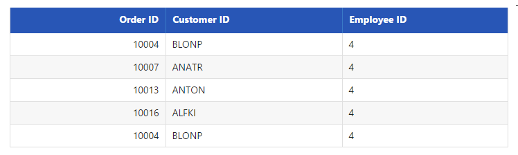

# Searching

Searching is a basic query technique in data manager. It is used to filter the records from the entire data source based on the `search` key parameter.





    public static List<OrderDetails> order = new List<OrderDetails>();
    public IActionResult Searching()
    {
        BindDataSource();
        ViewBag.datasource = order;
        return View();
    }
    public void BindDataSource()
    {
        int code = 10000;
        for (int i = 1; i < 10; i++)
        {
            order.Add(new OrderDetails(code + 1, "ALFKI", i + 0, 2.3 * i, "Berlin"));
            order.Add(new OrderDetails(code + 2, "ANATR", i + 2, 3.3 * i, "Madrid"));
            order.Add(new OrderDetails(code + 3, "ANTON", i + 1, 4.3 * i, "Cholchester"));
            order.Add(new OrderDetails(code + 4, "BLONP", i + 3, 5.3 * i, "Marseille"));
            order.Add(new OrderDetails(code + 5, "BOLID", i + 4, 6.3 * i, "Tsawassen"));
            code += 5;
        }
    }
    public class OrderDetails
    {
        public OrderDetails()
        {

        }
        public OrderDetails(int OrderID, string CustomerId, int EmployeeId, double Freight, string ShipCity)
        {
            this.OrderID = OrderID;
            this.CustomerID = CustomerId;
            this.EmployeeID = EmployeeId;
            this.Freight = Freight;
            this.ShipCity = ShipCity;
        }

        public int? OrderID { get; set; }
        public string CustomerID { get; set; }
        public int? EmployeeID { get; set; }
        public double? Freight { get; set; }
        public string ShipCity { get; set; }
    }





    /*ej-Tag Helper code to render DataManager*/
    <ej-grid query="new ej.Query().search(4, 'EmployeeID').take(5)" id="FlatGrid" dataamanager-id="myData">
        <e-datamanager json="(IEnumerable<object>)ViewBag.datasource"></e-datamanager>
        <e-columns>
            <e-column field="OrderID" header-text="Order ID" text-align="Right" width="70"></e-column>
            <e-column field="CustomerID" header-text="Customer ID" width="80"></e-column>
            <e-column field="EmployeeID" header-text="Employee ID" text-align="Left" width="75"></e-column>
        </e-columns>
    </ej-grid>





    /*Razor code to render DataManager*/
    @{Html.EJ().DataManager("FlatData").Json((IEnumerable<object>)ViewBag.datasource).Render();}

    @{Html.EJ().Grid<object>("myGrid")
        .DataManagerID("FlatData")
        .Query("new ej.Query().search(4, 'EmployeeID').take(5)")
        .Columns(col =>
        {
            col.Field("OrderID").HeaderText("Order ID").IsPrimaryKey(true).TextAlign(TextAlign.Right).Width(75).Add();
            col.Field("CustomerID").HeaderText("Customer ID").Width(80).Add();
            col.Field("EmployeeID").HeaderText("Employee ID").TextAlign(TextAlign.Right).Width(75).Add();
        }).Render();
    }





Result of above code example is illustrated as follows.

 

