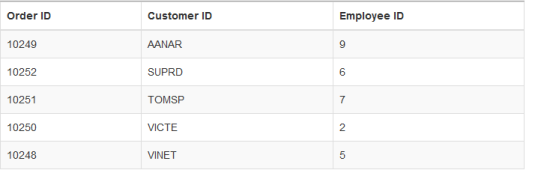
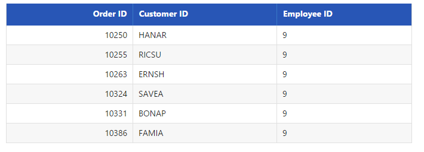
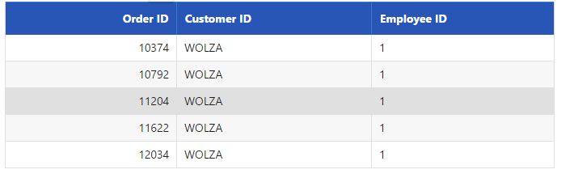

# Sorting

## Default

Sorting is basic query in **DataManager**. It enables you to view the items or records in ascending or descending order based on particular field and sorting direction specified. The query parameter of **DataManager** enables you to retrieve the data in the sorted fashion and thus utilizing the resultant data obtained.





    /*ej-Tag Helper code to render DataManager*/
    <ej-grid query="new ej.Query().sortBy('EmployeeID', ej.sortOrder.Ascending, false).take(6)" id="FlatGrid" dataamanager-id="myData" action-complete="onComplete">
        <e-datamanager url="http://mvc.syncfusion.com/Services/Northwnd.svc/Orders"></e-datamanager>
        <e-columns>
            <e-column field="OrderID" header-text="Order ID" text-align="Right" width="70"></e-column>
            <e-column field="CustomerID" header-text="Customer ID" width="80"></e-column>
            <e-column field="EmployeeID" header-text="Employee ID" text-align="Left" width="75"></e-column>
        </e-columns>
    </ej-grid>





    /*Razor code to render DataManager*/
    @{Html.EJ().DataManager("FlatData").URL("http://mvc.syncfusion.com/Services/Northwnd.svc/Orders").Render();}

    @{Html.EJ().Grid<object>("myGrid")
            .DataManagerID("FlatData")
            .Query("new ej.Query().sortBy('EmployeeID', ej.sortOrder.Ascending, false).take(6)")
            .Columns(col =>
            {
                col.Field("OrderID").HeaderText("Order ID").IsPrimaryKey(true).TextAlign(TextAlign.Right).Width(75).Add();
                col.Field("CustomerID").HeaderText("Customer ID").Width(80).Add();
                col.Field("EmployeeID").HeaderText("Employee ID").TextAlign(TextAlign.Right).Width(75).Add();
            }).Render();
    }





Result of the above code example is illustrated as follows.

 

## SortByDesc

The `sortByDesc` query of the data manager is used to sort the specified field in descending order by default. You can use the following code example for `sortByDesc` query.





    /*ej-Tag Helper code to render DataManager*/
    <ej-grid query="new ej.Query().take(6).sortByDesc('EmployeeID')" id="FlatGrid" dataamanager-id="myData" action-complete="onComplete">
        <e-datamanager url="http://mvc.syncfusion.com/Services/Northwnd.svc/Orders"></e-datamanager>
        <e-columns>
            <e-column field="OrderID" header-text="Order ID" text-align="Right" width="70"></e-column>
            <e-column field="CustomerID" header-text="Customer ID" width="80"></e-column>
            <e-column field="EmployeeID" header-text="Employee ID" text-align="Left" width="75"></e-column>
        </e-columns>
    </ej-grid>





    /*Razor code to render DataManager*/
    @{Html.EJ().DataManager("FlatData").URL("http://mvc.syncfusion.com/Services/Northwnd.svc/Orders").Render();}

    @{Html.EJ().Grid<object>("myGrid")
            .DataManagerID("FlatData")
            .Query("new ej.Query().sortByDesc('EmployeeID').take(6)")
            .Columns(col =>
            {
                col.Field("OrderID").HeaderText("Order ID").IsPrimaryKey(true).TextAlign(TextAlign.Right).Width(75).Add();
                col.Field("CustomerID").HeaderText("Customer ID").Width(80).Add();
                col.Field("EmployeeID").HeaderText("Employee ID").TextAlign(TextAlign.Right).Width(75).Add();
            }).Render();
    }
    




Result of the above code example is illustrated as follows.

 

## Dynamic sorting

The table can be dynamically sorted using an external button click event. The value of the column to be sorted can be obtained the sortBy query and thus the sorted data is retrieved and bounded to the table. The following code example illustrates you to dynamically sort the data source.





    <input id="field" type="text" placeholder="fieldName" />
    @{Html.EJ().Button("submit").Text("Sort").ClientSideEvents(e => { e.Click("onClick"); }).Render(); }





    /*ej-Tag Helper code to render DataManager*/
    <ej-grid query="new ej.Query().take(6).sortByDesc('EmployeeID')" id="FlatGrid" dataamanager-id="myData" action-complete="onComplete">
        <e-datamanager url="http://mvc.syncfusion.com/Services/Northwnd.svc/Orders"></e-datamanager>
        <e-columns>
            <e-column field="OrderID" header-text="Order ID" text-align="Right" width="70"></e-column>
            <e-column field="CustomerID" header-text="Customer ID" width="80"></e-column>
            <e-column field="EmployeeID" header-text="Employee ID" text-align="Left" width="75"></e-column>
        </e-columns>
    </ej-grid>





    /*Razor code to render DataManager*/
    @{Html.EJ().DataManager("FlatData").URL("http://mvc.syncfusion.com/Services/Northwnd.svc/Orders").Render();}

    @{Html.EJ().Grid<object>("myGrid")
            .DataManagerID("FlatData")
            .Query("new ej.Query().sortByDesc('EmployeeID').take(6)")
            .Columns(col =>
            {
                col.Field("OrderID").HeaderText("Order ID").IsPrimaryKey(true).TextAlign(TextAlign.Right).Width(75).Add();
                col.Field("CustomerID").HeaderText("Customer ID").Width(80).Add();
                col.Field("EmployeeID").HeaderText("Employee ID").TextAlign(TextAlign.Right).Width(75).Add();
            }).Render();
    }
    




    





Result of above code example is illustrated as follows.

 

## Multi sorting

Multi sorting is a special technique, where you can sort multiple fields by adding multiple sorting queries to **DataManager.**





    /*ej-Tag Helper code to render DataManager*/
    <ej-grid query="new ej.Query().sortBy('CustomerID', 'descending').sortBy('EmployeeID', 'ascending').page(8,5)" id="FlatGrid" dataamanager-id="myData" action-complete="onComplete">
        <e-datamanager url="http://mvc.syncfusion.com/Services/Northwnd.svc/Orders"></e-datamanager>
        <e-columns>
            <e-column field="OrderID" header-text="Order ID" text-align="Right" width="70"></e-column>
            <e-column field="CustomerID" header-text="Customer ID" width="80"></e-column>
            <e-column field="EmployeeID" header-text="Employee ID" text-align="Left" width="75"></e-column>
        </e-columns>
    </ej-grid>





    /*Razor code to render DataManager*/
    @{Html.EJ().DataManager("FlatData").URL("http://mvc.syncfusion.com/Services/Northwnd.svc/Orders").Render();}

    @{Html.EJ().Grid<object>("myGrid")
            .DataManagerID("FlatData")
            .Query("new ej.Query().sortBy('CustomerID', 'descending').sortBy('EmployeeID', 'ascending').page(8,5)")
            .Columns(col =>
            {
                col.Field("OrderID").HeaderText("Order ID").IsPrimaryKey(true).TextAlign(TextAlign.Right).Width(75).Add();
                col.Field("CustomerID").HeaderText("Customer ID").Width(80).Add();
                col.Field("EmployeeID").HeaderText("Employee ID").TextAlign(TextAlign.Right).Width(75).Add();
            }).Render();
    }
        




Result of above code example is illustrated as follows.

 

