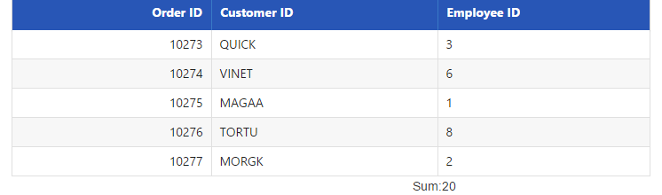
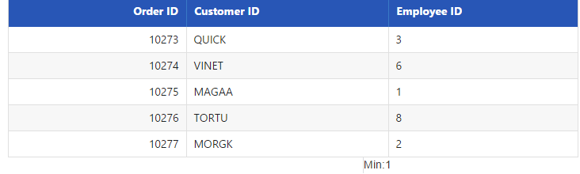
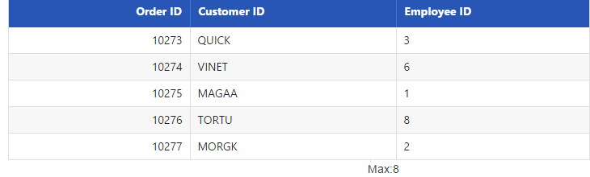
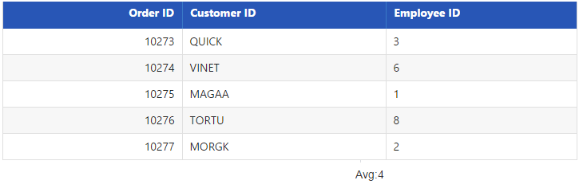
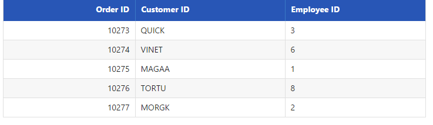

# Summary 

Summary is a key feature in **DataManager** that helps to aggregate any data. **DataManager** provides several summary type by default, they are as follows.

* Sum

* Average 

* Minimum

* Maximum

* Distinct

The ej provided several data utilization methods to achieve summary. 

## Sum

The `Sum` summary type provides the sum of the data. The Sum data utilization method accepts two parameters, they are **JSON** data and the field name where the sum is calculated. The following code example illustrates the Default Summary Types.





    /*ej-Tag Helper code to render DataManager*/
    <ej-grid query="new ej.Query().range(25,30)" id="FlatGrid" dataamanager-id="myData" action-complete="onComplete">
        <e-datamanager url="http://mvc.syncfusion.com/Services/Northwnd.svc/Orders"></e-datamanager>
        <e-columns>
            <e-column field="OrderID" header-text="Order ID" text-align="Right" width="70"></e-column>
            <e-column field="CustomerID" header-text="Customer ID" width="80"></e-column>
            <e-column field="EmployeeID" header-text="Employee ID" text-align="Left" width="75"></e-column>
        </e-columns>
    </ej-grid>





    /*Razor code to render DataManager*/
    @{Html.EJ().DataManager("FlatData").URL("http://mvc.syncfusion.com/Services/Northwnd.svc/Orders").Render();}

    @{Html.EJ().Grid<object>("myGrid")
            .DataManagerID("FlatData")
            .Query("new ej.Query().range(25,30)")
            .Columns(col =>
            {
                col.Field("OrderID").HeaderText("Order ID").IsPrimaryKey(true).TextAlign(TextAlign.Right).Width(75).Add();
                col.Field("CustomerID").HeaderText("Customer ID").Width(80).Add();
                col.Field("EmployeeID").HeaderText("Employee ID").TextAlign(TextAlign.Right).Width(75).Add();
            }).Render();
    }





    





The result of the above code example is illustrated as follows.

 

## Min

The Minimum of a particular field can be calculated using the `ej.min` data utilization method and this method accepts the arguments such as **JSON** data/array, field name and the comparer used for the comparison. When the data to the min method is a **JSON** array then the whole record is returned.

The minimum of particular field can be calculated as follows.





    /*ej-Tag Helper code to render DataManager*/
    <ej-grid query="new ej.Query().range(25,30)" id="FlatGrid" dataamanager-id="myData" action-complete="onComplete">
        <e-datamanager url="http://mvc.syncfusion.com/Services/Northwnd.svc/Orders"></e-datamanager>
        <e-columns>
            <e-column field="OrderID" header-text="Order ID" text-align="Right" width="70"></e-column>
            <e-column field="CustomerID" header-text="Customer ID" width="80"></e-column>
            <e-column field="EmployeeID" header-text="Employee ID" text-align="Left" width="75"></e-column>
        </e-columns>
    </ej-grid>





    /*Razor code to render DataManager*/
    @{Html.EJ().DataManager("FlatData").URL("http://mvc.syncfusion.com/Services/Northwnd.svc/Orders").Render();}

    @{Html.EJ().Grid<object>("myGrid")
            .DataManagerID("FlatData")
            .Query("new ej.Query().range(25,30)")
            .Columns(col =>
            {
                col.Field("OrderID").HeaderText("Order ID").IsPrimaryKey(true).TextAlign(TextAlign.Right).Width(75).Add();
                col.Field("CustomerID").HeaderText("Customer ID").Width(80).Add();
                col.Field("EmployeeID").HeaderText("Employee ID").TextAlign(TextAlign.Right).Width(75).Add();
            }).Render();
    }





    





The result of the above code example is illustrated as follows.

 

## Max

The Maximum of a particular field can be calculated using the `ej.max` data utilization method and this method accepts the arguments such as **JSON** data/array, field name and the comparer used for the comparison. When the data to the max method is a **JSON** array then the whole record is returned.

The maximum of particular field can be calculated as follows.





    /*ej-Tag Helper code to render DataManager*/
    <ej-grid query="new ej.Query().range(25,30)" id="FlatGrid" dataamanager-id="myData" action-complete="onComplete">
        <e-datamanager url="http://mvc.syncfusion.com/Services/Northwnd.svc/Orders"></e-datamanager>
        <e-columns>
            <e-column field="OrderID" header-text="Order ID" text-align="Right" width="70"></e-column>
            <e-column field="CustomerID" header-text="Customer ID" width="80"></e-column>
            <e-column field="EmployeeID" header-text="Employee ID" text-align="Left" width="75"></e-column>
        </e-columns>
    </ej-grid>





    /*Razor code to render DataManager*/
    @{Html.EJ().DataManager("FlatData").URL("http://mvc.syncfusion.com/Services/Northwnd.svc/Orders").Render();}

    @{Html.EJ().Grid<object>("myGrid")
            .DataManagerID("FlatData")
            .Query("new ej.Query().range(25,30)")
            .Columns(col =>
            {
                col.Field("OrderID").HeaderText("Order ID").IsPrimaryKey(true).TextAlign(TextAlign.Right).Width(75).Add();
                col.Field("CustomerID").HeaderText("Customer ID").Width(80).Add();
                col.Field("EmployeeID").HeaderText("Employee ID").TextAlign(TextAlign.Right).Width(75).Add();
            }).Render();
    }





    





The result for the above code example is illustrated as follows.

 

## Avg

The Average summary type provides the average of the given data. The Average data utilization method accepts two parameters, they are **JSON**/Array data and the field name where the sum is calculated. Use the following code example for calculating the average of given **JSON** data.





    /*ej-Tag Helper code to render DataManager*/
    <ej-grid query="new ej.Query().range(25,30)" id="FlatGrid" dataamanager-id="myData" action-complete="onComplete">
        <e-datamanager url="http://mvc.syncfusion.com/Services/Northwnd.svc/Orders"></e-datamanager>
        <e-columns>
            <e-column field="OrderID" header-text="Order ID" text-align="Right" width="70"></e-column>
            <e-column field="CustomerID" header-text="Customer ID" width="80"></e-column>
            <e-column field="EmployeeID" header-text="Employee ID" text-align="Left" width="75"></e-column>
        </e-columns>
    </ej-grid>





    /*Razor code to render DataManager*/
    @{Html.EJ().DataManager("FlatData").URL("http://mvc.syncfusion.com/Services/Northwnd.svc/Orders").Render();}

    @{Html.EJ().Grid<object>("myGrid")
            .DataManagerID("FlatData")
            .Query("new ej.Query().range(25,30)")
            .Columns(col =>
            {
                col.Field("OrderID").HeaderText("Order ID").IsPrimaryKey(true).TextAlign(TextAlign.Right).Width(75).Add();
                col.Field("CustomerID").HeaderText("Customer ID").Width(80).Add();
                col.Field("EmployeeID").HeaderText("Employee ID").TextAlign(TextAlign.Right).Width(75).Add();
            }).Render();
    }





    





The result of the above code example is illustrated as follows.

 

## Distinct

In a data, a field may contain many duplicate values; and sometimes you only require to list the different (distinct) values. This can be achieved by using the **ej.distinct** method. This method accepts three parameters such as **JSON**/Array data, fieldname that you want to fetch as distinct and the third boolean parameter when set as true, returns the whole record when the data is a **JSON** array. 

The following code example illustrates how to use the `ej.distinct` method. In the following code, the third param of distinct method is set as true and hence it fetches the whole record from the provided data.





    /*ej-Tag Helper code to render DataManager*/
    <ej-grid query="new ej.Query().range(25,30)" id="FlatGrid" dataamanager-id="myData" action-complete="onComplete">
        <e-datamanager url="http://mvc.syncfusion.com/Services/Northwnd.svc/Orders"></e-datamanager>
        <e-columns>
            <e-column field="OrderID" header-text="Order ID" text-align="Right" width="70"></e-column>
            <e-column field="CustomerID" header-text="Customer ID" width="80"></e-column>
            <e-column field="EmployeeID" header-text="Employee ID" text-align="Left" width="75"></e-column>
        </e-columns>
    </ej-grid>





    /*Razor code to render DataManager*/
    @{Html.EJ().DataManager("FlatData").URL("http://mvc.syncfusion.com/Services/Northwnd.svc/Orders").Render();}

    @{Html.EJ().Grid<object>("myGrid")
            .DataManagerID("FlatData")
            .Query("new ej.Query().range(25,30)")
            .Columns(col =>
            {
                col.Field("OrderID").HeaderText("Order ID").IsPrimaryKey(true).TextAlign(TextAlign.Right).Width(75).Add();
                col.Field("CustomerID").HeaderText("Customer ID").Width(80).Add();
                col.Field("EmployeeID").HeaderText("Employee ID").TextAlign(TextAlign.Right).Width(75).Add();
            }).Render();
    }





    





The result for the above code example is illustrated as follows.

 
