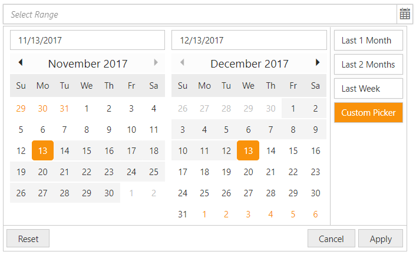

# Customization

Customization of DateRangePicker will be easier with its flexible customization options.

## Setting Dimension

Height and width of the DateRangePicker can be changed using corresponding API (**Height**,**Width**) like below code examples.

Add the following code in your CSHTML page to render DateRangePicker with customized **Height** and **Width**.



    @*Add the following code example to the corresponding CSHTML page to render DateRangePicker widget with customized height and width*@
        
    <ej-date-range-picker id="DateRange"  height="50" width="300"></ej-date-range-picker>

  

## Rounded Corners

**ShowRoundedCorner** property is used to add rounded borders to the input and popup elements. By default, ShowRoundedCorners property will be disabled state. we can enable the property by setting **ShowRoundedCorner** as **true**.

Add the following code in your CSHTML page to render DateRangePicker widget with rounded corners.


   
	@*Add the following code example to the corresponding CSHTML page to render DateRangePicker widget with rounded corners*@

	<ej-date-range-picker id="DateRange" show-rounded-corner=true></ej-date-range-picker>

  
   
## Persistence

The value of DateRangePicker can be sustained even after form post back and page refreshing by enabling the **EnablePersistence** API like below code example.


    
    @*Add the following code example to the corresponding CSHTML page to enable state persistence in rendered DateRangePicker widget*@

    <ej-date-range-picker id="DateRange" enable-persistence=true></ej-date-range-picker>



The DateRangePicker Model value will be stored in local storage / cookies of browser before page refreshes and reinitialized with the restored model after refresh.

## Preset Ranges

We can make use of **Ranges** API for easy selection of preset ranges from the popup. Each preset range will have a label which will be displayed on the right side of the popup with user-defined name. By clicking the labels the associated date ranges will get updated in the popup, automatically.
   

    @*Add the following code example to the corresponding CSHTML page to enable state persistence in DateRangePicker widget*@

    @{ DateTime Today = DateTime.Now;}
    <ej-date-range-picker id="DateRange" value="05/28/2016-06/27/2017" width="44%">
        <e-ranges>
            <e-range label="Last 1 Month" range="new List< Object>() { Today.AddMonths(-1).ToString(), Today.ToString() }" />
            <e-range label="Last 2 Months" range="new List<Object>() { Today.AddMonths(-2).ToString(), Today.ToString() }" />
            <e-range label="Last Week" range="new List< Object>() { Today.AddDays(-7).ToString(), Today.ToString() }" />
        </e-ranges>
    </ej-date-range-picker>
    


Execute the above code to render the following output.

    
DateRangePicker with preset ranges
{:.caption}

## TimePicker Option

The date ranges can also be selected with start time and end time by enable the TimePicker in popup using **EnableTimePicker** API. Each calendar will have separate Time Pickers in which we can select start time along with start date and end time along with end date. Please check with the below code example to enable the time picker.


   
    @*Add the following code example to the corresponding CSHTML page to render DateRangePicker with TimePicker widget*@

    <ej-date-range-picker id="DateRange" width="35%" value="05/28/2016-06/27/2017" enable-time-picker=true></ej-date-range-picker>



Execute the above to render the following output.

    
DateRangePicker with TimePicker option
{:.caption}
