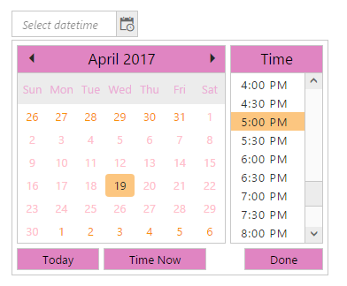

# Appearance and Styling

## Theme

DateTimePicker control support rich appearance. This control consist of six flat themes and six gradient themes. To use these twelve themes, refer the themes files in HTML file. 

You need two style sheets to apply styles to DateTimePicker control; one ej.widgets.core.min.css and one ej.theme.min.css. If you use ej.widgets.all.min.css then you don’t need to use ej.widgets.core.min.css and ej.theme.min.css because ej.widgets.all.min.css is a combination of these two.

The core style sheet applies styles related to positioning and size, but are not related to the color scheme and always require the control to look correct and function properly. The theme style sheet applies theme-specific styles like colors and backgrounds.

The following list is of the twelve themes supported by DateTimePicker:

* default-theme
* flat-azure-dark
* flat-lime
* flat-lime-dark
* flat-saffron
* flat-saffron-dark
* gradient-azure
* gradient-azure-dark
* gradient-lime
* gradient-lime-dark
* gradient-saffron
* gradient-saffron-dark

1. Add the following code in your CSHTML page to render DateTimePicker widget. 



/*ej-Tag Helper code to render DateTimePicker*/
   
	@*Add the following code example to the corresponding CSHTML page to render DateTimePicker widget with right to left appearance*@

     <ej-date-time-picker id="DateTime" width="175px"></ej-date-time-picker>



   
     <ej-date-time-picker id="DateTime2" css-class="Purple-dark"></ej-date-time-picker>



/*Razor code to render DateTimePicker*/

     @{Html.EJ().DateTimePicker("dt").CssClass("Purple-dark").Render(); }



N> To render the DateTimePicker Control you can use either Razor or Tag helper code as given in the above code snippet.

   

2. The following screenshot displays the output for the above code.

	
    
	Showcase of DateTimePicker with gradient lime dark theme
	{:.caption}

## CSS Class

DateTimePicker control also allows you to customize its appearance using user-defined CSS and custom skin options such as colors and backgrounds. To apply custom themes you have a property called css-class . css-class  property sets the root class for DateTimePicker theme.

Using this CssClass you can override the existing styles under the theme style sheet. The theme style sheet applies theme-specific styles like colors and backgrounds. In the following example, the value of  css-class  property is set as “Purple-dark”. Purple-dark is added as root class to DateTimePicker control at the runtime. From this root class you can customize the DateTimePicker control theme.

1. Add the following code in your CSHTML page to render the DateTimePicker.


   	 
	@*Add the following code in your view page to render the DateTimePicker.*@

	<ej-date-time-picker id="DateTime" css-class="Purple-dark"></ej-date-time-picker>


   

   In the following style sheet the exiting theme style sheet file has been over-ridden using root class “Purple-dark”. 

2. Add the following code in your style section.

  
		

 
   

 Showcase for DateTimePicker with cssClass “Purple-dark”
    {:.caption}

