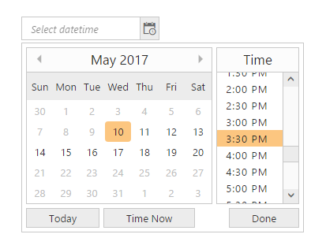

# Date Range

Date Range between two dates is achieved by min-date-time, max-date-time property of DateTimePicker.

In DateTimePicker, a property called enable-strict-mode is available.When this property is set to false, it does not allow wrong values and corrects the entered value automatically. If it is true, then DateTimePicker allows values with error class to indicate the selected date is wrong.

min-date-time - Sets the minimum value to the DateTimePicker. Based on the enable-strict-mode value behind the minimum value an error class is added to the wrapper element or it is corrected automatically to the nearest correct date value.

max-date-time - Sets the maximum value to the DateTimePicker. Based on the enable-strict-mode value beyond the maximum value an error class is added to the wrapper element or it is corrected automatically to the nearest correct date value.

Sometimes, you can give restrictions on selecting the date before or after the particular date. Consider you are going to make a project for hotel reservation system. The “In DateTime” has to be lesser than the “Out DateTime” and vice versa. So you have to set “In DateTime” as minimum DateTime and “Out DateTime” as maximum DateTime for selection in DateTimePicker control. 

The dates before min date and after the max date are considered as invalid dates and it is disabled for selection. 

In the following example May 10, 2017 09:00 AM is set as max-date-time and May 20, 2017 09:00 PM set as max-date-time.

1. Add the following code in your CSHTML page to render DateTimePicker widget.

  

/*ej-Tag Helper code to render DateTimePicker*/

	@*Add the following code example to the corresponding CSHTML page to render DateTimePicker widget with customized Mintime and Maxtime*@

	<ej-date-time-picker id="DateTime" min-date-time=@("05/10/2017 09:00 AM") max-date-time=@("05/20/2017 09:00 PM") interval="30" width="175px"></ej-date-time-picker>


   


/*Razor code to render DateTimePicker*/

	 @{Html.EJ().DateTimePicker("DateTime").MinDateTime("05/10/2017 09:00 AM").MaxDateTime("05/20/2017 09:00 PM").Interval(30).Width("175px").Render(); }



N> To render the DateTimePicker Control you can use either Razor or Tag helper code as given in the above code snippet.

2. The following screenshot displays the output for the above code.

	
    
	Showcase of min and max dates in DateTimePicker
	{:.caption}
