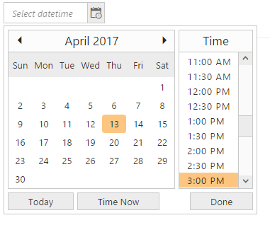

# Date in other months

DateTimePicker calendar can display the dates in other months at the start or end of the current month. To enable or disable the display of other month dates in the current month, you can use the property called show-other-months. By setting this property value as “true” you can display the dates in other months at the start or end of the current month. By default the value of this property is “true”. 

Consider you are going to calculate the monthly report of your company’s employee attendance. To avoid the mistake of selecting other month dates while calculating current month report, you can disable showing other month dates in the current month. You can achieve this requirement by setting show-other-months value as “false”.

1. Add the following code in your CSHTML page to render DateTimePicker widget.

 

 /*ej-Tag Helper code to render DateTimePicker*/
	 
	@*Add the following code example to the corresponding CSHTML page to render DateTimePicker widget with customized other months*@

     <ej-date-time-picker id="DateTime" show-other-months="false"></ej-date-time-picker>





/*Razor code to render DateTimePicker*/

	 @{Html.EJ().DateTimePicker("DateTime").ShowOtherMonths(false).Render();}



N> To render the DateTimePicker Control you can use either Razor or Tag helper code as given in the above code snippet.
   

2. The following screenshot displays the output for the above code.

	
    
	Showcase for DateTimePicker without other month dates
	{:.caption}

