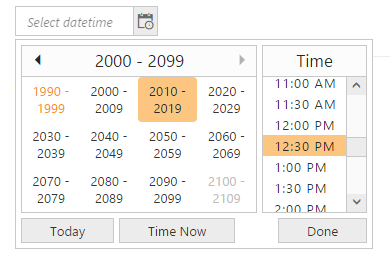
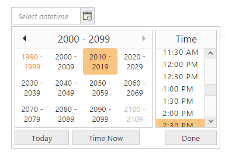

# Start and Depth level

## Start Level

DateTimePicker allows you to change the starting level view of Calendar inside the DateTimePicker popup. Consider you are creating a login form for your blog. If the “Birth date” field in the form starts from year, it is easy to select date from year, month and date. By default, the Start Level of DateTimePicker is “Month” level view. The start-level property receives “enum” value. The “Period” class contains four types of levels. Refer the following table to know the different types of start level.

_Start Level_

<table>
<tr>
<th>
StartLevel</th><th>
Syntax</th><th>
Description</th></tr>
<tr>
<td>
Month</td><td>
StartLevel(Period.Month)</td><td>
Starts from month level view.</td></tr>
<tr>
<td>
Year</td><td>
StartLevel(Period.Year)</td><td>
Starts from year level view.</td></tr>
<tr>
<td>
Decade</td><td>
StartLevel(Period.Decade)</td><td>
Starts from year decade level view.</td></tr>
<tr>
<td>
Century</td><td>
StartLevel(Period.Century)</td><td>
Starts from century level view.</td></tr>
</table>

In the following example DateTimePicker popup Start level view is set to “century level” when you drop down the DateTimePicker popup.

1. Add the following code in your CSHTML page to render DateTimePicker widget.

 

 /*ej-Tag Helper code to render DateTimePicker*/

     @*Add the following code example to the corresponding CSHTML page to render DateTimePicker widget with customized Start level*@
     
      <ej-date-time-picker id="DateTime" start-level="@Period.Century"></ej-date-time-picker>





/*Razor code to render DateTimePicker*/

     @{ Html.EJ().DateTimePicker("DateTime").StartLevel(Period.Century).Render(); }



N> To render the DateTimePicker Control you can use either Razor or Tag helper code as given in the above code snippet.
  

2. The following screenshot displays the output for the above code.

   
   
   Showcase of DateTimePicker with short name of day of the week
   {:.caption}

## Depth Level

DateTimePicker enables you to set the drill down level of DateTimePicker. Consider, you are going to take the monthly report of sales in your company. In that case, there is no need for selecting date from month view. You can restrict the drill-down of DateTimePicker popup to month view.

In the following example, start level is set from century and drill down is set to year view. So drill-down to month is restricted. So you can avoid selecting the day of the month. By default, the current day of the month is maintained in the day number field. Refer the following code to set drill down value to year view.

The following code snippet is set to depth-level in DateTimePicker.

1. Add the following code in your CSHTML page to render DateTimePicker widget.



/*ej-Tag Helper code to render DateTimePicker*/

	@*Add the following code example to the corresponding CSHTML page to render DateTimePicker widget with customized Depth level*@

 <ej-date-time-picker id="DateTime" start-level="@Period.Century" depth-level="@Period.Month"></ej-date-time-picker>





/*Razor code to render DateTimePicker*/

     @{Html.EJ().DateTimePicker("DateTime").StartLevel(Period.Century).DepthLevel(Period.Year).Render(); }


 

2. The following screenshot displays the output for the above code.

	
	
	Showcase of DateTimePicker with Depth level 
	{:.caption}