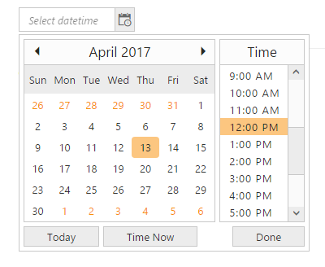

# Time Interval

You can set time interval between two adjacent time values in the time popup manually using the “interval” property. By default the value of the “Interval” property is 30 minutes. Setting this value as 60 is considered as 1 hour. Sometimes you need to update for every hour work log reports. In that case to select time from time popup window with 1 hour interval to update the every 1 hour report you can use Interval option by setting time interval value as “60 minutes”.

1. Add the following code in your CSHTML page to render DateTimePicker widget.



/*ej-Tag Helper code to render DateTimePicker*/

	@*Add the following code example to the corresponding CSHTML page to render DateTimePicker widget with customized interval*@

	 <ej-date-time-picker id="DateTime" interval="60"></ej-date-time-picker>


   



/*Razor code to render DateTimePicker*/

	 @{Html.EJ().DateTimePicker("DateTime").Interval(60).Render();}



N> To render the DateTimePicker Control you can use either Razor or Tag helper code as given in the above code snippet.
   
   
2. The following screenshot displays the output for the above code.

    
	
	Showcase for DateTimePicker with I hour interval in time picker popup
	{:.caption}
