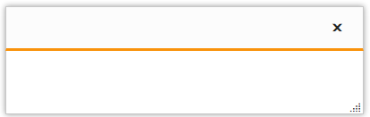
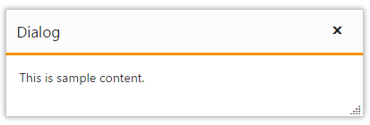
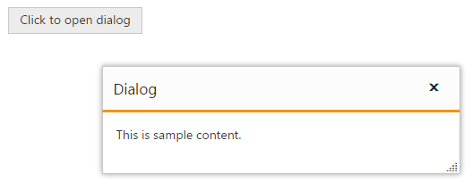

# Getting Started

This section allows you to learn how to configure and use our Dialog control in your application. It also allows you to learn how to add content to the dialog in different way.

## Create your first Dialog in ASP.NET Core

Refer the [Getting Started](https://help.syncfusion.com/aspnet-core/getting-started) page of the Introduction part to know more about the basic system requirements and the steps to configure the Syncfusion components in an ASP.NET Core application.

Add the following code snippet to the corresponding view page to render dialog with default settings.



        <ej-dialog id="basicDialog" >
          </ej-dialog>



## Set content

Add Contents to the dialog using "e-content-template" property, which is given below.



        <ej-dialog id="basicDialog" >
        <e-content-template>
                

                                This is sample content.
                     

                       </e-content-template>
          </ej-dialog>



       
## Set Title

The Dialog control's title can be set through the 'title' property. which is shown in the below code snippet.



        <ej-dialog id="basicDialog" title="Dialog">
            <e-content-template>
                
This is sample content. 
 
            </e-content-template> 
        </ej-dialog>
     

  

## Open Dialog dynamically

In most cases, the Dialog controls are needed only in dynamic actions like showing some messages on clicking a button, to provide alert, etc. So the Dialog control provides “open” and “close” methods to open/close the dialogs dynamically.

The Dialog control can be hidden on initialize using **show-on-init** property which should be set to false.
We can open and close the dialog on button click. Refer the below code



        <ej-button id="btnOpen" text="Click to open dialog" click="onclick" />
        

                <ej-dialog id="basicDialog" title="Dialog" is-responsive="true" close="onDialogClose" show-on-init="false">
                <e-content-template>
                        This is sample content.
                </e-content-template>
                </ej-dialog>
        

       
  

  

        function onclick() {
            $("#basicDialog").ejDialog("open");
            $("#btnOpen").hide();
        }
        function onDialogClose(args) {
            $("#btnOpen").show();
        }

  

