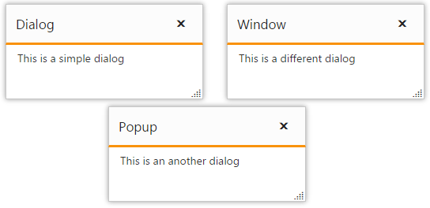
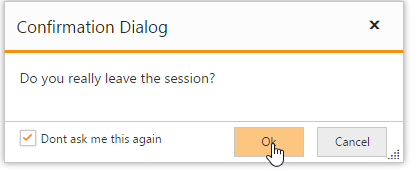

# How To?

## Create Multiple Dialogs

Essential Studio for ASP.NET Core library supports multiple Dialog control in the same web page with different contents and different functionalities.

Initialize the Dialog control by configuring as below.



        <ej-dialog id="firstdialog" title="Dialog" width="250">
            <e-dialog-position x-value="20" y-value="20" />
            <e-content-template>
                

                    
This is a simple dialog

                

            </e-content-template>
        </ej-dialog>
        <ej-dialog id="seconddialog" title="Window" width="250">
            <e-dialog-position x-value="300" y-value="20" />
            <e-content-template>
                

                    
This is a different dialog

                

            </e-content-template>
        </ej-dialog>
        <ej-dialog id="thirddialog" title="Popup" width="250">
            <e-dialog-position x-value="150" y-value="150" />
            <e-content-template>
                

                    
This is an another dialog

                

            </e-content-template>
        </ej-dialog>



N> If the position of the dialog is not set as above, all the three dialogs will be overlapped with each other.

## Create Nested Dialog

A Dialog control can be nested within another Dialog control.

Create a div element to render the child Dialog control and use it as a content of parent Dialog control.



    <ej-button id="outerbutton" text="Open Dialog" click="openDialog" />
    <ej-dialog id="outerdialog" title="Dialog" width="500" height="400" show-on-init="false">
        <e-dialog-position x-value="20" y-value="20" />
        <e-content-template>
            <ej-button id="innerbutton" text="Open Nested Dialog" click="openNestedDialog" />
        </e-content-template>
    </ej-dialog>
    <ej-dialog id="seconddialog" title="Window" width="400" height="300" show-on-init="false">
        <e-dialog-position x-value="300" y-value="20" />
        <e-content-template>
            
This is a nested dialog

        </e-content-template>
    </ej-dialog>



Add the below script to the view page



    



## Create a Confirmation Dialog with Footer section

Essential MVC Dialog supports Alert type Dialog control.

Using `ShowFooter` property to render Alert Dialog with Footers in Dialog control.

Create a Dialog control with enabling Footer property.


    <ej-button id="btnOpen" text="Click to open dialog" click="onclick" />
    <ej-dialog id="dialogIcon" title="Audi Q8" width="325" enable-resize="false" is-responsive="true"  show-footer="true" footer-template-id="samplefooter" before-open="onbeforeopen" close="onDialogClose" >
            <e-content-template>
                

                    The Audi R8 was initially equipped with a 4.2 litre V8 engine. Specifically, it is an all-aluminum alloy 32-valve (four valves per cylinder) petrol engine, utilising Fuel Stratified Injection (FSI), and has a displacement of 4,163 cubic centimetres (254.0 cu in).
                

            </e-content-template>
        </ej-dialog>
	


Add the following script to close and open the Dialog control.



    $("#btnOpen").hide();
    function onclick() {
            $("#dialogIcon").ejDialog("open");
            $("#btnOpen").hide();
        }
        function onDialogClose(args) {
            $("#btnOpen").show();
        }



Initialize Footer in Dialog control by adding the script section as below.



    

     
 


