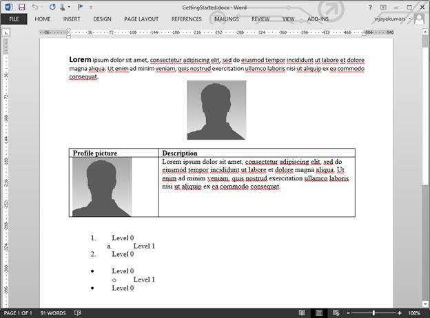
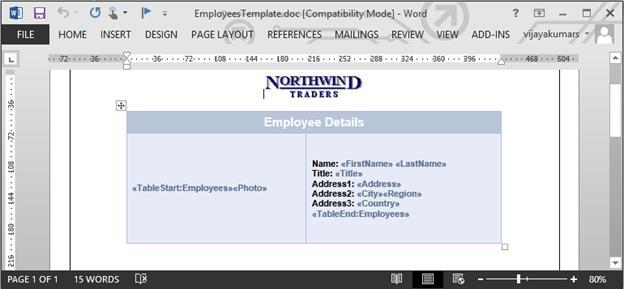
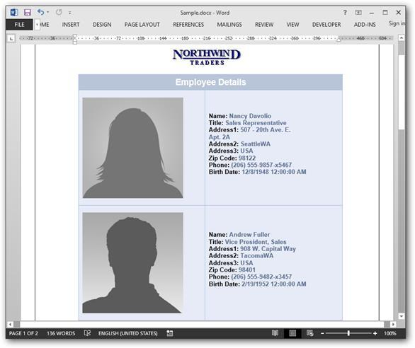

# Getting Started

Refer the [Getting Started](https://help.syncfusion.com/aspnet-core/getting-started) page of the introduction part to know more about the basic [system requirements](https://help.syncfusion.com/aspnet-core/getting-started#system-requirements) and the steps to [configure Syncfusion File Format components](https://help.syncfusion.com/aspnet-core/getting-started#configure-syncfusion-file-format-components-in-aspnet-core-application) in an ASP.NET Core application. Ensure once whether all the following dependency packages are included within the project.json file as mentioned [here](https://help.syncfusion.com/aspnet-core/getting-started#configure-syncfusion-file-format-components-in-aspnet-core-application), to create and manipulate the Word documents using DocIO.

<table>
<thead>
<tr>
<th>
Package Name 
</th>
<th>
Short Description 
</th>
</tr>
</thead>
<tbody>
<tr>
<td>
Syncfusion.DocIO.AspNet.Core
</td>
<td>
This package contains the core features needed for creating, reading, manipulating a Word document.
</td>
</tr>
<tr>
<td>
Syncfusion.Compression.AspNet.Core
</td>
<td>
This package is used to archive/extract the Word document contents.
</td>
</tr>
<tr>
<td>
Syncfusion.OfficeChart.AspNet.Core
</td>
<td>
This package contains the Office Chart Object model and core features needed for chart creation.
</td>
</tr>
</tbody>
</table>

Include the following namespaces in your .cs file



using Syncfusion.DocIO;
using Syncfusion.DocIO.DLS;



## Creating a new Word document with few lines of code

The following code example explains how to create a new Word document with few lines of code.



//Creates an instance of WordDocument
WordDocument document = new WordDocument();
//Add a section & a paragraph in the empty document
document.EnsureMinimal();
//Append text to the last paragraph of the document
document.LastParagraph.AppendText("Hello World");
MemoryStream memoryStream = new MemoryStream();
//Save the document into memory stream
document.Save(memoryStream, FormatType.Docx);
//Closes the Word document instance
document.Close();
memoryStream.Position = 0;
return File(memoryStream, "application/application/vnd.ms-word.document.12", "Sample.docx");



## Creating a new Word document from scratch with basic elements

An entire Word document is represented by an instance of WordDocument and it is root element of DocIO’s DOM. Word document contains a collection of sections. A Word document must contain at least one section.

A section represents group of paragraphs, tables etc., that have a specific set of properties used to define the pages, number of columns, headers and footers and so on that decides how the text appears. A section should contain at least one paragraph in this body.

The following code example explains how to add a section into a `WordDocument` instance.



//Creates an instance of Word document
WordDocument document = new WordDocument();
//Adds a new section into the Word document
IWSection section = document.AddSection();
//Specifies the page margins 
section.PageSetup.Margins.All = 50f;



All the textual contents in a Word document is represented by Paragraphs. Within the paragraph, textual contents are grouped into one or more child elements such as text range, field etc. Each text range represents a region of text with a common set of rich text formatting.

The following code example explains how to add a Paragraph into a Word document



//Adds a new simple paragraph into the section
IWParagraph firstParagraph = section.AddParagraph();
//Sets the paragraph's horizontal aligment as justify
firstParagraph.ParagraphFormat.HorizontalAlignment = HorizontalAlignment.Justify;
//Adds a text range into the paragraph
IWTextRange firstTextRange = firstParagraph.AppendText("Lorem");
//Sets the font formatting of the text range
firstTextRange.CharacterFormat.Bold = true;
firstTextRange.CharacterFormat.FontName = "Calibri";
firstTextRange.CharacterFormat.FontSize = 14;
//Adds another text range into the paragraph
IWTextRange secondTextRange = firstParagraph.AppendText" ipsum dolor sit amet, consectetur adipiscing elit, sed do eiusmod tempor incididunt ut labore et dolore magna aliqua. Ut enim ad minim veniam, quis nostrud exercitation ullamco laboris nisi ut aliquip ex ea commodo consequat. ");
//Sets the font formatting of the text range
secondTextRange.CharacterFormat.FontName = "Calibri";
secondTextRange.CharacterFormat.FontSize = 11;



The following code example shows how to add an image into the Word document.



//Adds another paragraph and aligns it to center
IWParagraph paragraph = section.AddParagraph();
paragraph.ParagraphFormat.HorizontalAlignment = HorizontalAlignment.Center;
//Adds a picture into the paragraph
FileStream imageStream = new FileStream("DummyProfilePicture.jpg", FileMode.Open, FileAccess.Read);
IWPicture picture = paragraph.AppendPicture(imageStream);
//Specifies the size of the picture
picture.Height = 100;
picture.Width = 100;



Table is another important element in Word document that contains a set of paragraphs arranged in rows and columns. You can create simple as well as complex table by using Essential DocIO’s API. The following code example creates a simple table and adds contents into it. Each table cell must contain at least one paragraph.



//Adds a table into the Word document
IWTable table = section.AddTable();
//Creates the specified number of rows and columns
table.ResetCells(2,2);
//Accessess the instance of the cell (first row, first cell)
WTableCell firstCell = table.Rows[0].Cells[0];
//Specifies the width of the cell
firstCell.Width = 150;
//Adds a paragraph into the cell; a cell must have atleast 1 paragraph
paragraph = firstCell.AddParagraph();
IWTextRange textRange = paragraph.AppendText("Profile picture");
textRange.CharacterFormat.Bold = true;
//Accessess the instance of cell (first row, second cell)
WTableCell secondCell = table.Rows[0].Cells[1];
secondCell.Width = 330;
paragraph = secondCell.AddParagraph();
textRange = paragraph.AppendText("Description");
textRange.CharacterFormat.Bold = true;
firstCell = table.Rows[1].Cells[0];
firstCell.Width = 150;
paragraph = firstCell.AddParagraph();
imageStream = new FileStream("DummyProfile - Picture.jpg", FileMode.Open, FileAccess.Read);
IWPicture profilePicture = paragraph.AppendPicture(imageStream);
profilePicture.Height = 100;
profilePicture.Width = 100;
secondCell = table.Rows[1].Cells[1];
secondCell.Width = 330;
paragraph = secondCell.AddParagraph();
textRange = paragraph.AppendText("Lorem ipsum dolor sit amet, consectetur adipiscing elit, sed do eiusmod tempor incididunt ut labore et dolore magna aliqua. Ut enim ad minim veniam, quis nostrud exercitation ullamco laboris nisi ut aliquip ex ea commodo consequat. ");



Essential DocIO allows you to create simple and multi-level lists. The following code snippet explains about how to create a numbered and bulleted list.



//Writes default numbered list 
paragraph = section.AddParagraph();
paragraph.AppendText("Level 0");
//Applies the default numbered list formats 
paragraph.ListFormat.ApplyDefNumberedStyle();
paragraph = section.AddParagraph();
paragraph.AppendText("Level 1");
//Specifies the list format to continue from last list
paragraph.ListFormat.ContinueListNumbering();
//Increments the list level
paragraph.ListFormat.IncreaseIndentLevel();
paragraph = section.AddParagraph();
paragraph.AppendText("Level 0");
paragraph.ListFormat.ContinueListNumbering();
//Decrements the list level
paragraph.ListFormat.DecreaseIndentLevel();
section.AddParagraph();
//Writes default bulleted list
paragraph = section.AddParagraph();
paragraph.AppendText("Level 0");
//Applies the default bulleted list formats
paragraph.ListFormat.ApplyDefBulletStyle();
paragraph = section.AddParagraph();
paragraph.AppendText("Level 1");
//Specifies the list format to continue from last list
paragraph.ListFormat.ContinueListNumbering();
//Increments the list level
paragraph.ListFormat.IncreaseIndentLevel();
paragraph = section.AddParagraph();
paragraph.AppendText("Level 0");
//Specifies the list format to continue from last list
paragraph.ListFormat.ContinueListNumbering();
//Decrements the list level
paragraph.ListFormat.DecreaseIndentLevel();
section.AddParagraph();



Finally, save the document in file system and close its instance.



MemoryStream memoryStream = new MemoryStream();
//Save the document into memory stream
document.Save(memoryStream, FormatType.Docx);
//Closes the Word document instance
document.Close();
memoryStream.Position = 0;
return File(memoryStream, "application/application/vnd.ms-word.document.12", "Sample.docx");



The resultant Word document looks as follows.

## Performing Mail Merge

Essential DocIO allows to generate documents by filling data in template document from data source. Mail merge operation automatically maps the column name in the data source and names of the merge fields in the template Word document and fills the data.

The following data sources are supported by Essential DocIO for performing Mail merge.

* String Arrays
* ADO.NET objects
* Business Objects
* Dynamic objects

Also, you can perform more than one Mail merge operations over the same template to generate document as per your requirement.

Follow the given steps to perform simple Mail merge in a Word document.

Let’s consider that you have a template Word document with merge fields as shown.

The `MailMerge` class provides various overloads for `Execute` method to perform Mail merge from various data source. The Mail merge operation replaces the matching merge fields with the respective data.

The following code example shows how to perform simple Mail merge by using string array.



  //Loads the template document with required merge fields
WordDocument document = new WordDocument("SimpleMailMergeTemplate.docx");
//Initializes the string array with field names
string[] fieldNames = new string[] { "FirstName", "LastName", "Email", "Country" };
//Initializes the string array with field values
string[] fieldValues = new string[] { "John", "Smith", "johnsmith@domain.com", "USA" };
//Executes the mail merge operation that replaces the matching field names with field values respectively
document.MailMerge.Execute(fieldNames, fieldValues);
MemoryStream memoryStream = new MemoryStream();
//Save the document into memory stream
document.Save(memoryStream, FormatType.Docx);
//Closes the Word document instance
document.Close();
memoryStream.Position = 0;
return File(memoryStream, "application/application/vnd.ms-word.document.12", "Sample.docx");



The resultant Word document look as follows.

### Simple Mail merge with Group

You can perform Mail merge with group to append multiple records from data source into a single document. Group is a part of the document enclosed by two special merge fields named «TableStart:TableName» and «TableEnd:TableName»

* «TableStart:TableName» - denotes the start of the group
* «TableEnd:TableName» - denotes the end of the group

The region between these two merge fields get repeated for every record from the data source.

For example – let’s consider that you have a template document as shown.

Here, in this template, Employees is the group name and exact same name should be used while performing Mail merge through code. There are two special merge fields “TableStart:Employees” and “TableEnd:Employees”, to denote the start and end of the Mail merge group.

To merge an image in the replace of a merge field, you need to add a prefix (“Image:”)the merge field name.

For example: the merge field name should be like “«Image:Photo»”(«Image:MergeFieldName»)

The following code example shows how to perform Mail merge with objects.



//Loads the template document
WordDocument document = new WordDocument("EmployeesTemplate.doc");
//Gets the employee details as IEnumerable collection
List<Employee> employeeList = GetEmployees();
//Creates an instance of MailMergeDataTable by specifying MailMerge group name and IEnumerable collection
MailMergeDataTable dataSource = new MailMergeDataTable("Employees", employeeList);
//Uses the mail merge events handler for image fields
document.MailMerge.MergeImageField += new MergeImageFieldEventHandler(MergeField_ProductImage);
//Performs Mail merge
document.MailMerge.ExecuteGroup(dataSource);
MemoryStream memoryStream = new MemoryStream();
//Save the document into memory stream
document.Save(memoryStream, FormatType.Docx);
//Closes the Word document instance
document.Close();
memoryStream.Position = 0;
return File(memoryStream, "application/application/vnd.ms-word.document.12", "Sample.docx");



The following code example provides supporting methods and class for the above code.



public void MergeField_ProductImage(object sender, MergeImageFieldEventArgs args)
{
//Binds image from file system during mail merge
if (args.FieldName == "Photo")
{
string ProductFileName = args.FieldValue.ToString();
args.ImageStream = new FileStream(ProductFileName, FileMode.Open, FileAccess.Read);
}
}

public List<Employee> GetEmployees()
{
List<Employee> employees = new List<Employee>();
employees.Add(new Employee("Nancy", "Davolio", "Sales Representative", "505 - 20th Ave. E. Apt. 2A,", "Seattle", "WA", "USA", "Nancy.png"));
employees.Add(new Employee("Andrew", "Fuller", "Vice President, Sales", "908 W. Capital Way", "Tacoma", "WA", "USA", "Andrew.png"));
employees.Add(new Employee("Janet", "Leverling", "Sales Representative", "722 Moss Bay Blvd.", "Kirkland", "WA", "USA", "Janet.png"));
employees.Add(new Employee("Margaret", "Peacock", "Sales Representative", "4110 Old Redmond Rd.", "Redmond", "WA", "USA", "Margaret.png"));
employees.Add(new Employee("Steven", "Buchanan", "Sales Manager", "14 Garrett Hill", "London", string.Empty, "UK", "Steven.png"));
return employees;
}
public class Employee
{
public string FirstName { get; set; }
public string LastName { get; set; }
public string Address { get; set; }
public string City { get; set; }
public string Region { get; set; }
public string Country { get; set; }
public string Title { get; set; }

public Employee(string firstName, string lastName, string title, string address, string city, string region, string country, string photoFilePath)
{
FirstName = firstName;
LastName = lastName;
Title = title;
Address = address;
City = city;
Region = region;
Country = country;
}
}



The resultant document looks as follows.

