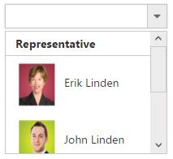
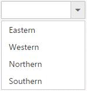

# Data Binding

To populate data in the DropDownList control, define DataSource property with associated fields. You can bind any list data and other remote services in the DropDownList.

## Fields

The following properties provides you a way to bind either local or remote data to the DropDownList control.
<table>
    <tr>
        <th>
            Properties
             
        </th>
        <th>
            Description
             
        </th>
    </tr>
    <tr>
        <td>
            DataSource
             
        </td>
        <td>
            The data source contains the list of data for generating the popup list items.
             
        </td>
    </tr>
    <tr>
        <td>
            Query
             
        </td>
        <td>
            It specifies the query to retrieve the data from the online server.
             
        </td>
    </tr>
    <tr>
        <td>
            Fields
             
        </td>
        <td>
            It specifies the mapping fields for the data items of the DropDownList control.
             
        </td>
    </tr>
    <tr>
        <td>
            ID
             
        </td>
        <td>
            It specifies the ID of the tag.
             
        </td>
    </tr>
    <tr>
        <td>
            Text
             
        </td>
        <td>
            It specifies the text content of the tag.
             
        </td>
    </tr>
    <tr>
        <td>
            Value
             
        </td>
        <td>
            It specifies the value of the tag.
             
        </td>
    </tr>
    <tr>
        <td>
            Category
             
        </td>
        <td>
            It is used to categorize the items based on a specific field. The value mapped to this field must be able to group the popup items.
             
        </td>
    </tr>
    <tr>
        <td>
            ImageUrl
             
        </td>
        <td>
            It defines the image location.
             
        </td>
    </tr>
    <tr>
        <td>
            ImageAttributes
             
        </td>
        <td>
            It defines the image attributes such as height, width, styles, etc.
             
        </td>
    </tr>
    <tr>
        <td>
            SpriteCssClass
             
        </td>
        <td>
            It defines the sprite CSS for the image tag to add a prefix icon to all popup items.
             
        </td>
    </tr>
    <tr>
        <td>
            HtmlAttributes
             
        </td>
        <td>
            It defines the HTML attributes such as class and styles for an item.
             
        </td>
    </tr>
    <tr>
        <td>
            Selected
             
        </td>
        <td>
            This field defines the tag value to be selected initially. Corresponding field mapped has Boolean values to select the list items on control creation. The data with value true in this field is selected automatically when the control is initialized with checkbox.
             
        </td>
    </tr>
    <tr>
        <td>
            TableName
             
        </td>
        <td>
            It defines the table name for the tag value or displays text while rendering remote data.
             
        </td>
    </tr>
</table>

## Local Data

Define a List data and initialize the control with DataSource property. Specify the column names in the Fields property.  

N> The columns are bounded automatically when the fields are specified with the default names like id, text, etc...



	

    <ej-drop-down-list id="groupsList" datasource="ViewBag.datasource" width="250px" header-template="
PHOTO DETAILS
" template="
 
 ${Text} 

 ${Role} 

 ${Country} 

">
    </ej-drop-down-list>

	
    
    

     .imgId {
        margin: 0;
        padding: 3px 10px 3px 3px;
        border: 0 none;
        width: 60px;
        height: 60px;
        float: left;
    }
    
    .eheader {
        font-weight: bold;
        border-bottom: 1px solid #c8c8c8;
        background: #c8c8c8;
    }
    
    .eheader > span {
        display: inline-block;
        padding: 10px;
    }
    
    .ename {
        font-weight: bold;
        padding: 6px 3px 1px 3px;
    }
    
    .role, .cont {
        font-size: smaller;
        padding: 3px 3px -1px 0px;
    }

    
    
    
        public ActionResult Index()
        {
            List<Employee> EmpData = new List<Employee>();
            EmpData.Add(new Employee
            {
                Text = "Erik Linden",
                Role = "Executive",
                Country = "England",
                Image = "../Content/Employees/3.png",
                ImgAttr = "class='imgId'"
            });
            EmpData.Add(new Employee
            {
                Text = "John Linden",
                Role = "Representative",
                Country = "Norway",
                Image = "../Content/Employees/6.png",
                ImgAttr = "class='imgId'"
            });
            EmpData.Add(new Employee
            {
                Text = "Louis",
                Role = "Representative",
                Country = "Australia",
                Image = "../Content/Employees/7.png",
                ImgAttr = "class='imgId'"
            });
            EmpData.Add(new Employee
            {
                Text = "Lawrence",
                Role = "Executive",
                Country = "India",
                Image = "../Content/Employees/8.png",
                ImgAttr = "class='imgId'"
            });
            ViewBag.datasource = EmpData;
            return View();
        }
        public class Employee
        {
            public string Text { get; set; }
            public string Role { get; set; }
            public string Country { get; set; }
            public string Image { get; set; }
            public string ImgAttr { get; set; }
        }
    
    


N> Images for this sample are available in (installed location)\Syncfusion\Essential Studio\{{ site.releaseversion }}\JavaScript\samples\web\themes\images  

## Remote data 

To bind remote data to the DropDownList, you can assign a service data as an instance of DataManager to the Datasource property.

### OData

OData is a standardized protocol for creating and consuming data. You can provide the [OData service](http://www.odata.org/) URL directly to the Datasource URL property.


               
    <ej-drop-down-list id="customerList" query="ej.Query().from('Customers').take(6)" watermark-text="Select a customer" width="100%">
        <e-datamanager url="//mvc.syncfusion.com/Services/Northwnd.svc/"></e-datamanager>
        <e-drop-down-list-fields text="CustomerID" table-name="Customers" />
    </ej-drop-down-list>


           
          
## OData Version 4

For OData Version 4 support ODataV4Adaptor should be used. By using URL property of Datasource, you can bind OData Version 4 Service link and specify  Adaptor value as enum AdaptorType.ODataV4Adaptor.
 
For further details about OData service please refer [the link](http://www.odata.org/).



    <ej-drop-down-list id="customerList">
        <e-datamanager url="http://services.odata.org/V4/Northwind/Northwind.svc/Regions/" adaptor="@AdaptorType.ODataV4Adaptor"></e-datamanager>
        <e-drop-down-list-fields text="RegionDescription" value="RegionID" />
    </ej-drop-down-list>
     
           
           

N> Events associated with remote data bind is listed [here](http://help.syncfusion.com/js/api/ejdropdownlist#events). 

## WebAPI

Using WebApiAdaptor, you can bind WebApi service’s data to DropDownList. The data from WebApi service must be returned as an object that has property “Items” with its value as data source and another property “Count” with its value as dataSource’s total records count.



    <ej-drop-down-list id="dropdown">
        <e-datamanager url="/api/Orders" adaptor="@AdaptorType.WebApiAdaptor"></e-datamanager>
        <e-drop-down-list-fields text="Name" value="EmployeeID" />
    </ej-drop-down-list>





    public class OrdersController : ApiController
    {
        NorthwindDataContext db = new NorthwindDataContext();
        
        // GET api/<controller>       
        public PageResult<EmployeePhoto> Get(ODataQueryOptions opts)
        {
            List<EmployeePhoto> emp = db.EmployeePhotos.ToList();            

            return new PageResult<EmployeePhoto>(emp as IEnumerable<EmployeePhoto>, null, emp.Count);
        }
    } 



## Virtual Scrolling 

To improve the performance when displaying large data set, you can use “AllowVirtualScrolling” and VirtualScrollMode property. This retrieves only a fixed amount of list items and loads remaining data on scrolling. The items will be fetched via AJAX request.

This supports two modes of virtualization. They are,

* Normal Mode
* Continuous Mode

I> 1. Sorting and Grouping is not supported with Virtual Scrolling
I> 2. “VirtualScrollMode” property accepts Syncfusion.JavaScript.VirtualScrollMode enum value.

### Normal Mode

It loads the data on scrolling the list of items. This can be achieved by setting Syncfusion.JavaScript.VirtualScrollMode.Normal value to the VirtualScrollMode property.



    <ej-drop-down-list id="customerList" allow-virtual-scrolling="true" virtual-scroll-mode="@VirtualScrollMode.Normal" items-count="7" query="ej.Query().from('Customers').take(6)" watermark-text="Select a customer" width="100%">
        <e-datamanager url="//mvc.syncfusion.com/Services/Northwnd.svc/"></e-datamanager>
        <e-drop-down-list-fields text="CustomerID" table-name="Customers" />
    </ej-drop-down-list>



### Continuous Mode

It loads the set of items when the scroller reaches at the end. This behaves like infinity scrolling. So when scroll reaches the end, it will fetch the remaining set of items and bind with your DropDownList. This can be achieved by setting Syncfusion.JavaScript.Continuous value to the "VirtualScrollMode" property.

N> In both modes, set of items will be fetched based on the count specified in the ItemsCount property and next set of items will be loaded on scrolling.



    <ej-drop-down-list id="customerList" allow-virtual-scrolling="true" virtual-scroll-mode="@VirtualScrollMode.Continuous" items-count="7" query="ej.Query().from('Customers').take(6)" watermark-text="Select a customer" width="100%">
        <e-datamanager url="//mvc.syncfusion.com/Services/Northwnd.svc/"></e-datamanager>
        <e-drop-down-list-fields text="CustomerID" table-name="Customers" />
    </ej-drop-down-list>

