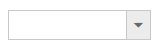
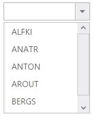

# Getting Started

## Create your first DropDownList in ASP.NET Core 

1.Create an ASP.NET Core Project as given in [`ASP.NET Core`](https://help.syncfusion.com/aspnet-core/getting-started) documentation

2.Add DropDownList control by using the below code.

  
  
   /*ej-Tag Helper code to render DropDownList*/

            <ej-drop-down-list id="selectCar"></ej-drop-down-list>

       
  
  
  
  
       /*Razor code to render DropDownList*/

          @{Html.EJ().DropDownList("DropDownList1").Render();}

  
  
N> To render the DropDownList Control you can use either Razor or Tag helper code as given in the above code snippet.

3.Execute the code and get the DropDownList control rendered as below

## Populating data

The DropDownList can be bounded to any local list data and remote data services. You can use DataManager component to serve data from the data services based on the query provided.You can bind data to dropdownlist locally from controller. To render the DropDownList items, map the DropDownListFields with corresponding Fields
 
 
   
   
      /*ej-Tag Helper code to render DropDownList*/

             <ej-drop-down-list id="customerList">
                <e-datamanager id="Data" json="(IEnumerable<Customers>)ViewBag.datasource"></e-datamanager>
                <e-drop-down-list-fields text="text" id="id" value="text"/>
            </ej-drop-down-list>
                        
    
   
   
   
       /*Razor code to render DropDownList*/

            @{Html.EJ().DropDownList("customersList").Datasource((IEnumerable<Customers>)ViewBag.datasource).DropDownListFields(df => df.ID("id").Text("text").Value("text")).Render();}
		  

  
  
  
  
        List<Customers> customer = new List<Customers>();
        public ActionResult Index()
        {
            customer.Add(new Customers { id = "1", text = "ALFKI" });
            customer.Add(new Customers { id = "2", text = "ANATR" });
            customer.Add(new Customers { id = "3", text = "ANTON" });
            customer.Add(new Customers { id = "4", text = "AROUT" });
            customer.Add(new Customers { id = "5", text = "BERGS" });
            customer.Add(new Customers { id = "6", text = "BLAUS" });
            ViewBag.datasource = customer;
            return View();
        }

       public class Customers
        {
            public string id { get; set; }
            public string text { get; set; }
        }
  

Execute the code and to get a DropDownList control with data bound from controller

## Setting Dimensions

DropDownList dimensions can be set using width and height Properties.

 

   
   
     /*ej-Tag Helper code to render DropDownList*/

               <ej-drop-down-list id="customerList" width="300px" height="50px">
                   <e-datamanager id="Data" json="(IEnumerable<Customers>)ViewBag.datasource"></e-datamanager>
                   <e-drop-down-list-fields text="text" id="id" value="text"/>
               </ej-drop-down-list>

  
  
   
   
       /*Razor code to render DropDownList*/

         @{Html.EJ().DropDownList("customersList").Datasource((IEnumerable<Customers>)ViewBag.datasource).DropDownListFields(df => df.ID("id").Text("text").Value("text")).Width("300px").Height("50px").Render();}
		 
		  

  

**Setting dimensions to Popup list**

popup-width and popup-height can be used to create a fixed size popup list.

   
   
       /*ej-Tag Helper code to render DropDownList*/

       <ej-drop-down-list id="customerList"  width="200px" popup-height="300px" popup-width="200px">
                <e-datamanager id="Data" json="(IEnumerable<Customers>)ViewBag.datasource"></e-datamanager>
                <e-drop-down-list-fields text="text" id="id" value="text"/>
        </ej-drop-down-list>

   
   
  
  
       /*Razor code to render DropDownList*/

          @{Html.EJ().DropDownList("customersList").Datasource((IEnumerable<Customers>)ViewBag.datasource).DropDownListFields(df => df.ID("id").Text("text").Value("text")).Width("300px").Height("50px").PopupHeight("300px").PopupWidth("300px").Render();}
		 
		  

  

## Setting and Getting Value

You can select single or multiple values from DropDownList control. To assign a value initially to the DropDownList, you can use <b>value</b> property.

  



    /*ej-Tag Helper code to render DropDownList*/

      @using (Html.BeginForm("Index", "Home", FormMethod.Post, null))
        {
		
		<ej-drop-down-list id="bikeList" datasource="(IEnumerable<Bikes>)ViewBag.datasource" watermark-text="Select a bike" width="100%">
                <e-drop-down-list-fields id="empid" text="text" value="text" />
       </ej-drop-down-list>
       <input type="submit" value="Get Value" />
		}


    


	
        public IActionResult Index()
        {
		   List<Bikes> bike = new List<Bikes>();
            bike.Add(new Bikes { empid = "bk1", text = "Apache RTR" });
            bike.Add(new Bikes { empid = "bk2", text = "CBR 150-R" });
            bike.Add(new Bikes { empid = "bk3", text = "CBZ Xtreme" });
            bike.Add(new Bikes { empid = "bk4", text = "Discover" });
            bike.Add(new Bikes { empid = "bk5", text = "Dazzler" });
            bike.Add(new Bikes { empid = "bk6", text = "Flame" });
            bike.Add(new Bikes { empid = "bk7", text = "Fazzer" });
            bike.Add(new Bikes { empid = "bk8", text = "FZ-S" });
            bike.Add(new Bikes { empid = "bk9", text = "Pulsar" });
            bike.Add(new Bikes { empid = "bk10", text = "Shine" });
            bike.Add(new Bikes { empid = "bk11", text = "R15" });
            bike.Add(new Bikes { empid = "bk12", text = "Unicorn" });
            ViewBag.datasource = bike;
            return View();
        }
		[HttpPost]
        public ActionResult Index(string bikeList)
        {
            //bikeList is ID of DropDownList used in this example. You can get the selected items value in controller using the ID
            string DropDownValue = bikeList;
            return View();
        }
        public class Bikes
        {
            public string empid { get; set; }
            public string text { get; set; }
        }








    /*Razor code to render DropDownList*/

           @using (Html.BeginForm("Contact", "Home", FormMethod.Post, null))
    {   
	     
		 

        @{Html.EJ().DropDownList("DropDownList2").Datasource((IEnumerable<Data>)ViewData["DropDownSource"]).DropDownListFields(Df => Df.Text("Text").Value("Value")).Height("50px").Width("500px").PopupHeight("200px").PopupWidth("300px").Value("item3").Render();
        }

         

             
        <input type="submit" value="Get Value" />

    }
		 
		  

   
	

	
	     public IActionResult Contact()
        {
            List<Data> DropdownData = new List<Data>();
            DropdownData.Add(new Data { Value = "item1", Text = "List Item 1" });
            DropdownData.Add(new Data { Value = "item2", Text = "List Item 2" });
            DropdownData.Add(new Data { Value = "item3", Text = "List Item 3" });
            DropdownData.Add(new Data { Value = "item4", Text = "List Item 4" });
            DropdownData.Add(new Data { Value = "item5", Text = "List Item 5" });
            ViewData["DropDownSource"] = DropdownData;

            return View();
        }
        [HttpPost]
        public ActionResult Contact(string DropDownList2)
        {
             //DropDownList2 is ID of DropDownList used in this example. You can get the selected items value in controller using the ID
            string DropDownValue = DropDownList2;
            return View();
        }
	

	


