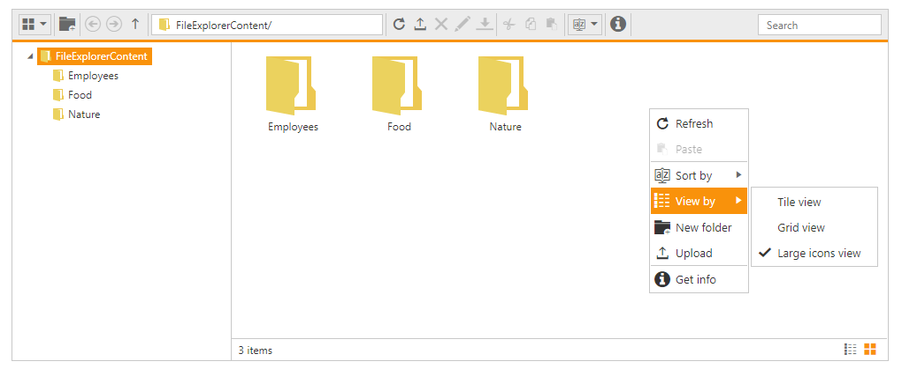

# Context Menu

The context-menu has [list of items](#context-menu-items) that helps you to perform file explorer operations, and it appears based on the target such as file or folder.

## Context menu items

The following table shows the context menu items corresponding to the location where it is opened:

<table>
<tr>
<td>
Context menu location
</td>
<td>
Context menu items
</td>
<td>
Screenshot
</td>
</tr>
<tr>
<td>
While right click on tree view nodes (from navigation pane)  </td>
<td>
* New folder * Upload * Delete * Rename * Cut * Copy * Paste *Get info   </td>
<td>
    </td>
</tr>
<tr>
<td>
While right click the File/Folder  </td>
<td>
* Open * Download * Upload * Delete * Rename * Cut * Copy * Paste * Get info *Open folder location    </td>
<td>
    </td>
</tr>
<tr>
<td>
While right click on layout (content pane)  </td>
<td>
* Refresh * Paste * Sort by * New folder * Upload  * Get info     </td>
<td>
    </td>
</tr>
</table>
The following table explains the behavior of each context menu item:
<table>
<tr>
<td>
Open  </td>
<td>
It opens the selected folder. When an image file is selected, it opens the preview of the image. For the remaining files this option becomes disabled.  </td>
</tr>
<tr>
<td>
Download  </td>
<td>
It downloads the selected file. Download option is enabled only when you select a file or number of files.  If multiple files are selected, it downloads all the selected files in a zip format.  </td>
</tr>
<tr>
<td>
Cut  </td>
<td>
It makes the copy of the selected files or folders from the clipboard. When the user paste the files in any location, the files are removed from the source location.  </td>
</tr>
<tr>
<td>
Copy  </td>
<td>
It makes the copy of the selected files or folders from the clipboard. When the user paste the files, only the copied files are pasted in the target location.  </td>
</tr>
<tr>
<td>
Paste  </td>
<td>
It paste the files from the clipboard into the current selected folder. Note: it is enabled only when the files are copied from the clipboard.  </td>
</tr>
<tr>
<td>
Delete  </td>
<td>
It deletes the currently selected file or folder. This option gets enabled only when you select any file or folder.  If multiple files are selected, it will delete all the selected items.  </td>
</tr>
<tr>
<td>
Rename  </td>
<td>
This is used to rename the currently selected file or folder. This option gets enabled only when you select any file or folder.  Even if multiple files are selected, it renames the single file only.  </td>
</tr>
<tr>
<td>
New Folder  </td>
<td>
It creates a new folder on the current directory.  When you click the “NewFolder” item, the dialog box will be displayed to get the folder name. Based on the user input, the file explorer creates new folder on the current directory.  </td>
</tr>
<tr>
<td>
Upload  </td>
<td>
It uploads a file or list of files into the current directory.  </td>
</tr>
<tr>
<td>
Get info  </td>
<td>
It displays the details of the currently selected file or folder.  </td>
</tr>
<tr>
<td>
Sort By  </td><td>
It is used to sort the files and folders from the current directory. Sorting can be done based on the columns available from grid, in both the ascending and descending order.  </td>
</tr>
<tr>
<td>
Open folder location
</td>
<td>
It helps to open a file location from the filtered list.
</td>
</tr>
</table>

## Context menu Visibility

The presence of the context menu can be controlled by the “[ShowContextMenu](http://help.syncfusion.com/js/api/ejfileexplorer#members:showcontextmenu)” property. This is enabled by default, and by disabling this property you can prevent our built-in context menu.

In the view page, add FileExplorer and specify the context menu visibility as false.



<ej-file-explorer id="custom" path="wwwroot/images/FileExplorer" show-context-menu="false" ajax-action="@Url.Content("FileActionDefault")" width="100%" is-responsive="true">
    <e-file-ajax-settings>
        <e-download url="/FileExplorer/Download{0}"></e-download>
        <e-get-image url="/FileExplorer/GetImage{0}"></e-get-image>
        <e-upload url="/FileExplorer/Upload{0}"></e-upload>
    </e-file-ajax-settings>
</ej-file-explorer>



## Enable/Disable the Context menu Item

The context menu items can be enabled or disabled through the client side public methods. It enables or disables the item from all the context menu where it is present.

For example, if you disable the “Upload” item, it is disabled in all places wherever it appears such as open the context menu on “TreeView”, open on file/folder, and open on layout.

* [enableMenuItem](http://help.syncfusion.com/js/api/ejfileexplorer#methods:enablemenuitem)

* [disableMenuItem](http://help.syncfusion.com/js/api/ejfileexplorer#methods:disablemenuitem)

These methods accepts only the context menu item name as the parameter.
    
    
    
            $(function () {
                var fileExpObj = $("#fileExplorer").data("ejFileExplorer");
                // this disables the New Folder item
                fileExpObj.disableMenuItem("New folder");
                // this disables the Download item
                fileExpObj.disableMenuItem("Download");
            });
            
    

## Context Menu Customization

You can customize the ContextMenu of FileExplorer control by using [ContextMenuSettings](https://help.syncfusion.com/api/js/ejfileexplorer#members:contextmenusettings) property.

You can add your own context menu items and its action along with default context menu items of file explorer control. You can also remove the default context menu items in file explorer control.

To add/remove/re-arrange context menu items, you need to use the [ContextMenuSettings.items](https://help.syncfusion.com/api/js/ejfileexplorer#members:contextmenusettings-items) property and to bind required actions for newly added menu items and add sub menu items, use the [ContextMenuSettings.CustomMenuFields](https://help.syncfusion.com/api/js/ejfileexplorer#members:contextmenusettings-custommenufields) property.



 <ej-file-explorer id="fileExplorer" path="wwwroot/css/images/FileExplorerContent" layout="LargeIcons" ajax-action="@Url.Content("FileActionDefault")" width="100%" is-responsive="true" menu-open="onMenuOpen" layout-change="onLayoutChange">
        <e-file-ajax-settings>
            <e-download url="/FileExplorer/Download{0}"></e-download>
            <e-get-image url="/FileExplorer/GetImage{0}"></e-get-image>
            <e-upload url="/FileExplorer/Upload{0}"></e-upload>
        </e-file-ajax-settings>
        <e-file-context-menu-settings>
            <e-file-items navbar='@new List<string>() { "Upload", "|", "Delete", "Rename", "|", "Cut", "Copy", "Paste", "|", "Getinfo" }' 
                          cwd ='@new List<string>() { "Refresh", "Paste", "|", "SortBy", "View", "|", "NewFolder", "Upload", "|", "Getinfo" }'
                          files ='@new List<string>() { "Open", "Download", "|", "Delete", "Rename", "|", "Cut", "Copy", "Paste", "|", 
          "OpenFolderLocation", "Getinfo" }'></e-file-items>
            <e-file-custom-menu-fields>
                <e-menu-fields id="View" text="View by" sprite-css-class="custom-grid">
                    <e-child-items>
                        <e-child-item id="tile" text="Tile view" action="onLayout"></e-child-item>
                        <e-child-item id="grid" text="Grid view" action="onLayout"></e-child-item>
                        <e-child-item id="largeicons" text="Large icons view" action="onLayout"></e-child-item>
                    </e-child-items>
                </e-menu-fields>
            </e-file-custom-menu-fields>
        </e-file-context-menu-settings>
    </ej-file-explorer>



Icons of context menu items can be customized by overriding the default context menu item style. The following code example illustrates how to customize the icon of context menu items.





The following screenshot displays the customization of context menu in file explorer control.

## Context Menu Events

You will be notified with events when you try to open the context menu items (**MenuBeforeOpen**), after context menu items is opened (**MenuOpen**), and when you click the menu items (**MenuClick**). The following code example illustrates how to define those events.



<ej-file-explorer id="custom" path="wwwroot/images/FileExplorer" show-context-menu="true" ajax-action="@Url.Content("FileActionDefault")" menu-click="menuClick" menu-before-open="menuBeforeOpen" menu-open="menuOpen">
    <e-file-ajax-settings>
        <e-download url="/FileExplorer/Download{0}"></e-download>
        <e-get-image url="/FileExplorer/GetImage{0}"></e-get-image>
        <e-upload url="/FileExplorer/Upload{0}"></e-upload>
    </e-file-ajax-settings>
</ej-file-explorer>





function menuBeforeOpen(args) {
    //you add/remove the context menu items in run time
    //do your custom action here.
    args.dataSource.pop();
}
function menuOpen(args) {
    //you can also identify which context menu is opened by 
    if (args.contextMenu == "cwd") {
        //do your custom action here.
    }
}
function menuClick(args) {
    switch (args.text) {
        case "largeIcons":
            //do your custom action here.
            break;
    }
}


