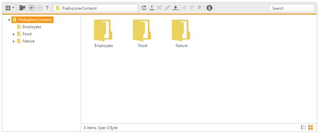

# Overview

The file explorer is an interface for managing the file system through any web application. It allows the user to perform the most common file operations such as browse files, open, create, rename, copy, paste, move, delete, and file searching.
For a live demo of file explorer, check the online sample [here](http://aspnetcore.syncfusion.com/fileexplorer/default).

## Key features

* Windows explorer like functionalities and appearances
* Handy file operations (copy, paste, move, and delete)
* File download and upload
* File type restriction
* Easy UI customization
* Different layouts (grid, tile, and large icons view)
* Context menu support
* Built-in image viewer support
* Keyboard navigation
* Right to Left alignment (RTL) support
* Localization support