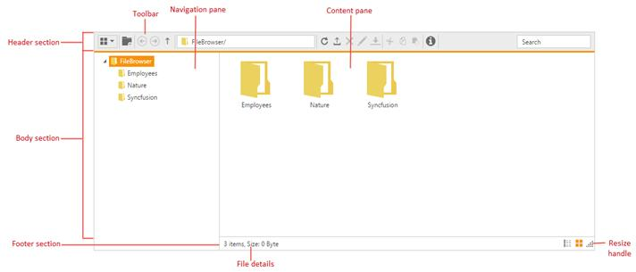

# User Interface

The file explorer UI is combined of several sections like header, body, and footer. Each section has the corresponding components to perform the file explorer related operations.

* The **header section** contains the toolbar that has the list of tools to perform the file and navigation related operations.

* The **body section** is the main area that explores the filesystem contents. It is separated into:

  * **Navigation pane** that contains the tree view to showcase the folder hierarchy.

  * **Content pane** that show cases the files from the file system. The files in the content pane can be viewed in the following modes:

    * Grid

    * Tile

    * Large Icons

* The **footer section** contains the status bar that showcases the file details.

The following screenshot shows the diagrammatic representation of file explorer UI:

From the previous screenshot, you can see file explorer has several subcomponents for different functionalities. The upcoming sections explains the brief details of each components and their customizations.
