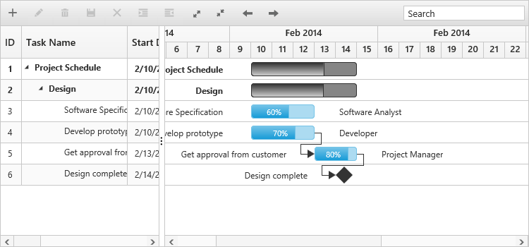
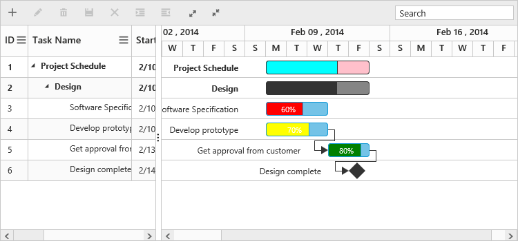
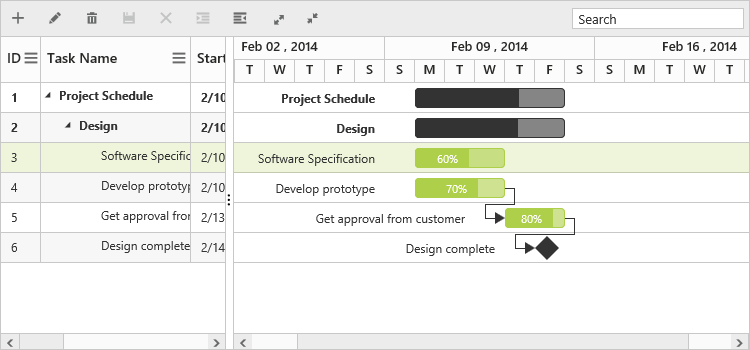

# Appearance and Styling

You can customize the look and feel of the Gantt control by applying themes and formatting the schedule header.

## Schedule Header Customization

You can customize the week header format and day header format in the Schedule part of the Gantt control by using the following code example.


    <ej-gantt id="ganttSample3" datasource="ViewBag.datasource" 
        //...
        is-responsive="true">
        <e-schedule-header-settings week-header-format="MMM yyyy" day-header-format="d" weekend-background="#F2F2F2">
        </e-schedule-header-settings>
    </ej-gantt>


The following screenshot shows the customized format schedule header in Gantt control.

## Taskbar Customization

You can customize the Taskbar based on the task information in Gantt control to highlight the task. The following code example shows how to customize the Taskbar in Gantt control.


    <ej-gantt id="ganttSample3" datasource="ViewBag.datasource" 
          //...
          query-taskbar-info="queryTaskbarInfo">
    </ejGantt>



    function queryTaskbarInfo(args) {
        //queryTaskbarInfo will be triggered when a taskbar is rendered
        if (args.data.level === 0) {
            args.parentTaskbarBackground = "pink";
            args.parentProgressbarBackground = "cyan";
        } else {
            if (args.data.status == "60") {
                args.progressbarBackground = "red";
            } else if (args.data.status == "70") {
                args.progressbarBackground = "yellow";
            } else if (args.data.status == "80") {
                args.progressbarBackground = "green";
            }
        }
    }


The following screenshot shows the customized taskbar in Gantt control.

## Themes

 The following are the types of themes available in Gantt control.

1.Flat Azure                
2.Flat Azure Dark                  
3.Flat Lime                          
4.Flat Lime Dark                   
5.Flat Saffron    
6.Flat Saffron Dark
7.Gradient Azure
8.Gradient Azure Dark
9.Gradient Lime
10.Gradient Lime Dark
11.Gradient Saffron
12.Gradient Saffron Dark
13.Bootstrap

You can apply the theme (Gradient lime) to the Gantt control by using the style sheet from the online link as follows.


<html lang="en">
<head>
    <title>Essential Studio for ASP.NET Core</title>
    <link href="http://cdn.syncfusion.com/{{ site.releaseversion }}/js/web/gradient-lime/ej.web.all.min.css" rel="stylesheet" /> 
</head>
</html>


The following screenshot shows the Gantt control with `Gradient-lime` theme.

