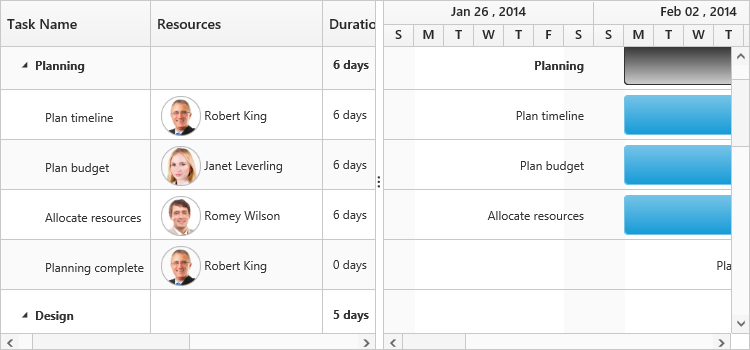
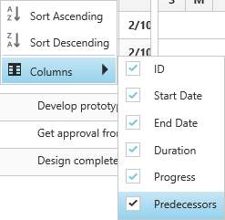
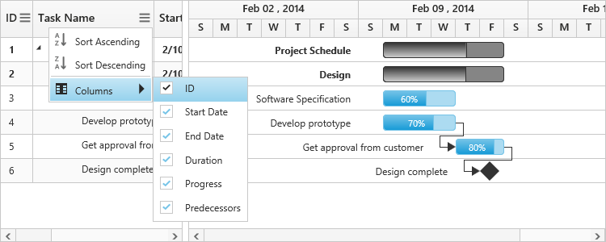
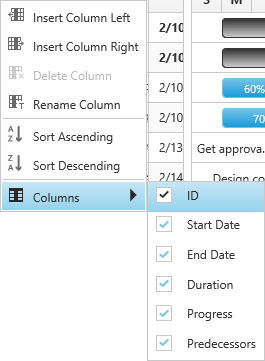
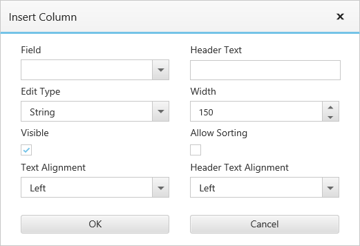

# Columns

The column displays the information from a bounded data source and it will be editable to update the task details through TreeGrid.

## Column edit types

Gantt supports the following types of column editors,

  * String 
  * Date
  * Datetime
  * Numeric
  * Maskedit
  * Currency
  * Dropdown
  
## Format column

It is possible to format a column using `load` event. The following code examples show how to format the ‘progress’ column with percentage value.


  <ej-gantt id="ganttSample3" datasource="ViewBag.datasource" 
          //...
          load="load">
  </ejGantt>



    function load(args) {
        var columns = this.getColumns();
        columns[5]["format"] = "{0:p0}";
    }


Note: For more numeric format strings, please refer this [link](https://msdn.microsoft.com/library/dwhawy9k(v=vs.100).aspx).

For more date format strings, please refer this [link](https://msdn.microsoft.com/library/az4se3k1(v=vs.100).aspx).

## Column Resizing

You can change the width of the column to show the entire text of the column by resizing the column. The following code example shows you how to enable the Column Resize feature at **Gantt** initialize.



 <ej-gantt id="ganttSample3" datasource="ViewBag.datasource" 
          //...
          allow-column-resize="true">
  </ejGantt>



## Column Template

Column template is used to customize the column’s look and feel, based on requirement. 

The following code example shows you how to display a column with resource images.






 <ej-gantt id="ganttSample3" datasource="ViewBag.datasource" 
        //...
        resource-info-mapping="ResourceID"
        resource-name-mapping="ResourceName"
        resource-id-mapping="ResourceID"
        resources="ViewBag.resources"
        load="load">
  </ejGantt>



    function load(args) {
        var columns = this.getColumns();
        columns[2].visible = columns[3].visible = false;
        columns[4].isTemplateColumn = true;
        columns[4].templateID = "columnTemplate";
        columns[4].width = "172";
    }


The following screenshot displays the customized column in Gantt control.

## Column menu

### Show column chooser

Gantt supports enabling and disabling the visibility of the columns dynamically with the `show-column-chooser` property. The visibility of the custom columns can also be toggled with this property. Column chooser option is rendered as a sub menu item within the column menu in the Gantt columns. 

The column menu is enabled with the `show-column-chooser` property, where the default value for this property is `false`.

The column menu provides the following options:

* Sort Ascending
* Sort Descending
* Columns 

Sort Ascending and Sort Descending options can be enabled or disabled with the `allow-sorting` property. Single level sorting can be performed with these options. To perform multilevel sorting, `allow-multi-sorting` property should be enabled. You can also disable the visibility of a particular column in the column collection manually by setting the `visible` property to `false`.


<ej-gantt id="ganttSample3" datasource="ViewBag.datasource" 
        //...
        show-column-chooser="true"
        allow-sorting="true"
        allow-multi-sorting="true">
  </ejGantt>


The following screenshot displays the column chooser in the Gantt control.

### Show column options

You can customize the column with some more options with the `show-column-options` property. Insert new column, delete column and update the header text of the column can be done with this property.

The column options can be enable or disabled with `show-column-options` property, where the default value for this property is `false`.

The column options provide the following options:

* Insert column left
* Insert column right
* Delete column
* Rename column

Inserting column provides the dialog to enter the details for the column

These fields can be customized with `column-dialog-fields` property. The following code snippet shows you how to customize these fields.


<ej-gantt id="ganttSample3" datasource="ViewBag.datasource" 
        //...
        show-column-chooser="true"
        show-column-options="true"
        column-dialog-fields="@(new List<string>() {"field", "headerText", "editType" })">
  </ejGantt>


